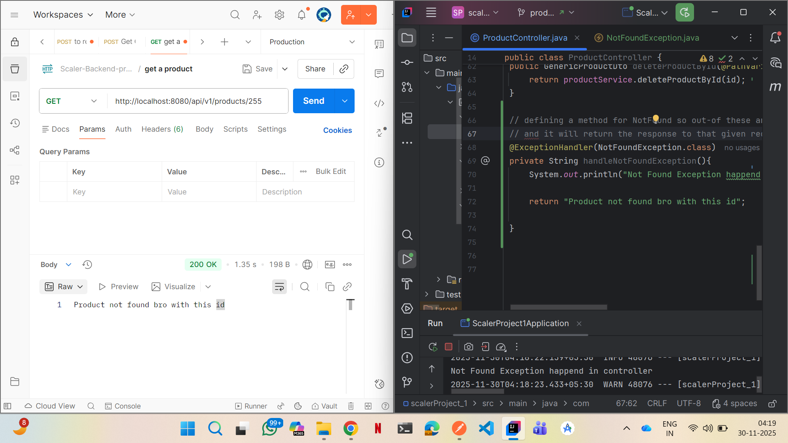
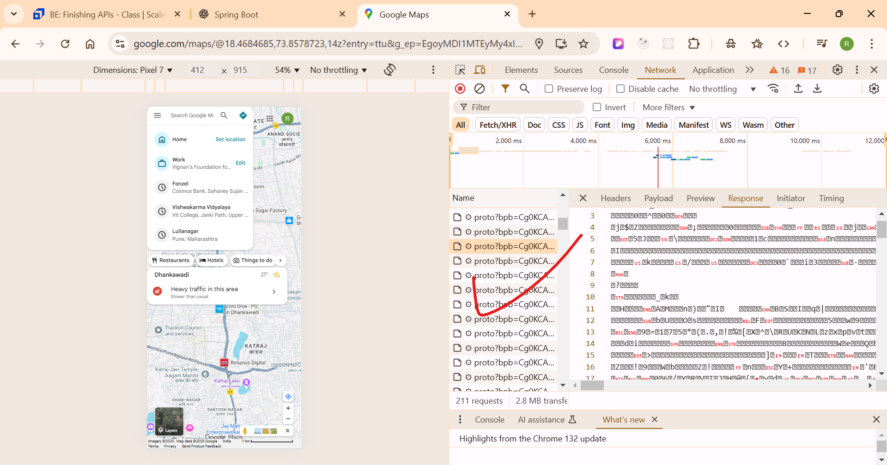

1) 

# ---------- what is @ControllerAdvice use of it ---
`@ControllerAdvice` (or `@RestControllerAdvice`) is one of the **most important** Spring annotations for building clean, production-level APIs.

Let me explain it in a very simple and practical way.

---

# 🚀 **What is `@ControllerAdvice`?**

`@ControllerAdvice` is a **global exception handler** or **global controller interceptor**.

It allows you to:

### ✔ Handle exceptions globally

### ✔ Apply validations globally

### ✔ Modify response bodies

### ✔ Bind model attributes

### ✔ Handle @InitBinder methods

So instead of writing error-handling code in every controller,
**you write it once in `@ControllerAdvice` and Spring applies it to all controllers.**

---

# ⭐ Recommended for APIs: `@RestControllerAdvice`

Use this for REST APIs because it automatically applies `@ResponseBody`.

```java
@RestControllerAdvice
public class GlobalExceptionHandler {

}
```

---

# 🧨 WHY do we need `@ControllerAdvice`?

Without it — every controller needs its own:

❌ try-catch
❌ repeated error response code
❌ repeated `@ExceptionHandler`
❌ messy controller code

With `@ControllerAdvice`:

✔ clean
✔ centralized
✔ reusable
✔ maintainable

---

# ✅ **Simple Example: Handle NotFoundException Globally**

### 1️⃣ Create Exception

```java
public class NotFoundException extends RuntimeException {
    public NotFoundException(String message) {
        super(message);
    }
}
```

> Prefer extending **RuntimeException**, not `Exception`.

---

### 2️⃣ Create `@RestControllerAdvice`

```java
@RestControllerAdvice
public class GlobalExceptionHandler {

    @ExceptionHandler(NotFoundException.class)
    public ExceptionDto handleNotFoundException(NotFoundException ex) {
        return new ExceptionDto(
                HttpStatus.NOT_FOUND,
                ex.getMessage()
        );
    }
}
```

---

### 3️⃣ Controller stays clean (no try-catch)

```java
@GetMapping("/{id}")
public GenericProductDto getProductById(@PathVariable Long id) {
    return productService.getProductById(id);
}
```

---

### 4️⃣ Service throws exception if missing

```java
public GenericProductDto getProductById(Long id) {
    GenericProductDto product = restClient.get()
            .uri("/products/" + id)
            .retrieve()
            .body(GenericProductDto.class);

    if (product == null) {
        throw new NotFoundException("Product not found with id: " + id);
    }

    return product;
}
```

---

# 🎯 **Result**

When product not found:

### Response

```json
{
  "httpStatus": "NOT_FOUND",
  "message": "Product not found with id: 10"
}
```

### Status code:

```
404 Not Found
```

And NO try-catch needed in controller.

---

# 📌 Other things `@ControllerAdvice` can do

### ✔ Global exception handling

### ✔ Global @ModelAttribute

### ✔ Global request preprocessing

### ✔ Global validation handling

---

# 🧠 Summary Table

| Feature         | With ControllerAdvice | Without  |
| --------------- | --------------------- | -------- |
| Error handling  | Centralized           | Repeated |
| Code            | Clean                 | Messy    |
| Reusability     | High                  | Low      |
| Maintainability | Easy                  | Hard     |

---

If you want, I can create:

🔥 Full global exception handler
🔥 Custom error response structure
🔥 Logger-enabled exception handling
🔥 Validation error handler (`@Valid`)
🔥 Handling multiple exceptions cleanly

Just tell me:
**"Give full GlobalExceptionHandler"**

# ----------- what is intersecter class --------
A **Spring Interceptor** is a special class that allows you to **intercept** (catch) incoming requests **before**, **after**, or **around** they reach a controller.

Think of an Interceptor as a **filter at the Spring MVC level**.

---

# 🚀 **What is an Interceptor Class?**

A class that implements:

```java
HandlerInterceptor
```

Spring uses this class to run logic **before** and **after** controller methods.

---

# 🎯 **Where are Interceptors used?**

Interceptors are used for:

### ✔ Authentication (check JWT before controller)

### ✔ Logging every request

### ✔ Checking headers

### ✔ Tracking execution time

### ✔ Rate limiting

### ✔ Modifying request/response

### ✔ Audit logs

---

# 🔥 **Life Cycle of an Interceptor**

Spring runs interceptor methods in this order:

### 1️⃣ `preHandle()` ➝ BEFORE controller

### 2️⃣ `postHandle()` ➝ AFTER controller but BEFORE sending response

### 3️⃣ `afterCompletion()` ➝ AFTER response is sent

---

# ⭐ **Interceptor Class Example**

```java
import org.springframework.stereotype.Component;
import org.springframework.web.servlet.HandlerInterceptor;

import jakarta.servlet.http.HttpServletRequest;
import jakarta.servlet.http.HttpServletResponse;

@Component
public class MyInterceptor implements HandlerInterceptor {

    @Override
    public boolean preHandle(HttpServletRequest request, HttpServletResponse response, Object handler)
            throws Exception {

        System.out.println("Pre Handle: Before Controller");
        
        // Return false to stop request going to controller
        return true;
    }

    @Override
    public void postHandle(HttpServletRequest request, HttpServletResponse response, Object handler,
                           org.springframework.web.servlet.ModelAndView modelAndView) throws Exception {
        System.out.println("Post Handle: After Controller");
    }

    @Override
    public void afterCompletion(HttpServletRequest request, HttpServletResponse response, Object handler, Exception ex)
            throws Exception {
        System.out.println("After Completion: After Response");
    }
}
```

---

# ⭐ How to Register Interceptor

Create a config class:

```java
import org.springframework.beans.factory.annotation.Autowired;
import org.springframework.context.annotation.Configuration;
import org.springframework.web.servlet.config.annotation.InterceptorRegistry;
import org.springframework.web.servlet.config.annotation.WebMvcConfigurer;

@Configuration
public class InterceptorConfig implements WebMvcConfigurer {

    @Autowired
    private MyInterceptor myInterceptor;

    @Override
    public void addInterceptors(InterceptorRegistry registry) {
        registry.addInterceptor(myInterceptor)
                .addPathPatterns("/api/**");   // apply to specific endpoints
    }
}
```

---

# 🧠 **Interceptor vs Filter vs ControllerAdvice**

| Feature            | Interceptor   | Filter                        | ControllerAdvice           |
| ------------------ | ------------- | ----------------------------- | -------------------------- |
| Level              | Spring MVC    | Servlet                       | Spring MVC                 |
| Works for          | controllers   | everything (static files too) | exceptions, model, binding |
| Before controller? | ✔ Yes         | ✔ Yes                         | ❌                          |
| After controller?  | ✔ Yes         | ❌                             | ❌                          |
| Purpose            | logging, auth | security, CORS                | exception handling         |

---

# 💡 Real use cases

### 🛡 1. JWT Authentication Interceptor

Reject request if token invalid.

### 📄 2. Logging Interceptor

Logs request URL & response time.

### 📊 3. Metrics Interceptor

Track performance.

### 🚫 4. Rate Limiter

Prevent too many requests.

---

# 💥 Simple JWT Interceptor Example

```java
@Override
public boolean preHandle(HttpServletRequest request, HttpServletResponse response, Object handler)
        throws Exception {

    String authHeader = request.getHeader("Authorization");
    
    if (authHeader == null || !authHeader.startsWith("Bearer ")) {
        response.setStatus(401);
        response.getWriter().write("Unauthorized");
        return false;
    }

    // validate JWT here...

    return true;
}
```

---

# 🎯 Summary

### **Interceptor Class = A Spring MVC hook to intercept requests before and after controller.**

Used for:

✔ Logging
✔ Security
✔ JWT validation
✔ Modifying requests/responses
✔ Performance monitoring

---

If you want, I can build a **JWT Interceptor**, **Logging Interceptor**, or **Execution Time Interceptor** for your project.


## -------what is adapter in spring boot ------------
In **Spring Boot**, an **Adapter** usually refers to a class that *adapts or customizes* framework behavior without forcing you to implement every method of an interface.

Spring provides many **Adapter classes** to make your life easier—especially when an interface contains many abstract methods that you don’t want to implement manually.

---

# ✅ **What is an Adapter in Spring Boot?**

An **Adapter** in Spring Boot/Spring is a **helper class** that gives default (empty) implementations for all methods in an interface.
You extend the adapter and override only the methods you need.

It follows the **Adapter Design Pattern**.

---

# ⭐ Why Adapter is needed?

Some Spring or Servlet interfaces have **15–20 abstract methods**.

Example:

* `HandlerInterceptor` → 3 methods
* `WebMvcConfigurer` → many configuration methods
* `HttpSessionListener` → many lifecycle methods

If you directly implement them, you need to override *all* methods—even if you need only one.

An **adapter** solves this.

---

# 🔥 Common Adapter Examples in Spring Boot

---

## **1️⃣ HandlerInterceptorAdapter (Before Spring 5)**

Used to create Interceptors.

```java
public class MyInterceptor extends HandlerInterceptorAdapter {

    @Override
    public boolean preHandle(HttpServletRequest request, HttpServletResponse response, Object handler) {
        System.out.println("Before controller...");
        return true;
    }
}
```

You override only the methods you want.

⚠️ **Note:** HandlerInterceptorAdapter was deprecated after Spring 5.
Now you implement `HandlerInterceptor` directly.

---

## **2️⃣ WebMvcConfigurer (Not an adapter but works similarly)**

Spring Boot gives default empty methods, so you override only what you need.

Example:

```java
@Configuration
public class WebConfig implements WebMvcConfigurer {

    @Override
    public void addCorsMappings(CorsRegistry registry) {
        registry.addMapping("/**");
    }
}
```

You don’t need to override all methods — only the ones needed.

---

## **3️⃣ WebSecurityConfigurerAdapter (Old Spring Security)**

Before Spring Security 5.7, this was used to configure security.

```java
@EnableWebSecurity
public class SecurityConfig extends WebSecurityConfigurerAdapter {

    @Override
    protected void configure(HttpSecurity http) throws Exception {
        http.authorizeRequests().anyRequest().permitAll();
    }
}
```

Now it is deprecated.

---

## **4️⃣ Servlet API Adapters**

Such as:

* `HttpServlet` (extends `GenericServlet`)
* `GenericFilterBean`
* `OncePerRequestFilter`

Example:

```java
public class MyFilter extends OncePerRequestFilter {

    @Override
    protected void doFilterInternal(HttpServletRequest request,
                                    HttpServletResponse response,
                                    FilterChain filterChain)
            throws ServletException, IOException {
        System.out.println("Filter executed...");
        filterChain.doFilter(request, response);
    }
}
```

---

# 🧠 In Simple Words

### **Adapter = Class with default empty methods that saves you from overriding everything.**

You use it when:

✔ You want to customize framework behavior
✔ But you want to override only selected methods
✔ Without writing boilerplate code

---

# If you want:

I can also explain:

* What is **ControllerAdvice**
* What is **Interceptor class**
* Difference between `Filter`, `Interceptor`, `AOP`

Just tell me!

## ---- so when we want to call the third party apis like payments apis which as many bank so where the adpter work here  --
Great question — **YES**, the Adapter pattern is heavily used when calling **third-party APIs** like **payment gateways, multiple banks, Razorpay, Paytm, Stripe, PayU, PhonePe, etc.**

Let me explain **how and where the Adapter pattern works in payment integrations**.

---

# 🧠 **Why Adapter is needed in Payment Integrations?**

When you work with multiple bank/payment APIs:

* Every bank has **different API URLs**
* Every provider has **different request formats**
* Every provider returns **different response formats**
* Some require headers, some require tokens, some require encryption

So if you directly write code for each bank:

❌ Your code becomes messy
❌ Hard to maintain
❌ You will duplicate logic
❌ If a new bank API comes → big changes in project

Instead, you create an **Adapter layer**.

---

# ✅ **How Adapter Works in Payment APIs**

### **You create a common interface → `PaymentGatewayAdapter`**

```java
public interface PaymentGatewayAdapter {
    PaymentResponse initiatePayment(PaymentRequest request);
    PaymentStatus checkStatus(String transactionId);
    RefundResponse refund(String transactionId);
}
```

---

# 🔁 **Then create separate Adapters for each bank/provider**

### **Example: HDFC Bank Payment Adapter**

```java
@Service
public class HdfcPaymentAdapter implements PaymentGatewayAdapter {

    @Override
    public PaymentResponse initiatePayment(PaymentRequest request) {
        // HDFC specific API payload
        // Call HDFC API using RestTemplate or WebClient
        return new PaymentResponse(...);
    }
}
```

### **Example: ICICI Bank Payment Adapter**

```java
@Service
public class IciciPaymentAdapter implements PaymentGatewayAdapter {

    @Override
    public PaymentResponse initiatePayment(PaymentRequest request) {
        // ICICI specific payload
        return new PaymentResponse(...);
    }
}
```

### **Example: Paytm Payment Adapter**

```java
@Service
public class PaytmPaymentAdapter implements PaymentGatewayAdapter {

    @Override
    public PaymentResponse initiatePayment(PaymentRequest request) {
        // Paytm specific API
        return new PaymentResponse(...);
    }
}
```

---

# 🎮 **Single Service Uses the Adapter**

```java
@Service
public class PaymentService {

    @Autowired
    private Map<String, PaymentGatewayAdapter> adapters;

    public PaymentResponse pay(String bankName, PaymentRequest request) {
        PaymentGatewayAdapter adapter = adapters.get(bankName);
        return adapter.initiatePayment(request);
    }
}
```

Now your controller can simply do:

```java
paymentService.pay("hdfc", request);
paymentService.pay("icici", request);
paymentService.pay("paytm", request);
```

---

# 🎯 **Why Adapter is PERFECT for Payment APIs?**

✔ One common interface → multiple bank implementations
✔ Add new bank = create one adapter class → no changes in core code
✔ Clean architecture
✔ Easy to test
✔ Easy to switch bank provider without changing business logic

---

# 📌 Example Real-World Architecture

```
Controller
   ↓
PaymentService
   ↓
PaymentGatewayAdapter (interface)
   ↓
------------------------------------------------
| HdfcPaymentAdapter  | IciciPaymentAdapter     |
| PaytmPaymentAdapter | PhonePePaymentAdapter   |
------------------------------------------------
```

---

# 🧠 Summary in one line

### **In payment APIs, the Adapter pattern helps you connect multiple bank APIs using one common structure — no matter how different their request/response formats are.**

---

If you want, I can also provide:

✅ Diagram
✅ Full working code
✅ Folder structure
✅ Real-life bank API example (HDFC/ICICI Pay)

Just tell me!

## ------ is there any difference between @Service @Contller @Componenet @Repository in term of psring boot object creating and to there working and reponsibality as well---
Yes — there **is a difference** between `@Service`, `@Controller`, `@Component`, and `@Repository`.
Even though all of them create Spring beans (objects) **with the same lifecycle**, their **usage, responsibility, and internal behavior differ.**

Let me explain clearly.

---

# 🧩 **1. Common Behavior in All Annotations**

All four annotations:

✔ Create a Spring-managed bean
✔ Are detected by component scanning
✔ Are singletons by default
✔ Participate in dependency injection
✔ Have the same basic bean lifecycle

So in terms of **object creation**, they are almost the same.

**BUT—** they differ in **purpose**, **responsibility**, and **additional special behavior**.

---

# 🔥 **2. Difference Between @Component, @Service, @Repository, @Controller**

---

## 🟦 **@Component — Generic Spring Bean**

**Responsibility:**

* Used for any general-purpose class
* No special behavior

**Use Case:**

* Utility classes
* Helpers
* Config classes (sometimes)

**Behavior:**

* Standard bean
* No extra exception handling
* No request mapping

---

## 🟩 **@Service — Business Logic Layer**

**Responsibility:**

* Holds business logic
* Handles calculations, validations, business rules

**Special Behavior:**

* Extra meaning for developers
* Spring may apply **AOP (Transactions, Logging)** more naturally
* Better readability in architecture

**Use Case:**

* Payment processing
* User management
* Calculations
* Interacting with repositories

**Object Creation:** Same as component, BUT intended for service layer.

---

## 🟧 **@Repository — Data Access Layer (DAO)**

**Responsibility:**

* Interacts with the database
* Performs CRUD operations
* Talks to JPA/Hibernate/MySQL/etc.

### ⭐ SPECIAL BEHAVIOR (Very Important!)

`@Repository` does **exception translation**.

Spring converts low-level database exceptions into **Spring's DataAccessException** hierarchy.

Example:

* HibernateException → DataIntegrityViolationException
* SQLException → DuplicateKeyException

So `@Repository` gives you:

✔ Exception translation
✔ Better DB error handling
✔ Cleaner error logs

**Use Case:**

* JPA repositories
* DAOs
* Database operations

---

## 🟥 **@Controller — Web Layer**

**Responsibility:**

* Handles HTTP requests
* Returns views (HTML) or API responses

**Special Behavior:**

✔ `@RequestMapping`, `@GetMapping`, `@PostMapping` become active
✔ Automatically mapped as a web controller
✔ Returns HTML pages (when using Thymeleaf)

**Use Case:**

* Web controllers in MVC
* Handling UI requests
* Returning templates

---

## 🟪 **@RestController — Special Type of @Controller**

`@RestController = @Controller + @ResponseBody`

Meaning:

✔ Returns JSON directly
✔ Used for REST APIs

---

# 🔍 **Comparison Table**

| Annotation          | Layer         | Creates Bean? | Special Behavior                         | Responsibility  |
| ------------------- | ------------- | ------------- | ---------------------------------------- | --------------- |
| **@Component**      | Generic       | Yes           | None                                     | Utility classes |
| **@Service**        | Service Layer | Yes           | Marks as business component, used in AOP | Business logic  |
| **@Repository**     | DAO Layer     | Yes           | **Exception translation**                | DB operations   |
| **@Controller**     | Web Layer     | Yes           | Handles HTTP requests                    | MVC Controllers |
| **@RestController** | REST API      | Yes           | Returns JSON by default                  | API endpoints   |

---

# 🧠 **In simple words**

### All create Spring beans, BUT:

* `@Controller` → handles **web requests**
* `@RestController` → handles **REST APIs**
* `@Service` → contains **business logic**
* `@Repository` → talks to **database**, converts exceptions
* `@Component` → simple generic bean

---

If you want, I can also explain:

🔹 Difference between Controller → Service → Repository architecture
🔹 Bean lifecycle
🔹 When to use which annotation
🔹 Full layered architecture diagram

Just tell me!

Below is a **clear, beginner-to-advanced explanation** of all topics you asked — step-by-step and super easy to remember.

---

# ✅ **1. Difference Between Controller → Service → Repository Architecture**

Spring Boot follows a **3-Layered Architecture**:

```
Controller Layer  →  Service Layer  →  Repository Layer
```

Let’s break them down.

---

## 🟦 **1) Controller Layer** (Web Layer)

**Purpose:**

* Handles **HTTP requests**
* Validates input
* Calls the service layer
* Returns responses (JSON / HTML)

**You never write business logic in a controller.**

```java
@RestController
@RequestMapping("/products")
public class ProductController {

    @Autowired
    private ProductService productService;

    @GetMapping("/{id}")
    public ProductDto getProduct(@PathVariable Long id) {
        return productService.getProductById(id);
    }
}
```

---

## 🟩 **2) Service Layer** (Business Logic Layer)

**Purpose:**

* Contains **all business calculations**
* Handles rules, validations, workflows
* Works between Controller & Repository
* Calls multiple repositories or third-party APIs

```java
@Service
public class ProductService {

    @Autowired
    private ProductRepository repo;

    public ProductDto getProductById(Long id) {
        Product p = repo.findById(id)
                .orElseThrow(() -> new RuntimeException("Not found"));

        return new ProductDto(p);
    }
}
```

---

## 🟧 **3) Repository Layer** (Database Layer)

**Purpose:**

* Talks to **database**
* Performs CRUD operations
* Uses JPA/Hibernate/MySQL

```java
@Repository
public interface ProductRepository extends JpaRepository<Product, Long> {
}
```

---

## 🧠 **Simple Summary**

| Layer          | Does What?                        | Example                        |
| -------------- | --------------------------------- | ------------------------------ |
| **Controller** | Accepts request, returns response | `/products/1`                  |
| **Service**    | Business logic                    | Apply discount, validate stock |
| **Repository** | DB operations                     | `findById()`, `save()`         |

---

# ✅ **2. Bean Lifecycle in Spring Boot**

Spring manages beans through a life cycle:

```
1. Instantiation  
2. Dependency Injection  
3. Bean Initialization  
4. Bean Ready for Use  
5. Bean Destruction (at shutdown)
```

---

## ⭐ Full Bean Lifecycle Steps

### **1. Instantiation**

Spring creates the object using the constructor.

### **2. Populate Properties (Dependency Injection)**

Spring injects dependencies (`@Autowired`, constructor injection).

### **3. BeanNameAware / BeanFactoryAware**

If a bean implements these interfaces, Spring gives metadata about itself.

### **4. PostConstruct (Optional)**

Runs code immediately after bean creation.

```java
@PostConstruct
public void init() {
    System.out.println("Bean initialized");
}
```

### **5. InitializingBean.afterPropertiesSet() (Optional)**

Alternative to init method.

### **6. Custom init Method (Optional)**

```java
@Bean(initMethod = "start")
public MyBean bean() { ... }
```

### **7. Bean is Ready to Use**

### **8. PreDestroy (Optional)**

```java
@PreDestroy
public void shutdown() {
    System.out.println("Bean destroyed");
}
```

### **9. Destroy Phase**

Spring removes beans at application shutdown.

---

# 🧠 Quick Summary of Bean Lifecycle

```
Constructor → @Autowired → @PostConstruct → (Bean used) → @PreDestroy
```

---

# ✅ **3. When to Use Which Annotation**

| Annotation          | Use When                                             |
| ------------------- | ---------------------------------------------------- |
| **@Controller**     | You want to return HTML pages (Thymeleaf, JSP)       |
| **@RestController** | You want to return JSON for REST APIs                |
| **@Service**        | You write business logic / algorithms / calculations |
| **@Repository**     | You interact with the database                       |
| **@Component**      | Utility/helper/common classes                        |

---

# 🧩 **Other Advanced Annotations**

| Annotation                | Purpose                          |
| ------------------------- | -------------------------------- |
| **@Configuration**        | Declares bean-creation methods   |
| **@Bean**                 | Creates custom beans             |
| **@ControllerAdvice**     | Global exception handling        |
| **@RestControllerAdvice** | Global REST exception handling   |
| **@ComponentScan**        | Tells Spring where to find beans |

---

# ✅ **4. Full Layered Architecture Diagram**

Here is the complete architecture of a real Spring Boot application:

```
                          ┌───────────────────────────┐
                          │       CONTROLLER          │
                          │ @RestController           │
                          │ Handles HTTP Requests     │
                          │ Validates Inputs          │
                          └────────────▲──────────────┘
                                       │ calls
                                       │
                          ┌────────────┴──────────────┐
                          │         SERVICE            │
                          │ @Service                   │
                          │ Business Logic             │
                          │ Connects to Multiple DAOs  │
                          │ Talks to Payment APIs etc  │
                          └────────────▲──────────────┘
                                       │ uses
                                       │
                          ┌────────────┴──────────────┐
                          │        REPOSITORY          │
                          │ @Repository                │
                          │ Database Operations        │
                          │ CRUD using JPA/Hibernate   │
                          └────────────▲──────────────┘
                                       │
                                       │
                          ┌────────────┴──────────────┐
                          │        DATABASE            │
                          │ MySQL / PostgreSQL         │
                          └────────────────────────────┘
```

---

# 👍 Final Summary

### ✔ Controller → handles requests

### ✔ Service → business logic

### ✔ Repository → database interaction

### ✔ Bean lifecycle → constructor → init → destroy

### ✔ Use correct annotations based on layer

### ✔ Architecture is clean, testable, maintainable

---

If you want, I can also provide:

🔹 Full working CRUD example with these layers
🔹 Exception handling using @ControllerAdvice
🔹 Folder structure best practices
🔹 DTO vs Entity explanation

Just tell me!


## -------- ERROR --------
You are **99% correct** — the only issue is:

---

# ❌ **Spring did NOT find a RestClient bean**

That's why you get:

```
Parameter 0 ... required a bean of type 'RestClient' that could not be found.
```

Because you are injecting RestClient like this:

```java
public FakeStoreProductServiceClient(RestClient restClient) {
    this.restClient = restClient;
}
```

But **you never created a RestClient bean** anywhere in your project.

So Spring does not know how to create it → **BeanNotFound Error**.

---

# ✅ **Solution: Create a RestClient Bean**

Create a configuration class:

### ✔ Create this file:

`com.scaler1.scalerProject_1.config.RestClientConfig.java`

```java
package com.scaler1.scalerProject_1.config;

import org.springframework.context.annotation.Bean;
import org.springframework.context.annotation.Configuration;
import org.springframework.web.client.RestClient;

@Configuration
public class RestClientConfig {

    @Bean
    public RestClient restClient() {
        return RestClient.builder().build();
    }
}
```

---

# 🔥 That’s it!

Now Spring Boot will automatically inject `RestClient` into:

```java
FakeStoreProductServiceClient(RestClient restClient)
```

and the application will start successfully.

---

# 📌 **Why RestClient must be defined manually?**

Because:

Spring Boot auto-configures:

* RestTemplate ✔ (old)
* WebClient ✔ (reactive)

But **RestClient (Spring 6.1 / Boot 3.2+)** does NOT have auto-configuration yet.

So you must manually add a bean.

---

# 🧠 **Final Notes on Your Code**

### ✔ Your layers are correct:

* Controller → ProductService → ThirdPartyClient → FakeStore API

### ✔ Conversions are correct

(You convert FakeStore DTO → Generic DTO)

### ✔ ResponseEntity usage is correct

### ❌ Only mistake was:

```java
@Primary
@Service("fakeStoreProductService")
```

This is fine — no need to modify.

---

# 🎉 Your project will run now after adding the RestClientConfig class.

If you want, I can also give you:
✅ Full layered architecture diagram
✅ Full project folder structure
✅ Correct interface definitions
Just tell me.


## ------- RPCs and Protobufs ----------
Here’s a **clear and simple explanation** of **RPCs** and **Protobufs**, with examples and when to use them.

---

# ✅ **What are RPCs? (Remote Procedure Calls)**

**RPC (Remote Procedure Call)** is a way for one service to call a function/method that is running on another server **as if it were a local method**.

Example idea:

```
productService.getProductById(10)
```

Even though the function is running on another backend server.

---

### 🔹 **Where RPC is used?**

* **gRPC** (Google’s RPC framework)
* Microservices communication
* High-performance distributed systems

---

### 🔹 How RPC Works?

1. Client calls a method → looks local
2. Request goes over network
3. Server executes method
4. Response sent back

---

# ✅ **What is Protobuf (Protocol Buffers)?**

**Protocol Buffers = A fast, lightweight, structured data format created by Google.**

Think of Protobuf as:
✔ Faster than JSON
✔ Smaller than JSON
✔ Great for microservices
✔ Works perfectly with **gRPC**

---

### 🔹 Example: A Protobuf message

```proto
syntax = "proto3";

message Product {
  int64 id = 1;
  string name = 2;
  double price = 3;
}
```

This defines a data structure like a DTO.

---

### 🔹 How is this used?

The `.proto` file is compiled → generates **Java/Node/Python classes** automatically.

---

# 🟦 **RPC + Protobuf Example (gRPC)**

### Example `.proto` file:

```proto
syntax = "proto3";

service ProductService {
  rpc GetProductById(ProductIdRequest) returns (ProductResponse);
}

message ProductIdRequest {
  int64 id = 1;
}

message ProductResponse {
  int64 id = 1;
  string title = 2;
  double price = 3;
}
```

---

### Server implementation (auto-generated skeleton)

```java
public class ProductServiceImpl extends ProductServiceGrpc.ProductServiceImplBase {

    @Override
    public void getProductById(ProductIdRequest request,
                               StreamObserver<ProductResponse> responseObserver) {

        ProductResponse response = ProductResponse.newBuilder()
                .setId(request.getId())
                .setTitle("Laptop")
                .setPrice(55000)
                .build();

        responseObserver.onNext(response);
        responseObserver.onCompleted();
    }
}
```

---

### Client calling service:

```java
ProductServiceGrpc.ProductServiceBlockingStub stub = 
        ProductServiceGrpc.newBlockingStub(channel);

ProductResponse response = stub.getProductById(
        ProductIdRequest.newBuilder().setId(10).build()
);
```

---

# 🟩 **Why use Protobuf instead of JSON?**

| Feature             | JSON      | Protobuf            |
| ------------------- | --------- | ------------------- |
| Size                | Larger    | Much Smaller        |
| Speed               | Slower    | 10-20x Faster       |
| Schema              | No        | Yes                 |
| Backward compatible | Hard      | Easy                |
| Used in             | REST APIs | gRPC, microservices |

---

# 🟧 **Where is RPC + Protobuf used in real world?**

* Google internal microservices
* Kubernetes APIs
* Netflix services
* Machine learning systems
* High-performance backend-to-backend communication

---

# 🟦 Summary

### **RPC**

A way to call remote functions like local ones.

### **Protobuf**

A special efficient format to serialize data, used heavily with gRPC.

### **RPC + Protobuf = gRPC**

Fast communication for microservices.

---

If you want, I can also give you:

✅ Full Spring Boot gRPC server example
✅ Full Spring Boot gRPC client example
✅ Gradle/Maven setup
✅ Diagram of REST vs gRPC vs Message Queue

Just tell me!

## ------------ Serialization and de-Serialization ---
Here is a **simple explanation** of **Serialization** and **Deserialization** in Java & Spring — in the easiest way:

---

# ⭐ **What is Serialization?**

### ✔ Converting a **Java Object → JSON / Bytes / String**

Example:

```java
User userSingleTable = new User("Ritik", 22);
```

After **serialization**, it becomes JSON:

```json
{
  "name": "Ritik",
  "age": 22
}
```

Spring uses **Jackson** to do this automatically.

### 📌 Why Serialization?

You serialize when you want to:

* Send a Java Object over an API
* Save an object in a file or database
* Convert object into JSON to respond from a REST API

---

# ⭐ **What is Deserialization?**

### ✔ Converting **JSON / Bytes / String → Java Object**

Example JSON from API:

```json
{
  "id": 1,
  "title": "T-Shirt",
  "price": 19.99
}
```

Spring automatically converts this into:

```java
Product product = new Product();
product.setId(1);
product.setTitle("T-Shirt");
product.setPrice(19.99);
```

This is **deserialization**.

---

# 🧠 Who does serialization/deserialization in Spring?

Spring uses:

✔ **Jackson**
✔ **ObjectMapper**
✔ **HttpMessageConverters**

You don’t need to write code manually.

Spring automatically converts:

### 🟢 Controller → returns object

→ **serialized into JSON** (response)

### 🟢 Controller → receives @RequestBody

→ **deserialized into object**

---

# 🚀 Example

## 🔹 Controller receives a JSON → Deserialization happens

```java
@PostMapping("/product")
public Product createProduct(@RequestBody Product product) {
    return product;
}
```

If client sends:

```json
{
  "title": "Laptop",
  "price": 50000
}
```

Spring **deserializes JSON → Product object**

---

## 🔹 Controller sends an object → Serialization happens

```java
@GetMapping("/product/{id}")
public Product getProduct(@PathVariable Long id) {
    Product p = new Product();
    p.setId(id);
    p.setTitle("Mouse");
    p.setPrice(999);
    return p;
}
```

Spring **serializes Product → JSON response**:

```json
{
  "id": 1,
  "title": "Mouse",
  "price": 999
}
```

---

# ⭐ Serialization/Deserialization in your FakeStore Code

When you do:

```java
FakeStoreProductDto[] products = restClient.get()
    .uri("/products")
    .retrieve()
    .body(FakeStoreProductDto[].class);
```

### ✔ JSON from FakeStore → Java objects

(**Deserialization**)

### ✔ When returning objects from controller → JSON is created

(**Serialization**)

---

# ❗ Why errors happen?

You got this error earlier:

```
Cannot deserialize ... from Array value
```

This means:

* Spring expected **one object**, but FakeStore returned **an array**
* So deserialization failed

---

# 🧩 Summary Table

| Feature      | Serialization      | Deserialization                |
| ------------ | ------------------ | ------------------------------ |
| Converts     | Java Object → JSON | JSON → Java Object             |
| Happens in   | Response           | Request                        |
| Who does it  | Jackson            | Jackson                        |
| Your example | Returning Product  | Reading Product from FakeStore |

---

If you want, I can also explain:

🔹 What is ObjectMapper
🔹 How to manually serialize/deserialize
🔹 How Lombok helps with it
🔹 How to debug deserialization errors

Just tell me!
Here’s a **clear and simple explanation** of **why serialization/deserialization can be slow** and **how protocols like Protocol Buffers solve the problem**:

---

# ✅ **Is Serialization & Deserialization Slow?**

**Yes**, traditional serialization/deserialization (especially JSON, XML, Java default serialization) is **relatively slow** because:

### ❌ **1. Text-based formats (JSON, XML) need parsing**

* They convert objects → readable text → objects again.
* Parsing text is slow.
* Size is large → more network cost.

### ❌ **2. Java's default serialization is extremely slow**

* Creates lots of metadata.
* Reflection is used internally.
* Very heavy compared to binary formats.

### ❌ **3. More size → more network latency**

* If your object is 2 KB in Protocol Buffers,
  the same object might be **20 KB in JSON**.

---

# ✅ **Why do we use Protocols like Protobuf?**

Because they **solve performance problems**.

## ✔️ 1. **Binary format → ultra-fast**

Serialization/deserialization is **much faster** because it's binary, not text.

## ✔️ 2. **Much smaller size**

A Protobuf message is usually **3x–10x smaller than JSON**.

## ✔️ 3. **Strong typing**

Schema ensures compatibility between services.

## ✔️ 4. **Designed for microservices & high performance systems**

Used by:

* Google
* Netflix
* Uber
* Twitter
* etc.

---

# 🔥 **Short Answer**

### JSON/XML are slow →

serialization/deserialization takes more time →
network payload is big.

### Protobuf/Avro/Thrift →

binary, compact, much faster →
used to handle high performance workloads.

---

# 📌 **Example Comparison**

| Format             | Speed       | Size         | Notes                  |
| ------------------ | ----------- | ------------ | ---------------------- |
| JSON               | Slow        | Large        | Human readable         |
| XML                | Very slow   | Very large   | Old format             |
| Java Serialization | Very slow   | Medium       | Reflection overhead    |
| ❗ Protobuf         | **Fastest** | **Smallest** | Best for microservices |
| Avro               | Fast        | Small        | Schema in data         |
| Thrift             | Fast        | Small        | Similar to protobuf    |

---

# 🧠 **In One Line**

**Serialization/deserialization is slow in text-based formats → that’s why we use faster binary protocols like Protocol Buffers to optimize speed and reduce size.**

---

If you want, I can also explain:
✔ What is RPC?
✔ How Protobuf works internally?
✔ When to use REST vs. gRPC?
✔ Why gRPC is faster than REST?

Just tell me!


Here is a **clear and beginner-friendly explanation of RPC**:

---

# 🚀 **What is RPC? (Remote Procedure Call)**

**RPC (Remote Procedure Call)** means:

👉 *Calling a function that lives on another computer (or server) as if it is a normal local function.*

You don’t worry about:

* network
* serialization
* HTTP routing
* endpoints

You just **call a method**, and RPC makes it run on the remote machine.

---

# 🔥 **Example (Simple Understanding)**

### **Local function**

```java
int add(int a, int b) {
    return a + b;
}
```

### **Remote function using RPC**

```java
int result = calculatorService.add(10, 20);
```

Even though `add()` is running on another server (in another city or even another machine),
it **feels like a local function call**.

RPC handles everything behind the scenes:

* sends request to remote server
* serializes the data
* server executes the method
* returns the result back

---

# 🧠 **Why is it called Remote *Procedure* Call?**

Because you are **calling a procedure/function remotely**, not locally.

---

# 🎯 **RPC vs Normal REST API**

| Feature     | REST API          | RPC                           |
| ----------- | ----------------- | ----------------------------- |
| Uses        | URLs, HTTP verbs  | Direct method calls           |
| Data format | JSON/XML          | Binary (Protobuf/Thrift/Avro) |
| Speed       | Slower            | Faster                        |
| Work style  | Resource-oriented | Function-oriented             |
| Example     | GET /products/1   | productService.getProduct(1)  |

---

# 🔥 **Modern RPC: gRPC**

The most famous modern RPC framework is **gRPC** (created by Google).

* Uses **HTTP/2**
* Uses **Protocol Buffers**
* Supports **streaming**, **bi-directional communication**
* Extremely fast

Microservices often use gRPC because of:
✔ speed
✔ small payload
✔ typed schema
✔ easy language interoperability

---

# 🧩 **Why Do We Need RPC?**

To allow:

* One microservice to call another microservice
* One server to call another server's function
* Cross-language communication (Java → Go → Node → Python)

---

# 📌 **Easy Real-Life Example**

Suppose we have two microservices:

### Product Service

### Order Service

Order Service wants product details:

### Using REST

```
GET /product/10
```

### Using RPC

```
productService.getProduct(10)
```

Feels like a local method call.

---

# 🧠 **In Simple One Line**

**RPC allows your service to call another service’s function directly like a local function — fast, simple, and binary.**

---

If you want, I can also explain:

* gRPC vs REST
* How Protobuf works in RPC
* What is an IDL (Interface Definition Language)?
* Why microservices prefer RPC

Just tell me!

## ------- gRPC vs REST ---
Here is a **crystal-clear, beginner-friendly, interview-perfect comparison of gRPC vs REST** 👇🔥

---

# 🚀 **gRPC vs REST — Full Explanation**

## 🥇 **1. Definition**

### **REST**

A web service architecture that uses:

* HTTP 1.1
* JSON
* URLs like `/products/1`

### **gRPC**

A high-performance Remote Procedure Call framework built on:

* HTTP/2
* Protocol Buffers (binary)
* Method calls like `getProduct(1)` instead of URLs

---

# ⚡ 2. **Speed**

| Feature      | REST       | gRPC                         |
| ------------ | ---------- | ---------------------------- |
| Speed        | Slow       | Very Fast                    |
| Payload Size | Big (JSON) | Very Small (Binary Protobuf) |
| Latency      | Higher     | Very Low                     |

👉 gRPC is **4–10 times faster** than REST.

---

# 💾 3. **Data Format**

| REST                         | gRPC                                |
| ---------------------------- | ----------------------------------- |
| JSON (text) → bigger, slower | Protobuf (binary) → smaller, faster |

Protobuf size is **70–90% smaller** than JSON.

---

# 🔌 4. **Protocol Used**

| REST     | gRPC   |
| -------- | ------ |
| HTTP/1.1 | HTTP/2 |

📌 **HTTP/2 Advantages**

* Multiplexing (parallel requests in single connection)
* Header compression
* Bidirectional streaming

---

# 🔥 5. **Communication Type**

| Feature                 | REST | gRPC |
| ----------------------- | ---- | ---- |
| Request–Response        | ✔    | ✔    |
| Server Streaming        | ❌    | ✔    |
| Client Streaming        | ❌    | ✔    |
| Bidirectional Streaming | ❌    | ✔    |

📌 gRPC = Great for **real-time** apps like chat, video calls, IoT, analytics.

---

# 🧠 6. **API Style**

| REST           | gRPC             |
| -------------- | ---------------- |
| Resource-Based | Method-Based     |
| `/products/10` | `getProduct(id)` |

---

# 🌍 7. **Interoperability**

| REST                                     | gRPC                                        |
| ---------------------------------------- | ------------------------------------------- |
| Works in all browsers, easy for frontend | Browser support is limited (needs gRPC-web) |

---

# 🧱 8. **Schema**

| REST                      | gRPC                               |
| ------------------------- | ---------------------------------- |
| No strict schema          | Strong Schema using `.proto` files |
| Flexible but inconsistent | Strict typing, auto-generated code |

---

# 🛠 9. **Tooling**

### REST

* Postman
* cURL
* Swagger/OpenAPI

### gRPC

* BloomRPC
* Evans CLI
* Postman (partial support)

---

# 🏗 10. **Use Cases**

### When to use **REST**

✔ Simple CRUD operations
✔ Public APIs
✔ Web browsers
✔ Third-party integrations

### When to use **gRPC**

✔ Microservices communication
✔ Real-time data streaming
✔ Low latency systems
✔ High-performance backend communication

---

# 📌 **Real Example Comparison**

### REST Call

```
GET /users/10
Headers: JSON
Response: JSON
```

### gRPC Call

```
userService.getUser(GetUserRequest { id: 10 })
Response: User { id: 10, name: "Ritik" }
```

Looks like normal function call → RPC style.

---

# 🧨 Summary Table (Interview-Ready)

| Feature         | REST          | gRPC                   |
| --------------- | ------------- | ---------------------- |
| Protocol        | HTTP/1.1      | HTTP/2                 |
| Data            | JSON          | Protobuf               |
| Speed           | Slow          | Very Fast              |
| Browser Support | Excellent     | Limited                |
| Streaming       | No            | Yes                    |
| Payload         | Big           | Small                  |
| API Style       | Resource      | Method                 |
| Use Case        | External APIs | Internal microservices |

---

# 🏁 Final Conclusion

👉 **REST is best for external/public APIs**
👉 **gRPC is best for internal microservices (fast + efficient)**

Both are needed — just for different use cases.

---

If you want, I can also explain:

* What is a `.proto` file?
* How gRPC works internally?
* gRPC server + client example in Java + Spring Boot
* Why Protobuf is faster than JSON

Just tell me!
## --------- https vs grpc ----------
Here is the **clearest and simplest explanation of HTTPS vs gRPC** 👇🔥

# 🚀 **HTTPS vs gRPC — What’s the Difference?**

First important point:

👉 **HTTPS and gRPC are not competitors.**
👉 **gRPC *uses* HTTPS (specifically HTTP/2).**

So it’s not **HTTPS vs gRPC**,
it is **REST over HTTPS vs gRPC over HTTP/2**.

Let’s compare them properly 👇

---

# 🥇 **1. What They Are**

## 🔐 **HTTPS**

* A *protocol* used to securely send data between client and server.
* Uses TLS (encryption).
* Works with any API style (REST, SOAP, GraphQL).

**HTTPS = Secure Highway**

## ⚡ **gRPC**

* A *communication framework* built by Google.
* Uses HTTP/2 (not HTTP/1.1).
* Uses Protobuf (binary data).
* Faster than REST.

**gRPC = High-Speed Transport Truck on that Highway**

👉 gRPC always uses **HTTP/2 + TLS (HTTPS)** in production.

---

# ⚡ 2. **Speed**

| Feature     | REST (HTTPS) | gRPC           |
| ----------- | ------------ | -------------- |
| Protocol    | HTTP/1.1     | HTTP/2         |
| Data Format | JSON         | Protobuf       |
| Speed       | Slow/Medium  | Very Fast      |
| Payload     | Larger       | 70–90% smaller |
| Latency     | Higher       | Very Low       |

---

# 🔌 3. **Communication Types**

| Feature                 | REST (HTTPS) | gRPC |
| ----------------------- | ------------ | ---- |
| Request–Response        | ✔            | ✔    |
| Server Streaming        | ❌            | ✔    |
| Client Streaming        | ❌            | ✔    |
| Bidirectional Streaming | ❌            | ✔    |

HTTPS REST = one request → one response
gRPC = can open long-running streams

---

# 🔐 4. **Security**

gRPC uses HTTPS internally.

| Feature        | REST (HTTPS) | gRPC |
| -------------- | ------------ | ---- |
| Encryption     | TLS          | TLS  |
| Certificates   | SSL          | SSL  |
| Security Level | High         | High |

Both are equally secure.

---

# 🏗 5. **Data Format**

| Feature  | HTTPS API | gRPC |
| -------- | --------- | ---- |
| JSON     | ✔         | ❌    |
| XML      | ✔         | ❌    |
| Text     | ✔         | ❌    |
| Protobuf | ❌         | ✔    |

REST via HTTPS uses human-readable formats (JSON/XML).
gRPC uses binary (Protobuf) → smaller, faster.

---

# 🧠 6. **Usage**

## When to use **HTTPS REST**

✔ Public APIs
✔ Browser-based applications
✔ Simpler CRUD applications
✔ Mobile apps
✔ Third-party integrations

## When to use **gRPC**

✔ Microservices communication
✔ High-performance systems
✔ Real-time apps (chat, video, IoT)
✔ Low-latency systems
✔ Heavy backend-to-backend traffic

---

# 🎯 Final Summary (Super Clear)

| Feature             | HTTPS REST               | gRPC (uses HTTPS) |
| ------------------- | ------------------------ | ----------------- |
| Type                | Protocol for secure data | RPC framework     |
| Underlying Protocol | HTTP/1.1                 | HTTP/2            |
| Data Format         | JSON/XML                 | Protobuf          |
| Streaming           | No                       | Yes               |
| Browser Friendly    | Very                     | Limited           |
| Speed               | Medium                   | Very Fast         |
| Ideal For           | Public APIs              | Microservices     |

---

# 🏁 Final Conclusion

👉 **HTTPS is the secure communication layer.**
👉 **REST is built on top of HTTPS.**
👉 **gRPC is also built on top of HTTPS (HTTP/2).**

So the comparison is really:

### **REST over HTTPS** ❌ vs **gRPC over HTTPS** ✔

Not HTTPS vs gRPC.

---

If you want, I can also explain:
✅ HTTP/1.1 vs HTTP/2
✅ Why Protobuf is faster than JSON
✅ gRPC full example with Spring Boot

Just tell me!
