# -------- what is ORM with full notes ------
Here is a **complete, beginner-friendly + interview-ready + advanced** explanation of **ORM (Object Relational Mapping)** with clean notes, diagrams (explained in text), examples, pros/cons, why it is used, and how Java/Hibernate implement it.

---

# ⭐ **ORM – Object Relational Mapping (Full Notes)**

ORM stands for **Object Relational Mapping** — a programming technique used to convert data between:

* **Object-oriented programming models** (Java, Python, C#, etc.)
* **Relational databases** (MySQL, PostgreSQL, Oracle, SQL Server)

In simple words:

### 👉 **ORM maps your Java objects → database tables and vice-versa automatically.**

You don’t write SQL manually; ORM handles it.

---

# 🧠 **Why ORM Exists**

Programming languages store data as **objects**, but databases store data in **tables**.

Objects ≠ Tables
Classes ≠ Database schema
Relationships (OOP) ≠ Foreign keys (DB)

So ORM works as a **translator** between objects and tables.

---

# 📌 **Example (Very Simple)**

### Java Object (OOP):

```java
class User {
    Long id;
    String name;
    String email;
}
```

### Database Table (SQL):

| id | name | email                     |
| -- | ---- | ------------------------- |
| 1  | John | [j@a.com](mailto:j@a.com) |

ORM automatically maps:

* `User.id` → `id`
* `User.name` → `name`
* `User.email` → `email`

---

# ⭐ Popular ORMs

### In Java

* **Hibernate** (most popular)
* **JPA** (specification, Hibernate implements it)
* EclipseLink
* Spring Data JPA

### In JavaScript

* Sequelize (SQL)
* Prisma
* TypeORM
* Mongoose (MongoDB – ODM)

### In Python

* SQLAlchemy
* Django ORM

---

# 🔥 **How ORM Works (Internally)**

ORM performs the following automatically:

### ✔ Converts Java objects → SQL INSERT

### ✔ Converts SQL ResultSet → Java objects

### ✔ Creates SQL queries for:

* insert/save
* update
* delete
* find
* join
* pagination
* relationships (One-To-Many, Many-To-Many)

You only work with **objects**, not SQL.

---

# 🧩 **Example Without ORM**

```java
String sql = "INSERT INTO users(name, email) VALUES (?, ?)";
PreparedStatement stmt = connection.prepareStatement(sql);
stmt.setString(1, userSingleTable.getName());
stmt.setString(2, userSingleTable.getEmail());
stmt.executeUpdate();
```

### ❌ Problems

* Too much code
* You repeat SQL everywhere
* Difficult to maintain
* Manual mapping
* Prone to bugs

---

# 🧩 **Same Example WITH ORM (Hibernate)**

```java
User u = new User("John", "j@a.com");
session.save(u);
```

Hibernate does everything internally.

---

# ⭐ ORM Relationships

ORM handles database relationships using annotations.

### ✔ One-to-One

```java
@OneToOne
private Profile profile;
```

### ✔ One-to-Many

```java
@OneToMany(mappedBy = "order")
private List<Item> items;
```

### ✔ Many-to-Many

```java
@ManyToMany
private List<Role> roles;
```

ORM automatically generates JOIN tables and SQL.

---

# ⭐ Advantages of ORM

### 1️⃣ No SQL needed

ORM generates SQL automatically.

### 2️⃣ Faster development

Write **10× less code**.

### 3️⃣ Database-independent

Same code works on:
MySQL, PostgreSQL, Oracle, SQL Server

### 4️⃣ Manages relationships

Automatic joins, cascading, lazy loading.

### 5️⃣ Prevents SQL injections

ORM uses prepared statements internally.

### 6️⃣ Cleaner, readable code

---

# ⚠ Disadvantages of ORM

### ❌ Slower than raw SQL (sometimes)

ORM generates extra SQL queries.

### ❌ Hard to debug

Hibernate may fire 20 SQL queries for 1 API call.

### ❌ Overkill for small applications

### ❌ Not good for complex, custom queries

For analytics, raw SQL is still better.

---

# 🔥 Why Companies Use ORM

99% enterprise apps use ORM because:

✔ Rapid development
✔ Minimize SQL code
✔ Reduce bugs
✔ Maintainability
✔ Cleaner architecture

Even if developers know SQL well, ORM saves **hundreds of hours**.

---

# ⭐ JPA & Hibernate Relationship

JPA → **Specification / Interface**
Hibernate → **Implementation**

Think like:

* JPA = Rules
* Hibernate = Tool that follows the rules

---

# 🧠 Example Entity (Hibernate + JPA)

```java
@Entity
@Table(name = "users")
public class User {

    @Id
    @GeneratedValue(strategy = GenerationType.IDENTITY)
    private Long id;
    
    private String name;
    private String email;
}
```

Hibernate does:

* Creates table if not exist
* Inserts rows
* Fetches data
* Updates
* Deletes

Everything with objects.

---

# ⭐ ORM Lifecycle (Hibernate)

1. **Transient** → new object
2. **Persistent** → saved in DB
3. **Detached** → session closed
4. **Removed** → object deleted

---

# ⭐ ORM in Real Projects

Example with Spring Data JPA:

```java
public interface UserRepository extends JpaRepository<User, Long> {
}
```

Usage:

```java
userRepositorySingleTable.save(userSingleTable);
userRepositorySingleTable.findById(1L);
userRepositorySingleTable.findAll();
userRepositorySingleTable.delete(userSingleTable);
```

No SQL anywhere!

---

# ⭐ When NOT to Use ORM

* Very heavy reporting system
* Highly complex custom SQL
* Real-time analytics
* You need best performance
* Database first / SQL heavy application

In those cases use raw SQL or stored procedures.

---

# 🎯 SUMMARY (Interview Ready)

**ORM = Object Relational Mapping**
Converts **Java objects ↔ SQL tables** automatically.
Used to reduce SQL code, improve maintainability, handle relationships, and reduce bugs.

Hibernate = Most popular ORM in Java
JPA = Standard specification that Hibernate implements.

---

If you want, I can also give you:

✅ ORM architecture diagram
✅ Hibernate interview questions
✅ Hibernate EntityManager & Session workings
✅ JPA Annotations cheat sheet
Just tell me **“give me ORM diagram and Q&A”**

## ------ ORM architecture diagram ---
Below is a **clean, interview-ready ORM Architecture Diagram** (text visualization + explanation).
This is the standard architecture used by **JPA + Hibernate**, **Sequelize**, **Django ORM**, **SQLAlchemy**, etc.

---

# 🧩 **ORM Architecture Diagram (ASCII Diagram)**

```
 ┌────────────────────────────────────────────────────────────┐
 │                  APPLICATION LAYER (Your Code)              │
 │                                                            │
 │  Service Layer  →  Repository/DAO  →  Entity Objects       │
 └────────────────────────────────────────────────────────────┘
                      │                ▲
                      │ uses objects   │ returns objects
                      ▼                │
 ┌────────────────────────────────────────────────────────────┐
 │                ORM FRAMEWORK (Hibernate / JPA)             │
 │                                                            │
 │     ┌────────────────────────────┬──────────────────────┐  │
 │     │      Entity Manager        │    Session Factory   │  │
 │     └────────────────────────────┴──────────────────────┘  │
 │                 │                     ▲                    │
 │                 │ manages entities    │ manages sessions   │
 │                 ▼                     │                    │
 │     ┌────────────────────────────────────────────────────┐ │
 │     │           ORM Core Components:                     │ │
 │     │                                                    │ │
 │     │  • Entity Mapping Engine                           │ │
 │     │  • Metadata Scanner (Annotations/XML)              │ │
 │     │  • Query Generator (HQL/JPQL/Criteria → SQL)       │ │
 │     │  • Transaction Manager                             │ │
 │     │  • Object ↔ Table Mapper                           │ │
 │     │  • Cache (L1, L2)                                  │ │
 │     └────────────────────────────────────────────────────┘ │
 └────────────────────────────────────────────────────────────┘
                      │
                      │ generated SQL
                      ▼
 ┌────────────────────────────────────────────────────────────┐
 │                    JDBC / DATABASE DRIVER                   │
 │   (PreparedStatement, ResultSet, Connection Pool, etc.)     │
 └────────────────────────────────────────────────────────────┘
                      │
                      │ final SQL query execution
                      ▼
 ┌────────────────────────────────────────────────────────────┐
 │                     RELATIONAL DATABASE                     │
 │         (MySQL, PostgreSQL, Oracle, SQL Server, etc.)       │
 │                                                            │
 │   Tables ←——— Foreign Keys ——→ Constraints ——→ Rows        │
 └────────────────────────────────────────────────────────────┘
```

---

# 🧠 **How ORM Architecture Works (Step-by-Step)**

### **1️⃣ Application Layer**

Your code interacts ONLY with:

* Entities (POJOs)
* Repository / DAO
* Services

Example:

```java
userRepositorySingleTable.save(userSingleTable);
```

➡ No SQL written.

---

### **2️⃣ ORM Framework (Hibernate / JPA)**

This is the **heart** of ORM.

It includes:

### ✔ Entity Manager / Session

Creates, fetches, updates, deletes objects.

### ✔ Mapping Engine

Reads annotations:

```java
@Entity
@Table(name="users")
```

…and maps them to tables/columns.

### ✔ Query Generator

Converts:

```java
SELECT u FROM User u
```

→ into SQL:

```sql
SELECT * FROM users;
```

### ✔ Transaction Manager

Wraps everything in atomic DB transactions.

### ✔ Caching (L1, L2 Cache)

Improves performance.

---

### **3️⃣ JDBC Layer**

ORM still uses JDBC internally:

* PreparedStatement
* Connection pool
* ResultSet

But **you never touch JDBC directly**.

---

### **4️⃣ Database**

Finally, ORM runs SQL on the relational database.

Data comes back → ORM converts to objects → Your code gets Java objects.

---

# 🎯 **Simplified Diagram for Interviews**

```
Your Code (Entity, Repository, Service)
                │
                ▼
           ORM Framework
   (Entity Manager, Mappings, SQL Generator)
                │
                ▼
            JDBC Driver
                │
                ▼
           Database (SQL)
```

---

# 🎨 Want a more graphical diagram (image-style)?

I can generate a **fully visual diagram** for you (PNG/SVG style drawing).
Just say **"Give me graphical ORM diagram"**.
1) 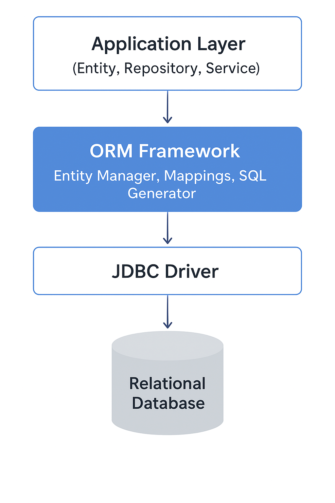
2) 
# -- most popular library of ORM in java --
ans- Hibernate : https://hibernate.org/orm/
3) as we know from LLD when ever we are using a libranry so instace of using library directy 
use the interface of that library so hibernate use the JPA(JAVAkarta persistance api)
4) hibernate is one of librany which implemnt the JPA
5) hibenate should not directy communicate with any database beacuse if in future we need to implment other database then
it will complex and change in code so for that hibernate communicate with JDBC so JDBC is implment by java vender based on databases like mysql driver, postGresQL driver etc 
6) Hibernate implennt the JPA and Database driver implemnts the JDBC
7) we are using spring data jPA to get feactures of JPA
8) 
# ------------ JPA vs Hibernate — Full Explanation ----------
Here is a **clean, clear, easy-to-remember** explanation of **JPA vs Hibernate** 👇

---

# ✅ **JPA vs Hibernate — Full Explanation**

## 🔵 **1. What is JPA? (Specification)**

**JPA → Java Persistence API**

* It is **NOT a framework**
* It is **a specification** (set of rules & guidelines)
* It tells *how* ORM should work in Java
* Contains interfaces only (e.g., `EntityManager`, `Query`, `EntityTransaction`, etc.)
* Part of Java EE (now Jakarta EE)

### ✔️ JPA provides:

* Annotations (`@Entity`, `@Id`, `@Column`)
* Query Language (JPQL)
* Standard API for ORM
  But **JPA cannot work alone** — it needs an implementation.

---

# 🔵 **2. What is Hibernate? (Implementation)**

**Hibernate → ORM Framework**
**Hibernate implements JPA** + provides extra features.

### ✔️ Hibernate provides:

* A complete ORM implementation
* Query features (HQL)
* Caching (1st & 2nd level)
* Lazy loading
* Auto schema generation
* Dirty checking
* Better performance features

Hibernate implements JPA interfaces but also adds more.

---

# 🔥 **3. Key Differences: JPA vs Hibernate**

| Feature        | JPA                 | Hibernate                                        |
| -------------- | ------------------- | ------------------------------------------------ |
| Type           | Specification       | Framework (implementation)                       |
| Contains Code? | No, only interfaces | Yes, full code                                   |
| Vendor         | Oracle (Jakarta EE) | RedHat                                           |
| Query Language | JPQL                | HQL + JPQL                                       |
| Features       | Limited (basic ORM) | Rich features (pagination, caching, batch, etc.) |
| Learning Curve | Easy                | Slightly more advanced                           |
| Schema Tools   | No                  | Yes (`hibernate.hbm2ddl.auto`)                   |

---

# 🔵 **4. Real Life Analogy**

### 🎓 JPA = Syllabus (standard rules)

### 🧑‍🏫 Hibernate = Teacher teaching the syllabus + extra things

JPA gives rules; Hibernate implements them + adds more.

---

# 🔥 **5. Example Code Difference**

### 👉 Using **JPA**

```java
import javax.persistence.EntityManager;

EntityManager em = entityManagerFactory.createEntityManager();
Product p = em.find(Product.class, 1L);
```

### 👉 Using **Hibernate (native)**

```java
import org.hibernate.Session;

Session session = sessionFactory.openSession();
Product p = session.get(Product.class, 1L);
```

Both do the same work — Hibernate just uses different APIs when not using JPA.

---

# 🟢 **6. Which Should You Use?**

### ✔️ **Always use JPA in your application layer**

Why?

* Portable
* Framework independent
* Can switch from Hibernate → EclipseLink → OpenJPA without changing code

### ✔️ Hibernate runs under the hood as the provider

Spring Boot default ORM provider = **Hibernate**

---

# ⭐ **7. When Hibernate is better?**

* You need caching (2nd level)
* Batch processing
* Multi-tenancy
* Advanced SQL features
* Better performance tuning

---

# 🎯 Final Conclusion

| JPA                         | Hibernate                     |
| --------------------------- | ----------------------------- |
| A guideline/specification   | A powerful ORM implementation |
| Defines how ORM should work | Actually performs ORM tasks   |
| Not usable alone            | Can be used standalone        |
| Portable                    | Feature-rich                  |

➡️ **JPA = Standard**
➡️ **Hibernate = Implementation of the Standard + extra power**

---

If you want, I can also generate a **side-by-side diagram (PNG)** explaining JPA vs Hibernate visually.
1) 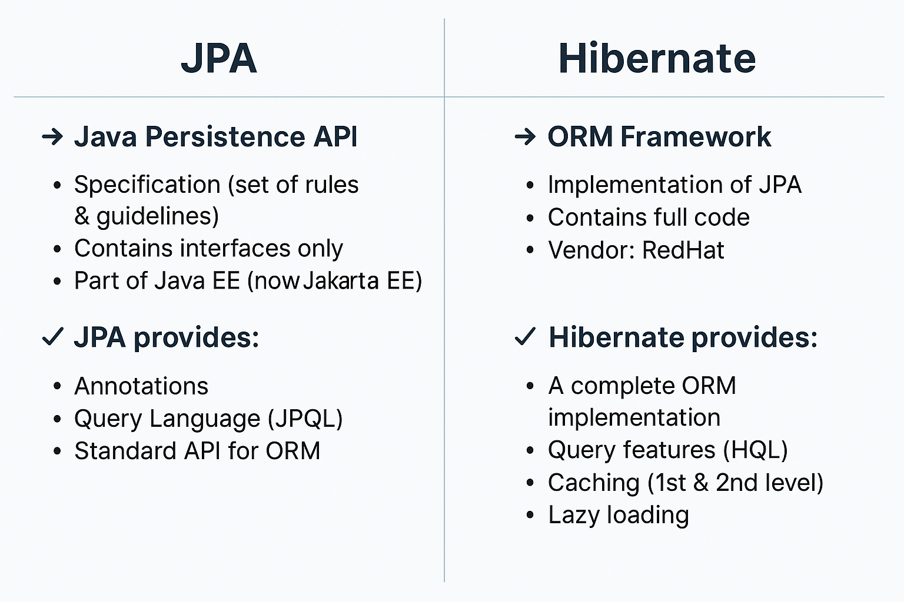
2) 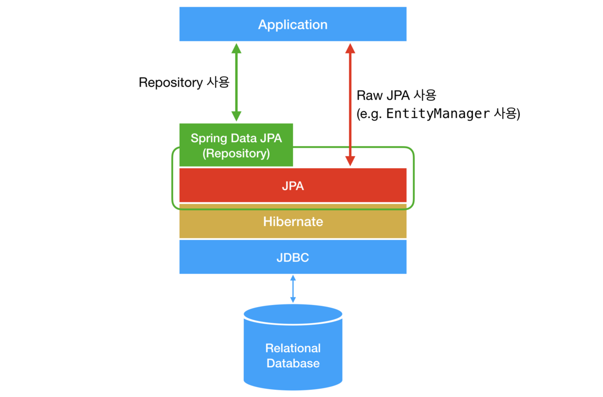

## ------- what is repository pattern --------
1) code to intract with persistance layer should be separate from the business login that is Repository pattern
2) 
The **Repository Pattern** is a **design pattern** used in software development to **separate the data access logic from the business logic**.
It provides a **clean abstraction** over the data layer (database, API, file system, etc.) and makes your application easier to maintain, test, and scale.

---

# ✅ **Simple Definition**

> **Repository Pattern acts like a middle layer between your application and the database.**
> You don’t directly talk to the database—
> instead, you talk to a **Repository**, and the Repository handles all data-related operations.

---

# 🎯 **Why do we use the Repository Pattern?**

### **1. To separate database logic from business logic**

Your service layer shouldn’t know *how* data is stored.

### **2. To make your code cleaner and testable**

You can easily mock repositories for unit tests.

### **3. To follow the Single Responsibility Principle (SRP)**

Each class has one job.

### **4. Easy to change databases**

You can switch from MySQL to MongoDB without rewriting the whole code—only the repository changes.

---

# 🏗️ **Repository Pattern Architecture**

```
Controller → Service → Repository → Database
```

* **Controller**: Handles HTTP requests
* **Service**: Contains business logic
* **Repository**: Handles CRUD operations
* **Database**: Stores data

---

# 📦 **Example (Java Spring Boot)**

### **Entity**

```java
@Entity
public class Product {
    @Id
    @GeneratedValue(strategy = GenerationType.IDENTITY)
    private Long id;

    private String name;
    private double price;
}
```

### **Repository**

```java
@Repository
public interface ProductRepository extends JpaRepository<Product, Long> {
}
```

### **Service**

```java
@Service
public class ProductService {

    @Autowired
    private ProductRepository productRepository;

    public Product getProduct(Long id) {
        return productRepository.findById(id)
                .orElseThrow(() -> new RuntimeException("Product not found"));
    }
}
```

### **Controller**

```java
@RestController
public class ProductController {

    @Autowired
    private ProductService service;

    @GetMapping("/product/{id}")
    public Product getProduct(@PathVariable Long id) {
        return service.getProduct(id);
    }
}
```

---

# 🧠 **Repository Pattern Benefits**

| Benefit                | Explanation                         |
| ---------------------- | ----------------------------------- |
| **Abstraction**        | Hides DB logic                      |
| **Testability**        | Mock repositories easily            |
| **Loose coupling**     | Service layer does not depend on DB |
| **Clean architecture** | Well-organized project              |
| **Flexibility**        | Easy to move/change data sources    |

---

# 🎨 **Real-Life Example**

Think of the Repository like a **waiter in a restaurant**:

* Controller = Customer
* Service = Chef
* Repository = Waiter
* Database = Kitchen

Customer never directly goes to the kitchen — the waiter handles all the communication.

---

If you want, I can also generate a **PNG diagram** showing the Repository Pattern visually.

# ---------- what id repository, dto, and dao ----------
Here is a **simple, clear, and complete explanation** of **Repository**, **DTO**, and **DAO**, including how they differ and why we use them.

---

# ✅ **1. DAO (Data Access Object)**

### **Definition**

DAO is a design pattern that **directly interacts with the database**.

* It contains **SQL queries** or ORM/Hibernate/JPA methods.
* Used to isolate persistence logic from business logic.

### **Example**

```java
public class UserDao {

    public User getUser(int id) {
        // SQL or ORM call
    }

    public void saveUser(User userSingleTable) {
        // SQL or ORM call
    }
}
```

### **Purpose**

* Encapsulate all database interaction.
* Hide SQL, JDBC, Hibernate calls inside one class.

---

# ✅ **2. Repository**

### **Definition**

Repository is a **higher-level abstraction** built on top of DAO.

DAO → database specific
Repository → domain specific

Repository returns **business objects** (domain models), not raw DB objects.

### **Example (Spring Boot)**

Spring Boot uses Repository Pattern through **Spring Data JPA**:

```java
@Repository
public interface UserRepository extends JpaRepository<User, Integer> {
}
```

👉 Here you did **not write any SQL**
👉 Repository hides DB internals completely

### **Purpose**

* Convert low-level DB calls (DAO) into higher-level domain operations.
* Provide a cleaner interface for your service layer.

---

# 🔎 **DAO vs Repository (Simple Difference)**

| DAO                   | Repository                         |
| --------------------- | ---------------------------------- |
| Low-level             | High-level                         |
| Database-focused      | Domain-focused                     |
| Often contains SQL    | Contains business-friendly methods |
| Deals with tables     | Deals with aggregates/entities     |
| Manual implementation | Spring Data auto-generates code    |

---

# ⭐ Best Example

If you have a `User` entity:

### DAO style:

```java
userDao.findById();
userDao.insert();
userDao.update();
```

### Repository style:

```java
userRepositorySingleTable.findById();
userRepositorySingleTable.save();
userRepositorySingleTable.delete();
```

**Repository is cleaner and more abstract.**

---

# ✅ **3. DTO (Data Transfer Object)**

### **Definition**

DTO is a **simple Java class used for sending data between layers (or services)**.

It is NOT an entity.
It is NOT connected to database.

Used to shape the JSON payload or response.

---

### Example

**Entity (DB Model)**:

```java
@Entity
public class User {
    private int id;
    private String name;
    private String password;
}
```

**DTO (safe to return in API)**:

```java
public class UserDto {
    private int id;
    private String name;  // no password included
}
```

Used for **security, clean API responses, and separating concerns**.

---

# ⭐ Summary Table

| Concept        | Used For                    | Contains                | Where Used             |
| -------------- | --------------------------- | ----------------------- | ---------------------- |
| **DAO**        | DB access                   | SQL / ORM operations    | Persistence layer      |
| **Repository** | Domain-level abstraction    | High-level CRUD methods | Service layer          |
| **DTO**        | Data transfer across layers | Only required fields    | Controller/service/API |

---

# 📌 How They Work Together (Architecture)

```
Controller  →  Service  →  Repository/DAO  →  Database
     ↑             ↓
     |—— receives & returns DTOs ——|
```

---

# 🎯 Final Simple Definitions

### **DAO** → Talks to the **database**

### **Repository** → Talks to **services** and wraps DAO/ORM

### **DTO** → Sends **data safely** between layers/API

---

If you want, I can generate a **full diagram PNG** showing the flow of Repository, DAO, and DTO together.

## ----- is DAO same as repository ---------
Short answer: **NO — DAO and Repository are NOT the same**, although they are similar and related.

Below is the **exact difference** in a simple, clear way 👇

---

# ✅ **DAO vs Repository — Simple Explanation**

## **1️⃣ DAO (Data Access Object)**

* Focused on **database operations** (SQL/JDBC/HQL/JPA calls).
* Works at a **low level** of persistence.
* Think of DAO as:
  **“How do I store/fetch this data from the database?”**

### Example:

```java
public class UserDao {
    public UserEntity getUserById(int id) { }
    public void saveUser(UserEntity userSingleTable) { }
}
```

DAO hides raw DB logic and SQL.

---

## **2️⃣ Repository Pattern**

* Works at a **higher domain level**.
* Hides both **database** and **ORM (Hibernate/JPA)** details.
* You work directly with domain objects (entities).
* Repository is like a **collection** of objects:

  **“Give me all users”, “save this userSingleTable”, “find by email”**, etc.

### Example (Spring Boot):

```java
@Repository
public interface UserRepository extends JpaRepository<User, Integer> {}
```

Spring creates full implementation (DAO-like code) under the hood.

---

# ⭐ So Are They the Same?

### ❌ **No, they are not the same.**

### But…

### ✔ They are related

### ✔ Repository often *uses* DAO internally

### ✔ Spring Data JPA combines both patterns

---

# 🔥 **Simple One-Line Difference**

### ⚙ DAO → database-focused (SQL/ORM operations)

### 🧠 Repository → business/domain-focused (acts like an in-memory collection)

---

# 🏛 Example to Understand Better

## **DAO Style**

You think about tables:

```java
userDao.getUserById(10); 
userDao.saveUser(userSingleTable);
```

## **Repository Style**

You think about domain model:

```java
userRepositorySingleTable.findById(10);
userRepositorySingleTable.save(userSingleTable);
```

---

# 💡 Why Spring uses “Repository” instead of “DAO”?

Because Repository:

* Is more expressive
* Closer to domain-driven design
* Avoids writing SQL manually
* Works smoothly with JPA/Hibernate

Spring Data JPA internally **auto-generates the DAO layer**, so you only write **Repository interfaces**.

---

# 🎯 Final Answer

### **DAO ≠ Repository**

But Spring Data JPA **blends both**, so many developers confuse them.

---

If you want, I can generate a **diagram PNG** showing DAO vs Repository visually.
1) 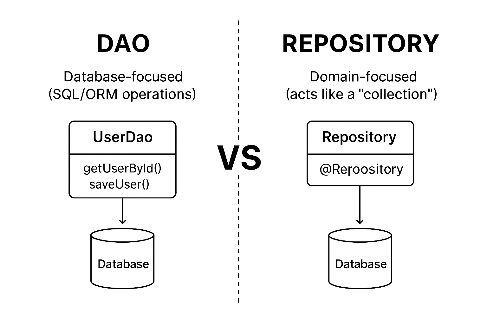
2) 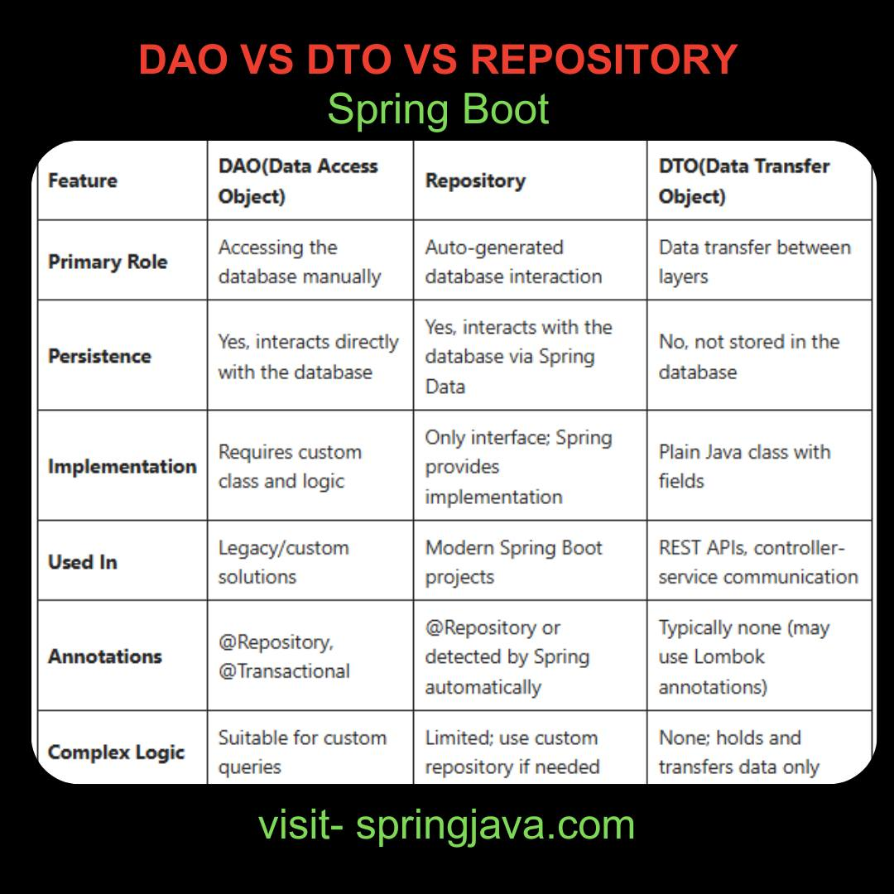
3) 
## ---- most important flow -------- 
1) userSingleTable=>controller=>service=>Repository=>Spring Data JPA => JPA=>Hibernate=> JDBC=> mysql driver => database
2) adding dependecy 

```declarative
<!-- https://mvnrepository.com/artifact/org.springframework.boot/spring-boot-starter-data-jpa -->
<dependency>
    <groupId>org.springframework.boot</groupId>
    <artifactId>spring-boot-starter-data-jpa</artifactId>
    <version>4.0.0</version>
</dependency>
```
```declarative
 <dependency>
      <groupId>com.mysql</groupId>
      <artifactId>mysql-connector-j</artifactId>
      <scope>runtime</scope>
    </dependency>
```
## ------ @MappedSuperclass ----------
`@MappedSuperclass` (correct spelling) is a **JPA annotation** used to create a **base class whose fields should be inherited by child entity classes**, BUT **the base class itself does NOT become a table in the database**.

---

# ✅ **What is `@MappedSuperclass`?**

`@MappedSuperclass` is used when you want to **share common fields** (like `id`, `createdAt`, `updatedAt`) across multiple entity classes **without creating a separate database table** for the superclass.

---

# 🧠 **Simple Definition**

**A superclass that provides common mappings for child entities but is NOT an entity itself and NOT mapped to any table.**

---

# 🎯 **Use Case**

Use `@MappedSuperclass` when:

* You want **inherited fields** inside multiple entity classes.
* You **do not want** a separate table in DB for that parent class.
* You want clean, reusable code.

---

# 🏗 **Example**

### **Base Class**

```java
@MappedSuperclass
public abstract class BaseEntity {

    @Id
    @GeneratedValue(strategy = GenerationType.IDENTITY)
    private Long id;

    private LocalDateTime createdAt;
    private LocalDateTime updatedAt;
}
```

### **Child Entity 1**

```java
@Entity
public class Product extends BaseEntity {
    private String name;
    private Double price;
}
```

### **Child Entity 2**

```java
@Entity
public class Customer extends BaseEntity {
    private String email;
    private String phone;
}
```

---

# 🧾 **Database Result**

Tables created:

✔ `product`
✔ `customer`

But **NO table for `BaseEntity`**.
Fields from BaseEntity go inside both tables:

| product table | customer table |
| ------------- | -------------- |
| id            | id             |
| created_at    | created_at     |
| updated_at    | updated_at     |
| name          | email          |
| price         | phone          |

---

# 🆚 `@MappedSuperclass` vs `@Inheritance`

| Feature               | `@MappedSuperclass` | `@Inheritance`               |
| --------------------- | ------------------- | ---------------------------- |
| Parent table created? | ❌ No                | ✔ Yes                        |
| Can be queried?       | ❌ No                | ✔ Yes                        |
| Used for?             | Code reuse          | Polymorphic DB relationships |
| Best for?             | Common fields       | Entity inheritance strategy  |

---

# 📝 Summary

`@MappedSuperclass` is used when:

* The parent is **NOT an entity**.
* The parent has **common fields**.
* Child entities **inherit fields directly**.
* **No table is created** for the parent.

---

If you want, I can also show:

📌 A **visual diagram**
📌 A **real-world example**
📌 `@Inheritance` vs `@MappedSuperclass` PNG comparison

Just tell me!

## ---------- UUId with full notes -----
Below is a **complete, beginner-friendly + interview-level + practical** explanation of **UUID** with examples, benefits, drawbacks, types, how to use in Java/Spring Boot, and diagrams.

---

# 🌟 **What is UUID? (Full Notes)**

**UUID = Universally Unique Identifier**

It is a **128-bit** unique ID used to identify objects in a system without relying on incremental numbers like 1, 2, 3…

Example UUID:

```
550e8400-e29b-41d4-a716-446655440000
```

A UUID is designed so that **no two UUIDs are the same** anywhere in the world — even if generated on different machines.

---

# 🎯 **Why UUID?**

UUID is used when you need **unique IDs** that:

✔ Do not depend on database auto-increment
✔ Can be generated at application level
✔ Useful in distributed systems
✔ Hard to guess (good for security)

Typical use cases:

* User IDs
* Order IDs
* Payment IDs
* In microservices
* File uploads
* Public APIs

---

# 🧠 **How UUID Works Internally?**

UUID is **128 bits**, represented as **32 hexadecimal characters**:

```
xxxxxxxx-xxxx-Mxxx-Nxxx-xxxxxxxxxxxx
```

Where:

* **M = version**
* **N = variant**

Example structure:

```
550e8400-e29b-41d4-a716-446655440000
```

Here:

* `4` = Version 4 UUID (random)
* `a` = Variant (type of UUID)

---

# 🧩 **Types of UUID (Important for Interviews)**

## **1. UUID Version 1 – Time-based**

* Uses timestamp + MAC address
* Very unique, can be traced to the machine
* Not secure (reveals device MAC)

## **2. UUID Version 2 – DCE Security**

* Rarely used
* Includes POSIX UID/GID

## **3. UUID Version 3 – Name-based (using MD5)**

* Deterministic
* Same input → same UUID
* Not secure because MD5 is weak

## **4. UUID Version 4 – Random UUID (MOST COMMON)**

* Purely random
* Very secure
* Used by default in Java and Spring Boot

## **5. UUID Version 5 – Name-based (using SHA-1)**

* Deterministic
* More secure than version 3

---

# 📌 **UUID vs Auto Increment ID**

| Feature                 | Auto Increment (1,2,3) | UUID        |
| ----------------------- | ---------------------- | ----------- |
| Generated by            | Database               | Application |
| Unique Globally         | ❌ No                   | ✔ Yes       |
| Secure                  | ❌ No                   | ✔ Yes       |
| Guessable               | ✔ Easy                 | ❌ Very hard |
| For distributed systems | ❌ Bad                  | ✔ Best      |
| Index performance       | ✔ Faster               | ❌ Slower    |

---

# ⚙️ **UUID in Java**

Generate UUID:

```java
UUID id = UUID.randomUUID();
System.out.println(id);
```

Generate UUID from string:

```java
UUID id = UUID.fromString("550e8400-e29b-41d4-a716-446655440000");
```

---

# ⚙️ **UUID in Spring Boot (JPA Entity)**

## **✔ Using UUID as Primary Key**

### **Step 1: Create Entity**

```java
@Entity
public class Product {

    @Id
    @GeneratedValue
    private UUID id;

    private String name;
}
```

Spring automatically generates UUID Version 4.

---

## **✔ UUID with Hibernate strategy**

```java
@Id
@GeneratedValue(generator = "UUID")
@GenericGenerator(
    name = "UUID",
    strategy = "org.hibernate.id.UUIDGenerator"
)
@Column(updatable = false, nullable = false)
private UUID id;
```

---

# ⚙️ **Database Column Type (Very Important)**

### For MySQL:

Use **BINARY(16)** (Best performance)

```sql
id BINARY(16) PRIMARY KEY
```

Text version (slower):

```sql
id CHAR(36)
```

---

# ⚠️ **Disadvantages of UUID**

| Disadvantage        | Explanation                                      |
| ------------------- | ------------------------------------------------ |
| Slow indexing       | UUIDs are random → index tree becomes fragmented |
| Large size          | UUID = 16 bytes vs integer = 4 bytes             |
| Hard to read        | Not human-friendly IDs                           |
| No sequence meaning | Cannot sort easily                               |

---

# 🌍 **Where UUID is Best?**

✔ Microservices
✔ Distributed databases
✔ Public APIs
✔ Payment/order tracking
✔ Document management
✔ Authentication tokens

---

# 🎨 **UUID Visual Diagram**

(Simplified conceptual view)

```
+-------------------------------------------------+
|                   UUID (128-bit)                |
+-------------------------------------------------+
| 60-bit timestamp | 16-bit clock | 48-bit MAC    |  --> Version 1
+-------------------------------------------------+

+-------------------------------------------------+
|                Random 122 bits                  |  --> Version 4 (Most used)
+-------------------------------------------------+

+-------------------------------------------------+
|  Name + Namespace --(MD5/SHA1)--> Hash (UUID)   |  --> Version 3/5
+-------------------------------------------------+
```

---

# 🎁 **Quick Revision Notes**

* UUID = Universally Unique Identifier
* 128-bit, 36 characters
* Types: v1(time), v4(random), v3/v5(name)
* Best for distributed systems
* More secure than auto-increment
* Slightly slower in DB indexing

---

If you want, I can also provide:

📌 UUID vs ULID vs Snowflake IDs
📌 UUID architecture PNG diagram
📌 UUID implementation in Spring Boot project

Just tell me!
1) 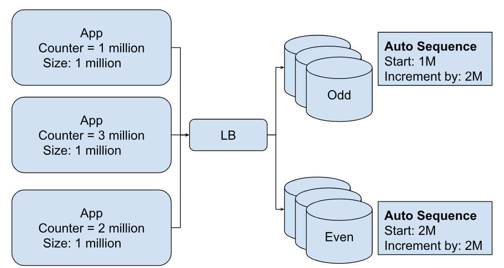
2) 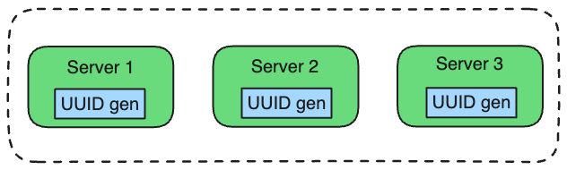

```declarative
@MappedSuperclass
public class BaseModel {
@Id
@GeneratedValue(generator = "uuidgenerator")
@GenericGenerator(name = "uuidgenerator",strategy = "org.hibernate.id.UUIDGenerator")
@Column(name = "id", columnDefinition = "binary(16)", nullable = false, updatable = false)
private UUID id;

}
error is:
org.hibernate.annotations.GenericGenerator' is deprecated since version 6.5 and marked for removal 
```
You're seeing this warning because **Hibernate 6.5 deprecated `@GenericGenerator`** and the old `org.hibernate.id.UUIDGenerator`.
Hibernate now provides **new built-in UUID generators** that you should use instead.

---

# ✅ **Modern (Hibernate 6.5+) UUID Generation — Recommended Approach**

Hibernate now recommends using:

### **1️⃣ `@UuidGenerator` (MOST MODERN)**

Works with both `UUID` and `String` fields.

### **2️⃣ `@GeneratedValue(strategy = GenerationType.UUID)`**

JPA-standard since Hibernate 6.

---

# ✅ **Best Updated Version of Your Code**

### **Use `@UuidGenerator(style = UuidGenerator.Style.RANDOM)`**

```java
import jakarta.persistence.*;
import org.hibernate.annotations.UuidGenerator;
import java.util.UUID;

@MappedSuperclass
public class BaseModel {

    @Id
    @UuidGenerator(style = UuidGenerator.Style.RANDOM)  // NEW RECOMMENDED
    @Column(name = "id", columnDefinition = "BINARY(16)", updatable = false, nullable = false)
    private UUID id;

}
```

---

# 🆚 Old Way vs New Way

| Old (Deprecated)                 | New (Recommended)                   |
| -------------------------------- | ----------------------------------- |
| `@GenericGenerator`              | `@UuidGenerator`                    |
| `org.hibernate.id.UUIDGenerator` | Built-in Hibernate 6 UUID generator |
| Custom generator name            | No need for custom names            |

---

# ⭐ **Alternatively (Simple JPA Way)**

If you want to use only JPA annotations (no Hibernate annotations):

```java
@Id
@GeneratedValue(strategy = GenerationType.UUID)
@Column(name = "id", columnDefinition = "BINARY(16)", updatable = false, nullable = false)
private UUID id;
```

✔ Works in Hibernate 6
✔ JPA standard
❌ Slightly slower than Hibernate's optimized generator

---

# 🧠 When to Use Which?

### **Use `@UuidGenerator`**

* Best performance
* Best Hibernate 6 compatibility
* Recommended for most apps

### **Use `GenerationType.UUID`**

* If you want pure JPA compatibility
* Slight performance overhead

---

# 🔍 Why BINARY(16)?

UUID as string = `"550e8400-e29b-41d4-a716-446655440000"` → 36 chars
UUID as binary = 16 bytes → **smaller + faster**

MySQL stores UUID best as:

```sql
BINARY(16)
```

---

# 💬 If you want, I can also generate:

✅ PNG diagram for UUID generator architecture
✅ Example with BaseEntity + auditing (createdAt, updatedAt)
✅ JPA + Hibernate full UUID cheatsheet

Just tell me!


## -------- how to Representing Inheritance -------
In JPA/Hibernate, representing **inheritance** means mapping Java class inheritance (OOP) to database tables.
There are **three inheritance strategies**, each with different behavior and use-cases.

---

# ✅ **1. Inheritance Strategies in JPA/Hibernate**

JPA provides these annotations:

* `@Inheritance(strategy = …)`
* `@DiscriminatorColumn`
* `@DiscriminatorValue`
* `@MappedSuperclass`

---

# ⭐ **(A) SINGLE_TABLE Strategy — Default & Fastest**

### ✔ How it works

* **One table** for all parent + child fields.
* Adds a special column (Discriminator Column) to identify subclasses.

### ✔ Advantages

* Fastest (only one table join).
* Simple schema.

### ❌ Disadvantages

* Many null columns (because child-specific fields cannot be filled for others).
* Not normalized.

### ✔ Example

```java
@Entity
@Inheritance(strategy = InheritanceType.SINGLE_TABLE)
@DiscriminatorColumn(name = "type")
public class Payment {  
    @Id  
    private Long id;  
    private Double amount;  
}

@Entity
@DiscriminatorValue("CASH")
public class CashPayment extends Payment {  
    private String cashCounter;  
}

@Entity
@DiscriminatorValue("CARD")
public class CardPayment extends Payment {  
    private String cardNumber;  
}
```

---

# ⭐ **(B) JOINED Strategy — Normalized, Uses Joins**

### ✔ How it works

* Parent class → one table
* Child class → separate table + FK to parent table
* When fetching a child → requires JOIN

### ✔ Advantages

* Clean schema (normalized)
* No null columns
* Good for large enterprise apps
* it will fast when you required the data of parent class


### ❌ Disadvantages

* Slower due to joins
* More complex schema
* it will show when you required to fetch the data of child class due to Join
* 

### ✔ Example

```java
@Entity
@Inheritance(strategy = InheritanceType.JOINED)
public class Vehicle {  
    @Id  
    private Long id;  
    private String brand;  
}

@Entity
public class Car extends Vehicle {  
    private int doors;  
}

@Entity
public class Bike extends Vehicle {  
    private boolean electric;  
}
```

---

# ⭐ **(C) TABLE_PER_CLASS — Each Class Gets Its Own Table**

### ✔ How it works

* Parent class has a table.
* Each child class **also** has its own complete table (with parent fields copied).

### ✔ Advantages

* No joins.
* Fast reads (child tables independent).
* query on child class object will fast 

### ❌ Disadvantages

* Duplicate columns across tables.
* Queries involving parent types become slow (UNION required).
* query on parent class will show

### ✔ Example

```java
@Entity
@Inheritance(strategy = InheritanceType.TABLE_PER_CLASS)
public class User {  
    @Id  
    private Long id;  
    private String name;  
}

@Entity
public class Admin extends User {  
    private String role;  
}

@Entity
public class Customer extends User {  
    private String address;  
}
```

---

# ⭐ **(D) @MappedSuperclass — No Table for Parent**

### ✔ How it works

* Only **child tables** exist.
* Parent fields copied into child’s table.
* Not a real entity (cannot be queried).

### ✔ When to use?

* Shared common fields like:

    * createdAt
    * updatedAt
    * id
    * audit fields

### ✔ Example

```java
@MappedSuperclass
public class BaseModel {
    @Id
    private UUID id;
    private LocalDate createdAt;
}

@Entity
public class Product extends BaseModel {
    private String name;
}

@Entity
public class Order extends BaseModel {
    private Double total;
}
```

---

# 📌 Summary Table of Strategies

| Strategy             | Tables          | Speed                | Normalization       | Use Case                     |
| -------------------- | --------------- | -------------------- | ------------------- | ---------------------------- |
| **SINGLE_TABLE**     | 1               | ⭐ Fastest            | ❌ Bad               | Small apps, simple hierarchy |
| **JOINED**           | Many            | Medium               | ⭐ Best              | Enterprise apps              |
| **TABLE_PER_CLASS**  | Many            | Fast for child reads | ❌ Duplicate columns | If parent queries rare       |
| **MappedSuperclass** | No parent table | N/A                  | N/A                 | Common fields only           |

---

# 📘 If you want → I can create a **PNG diagram** showing all inheritance strategies side-by-side.

Just say: **"Give PNG diagram of inheritance strategies"**.
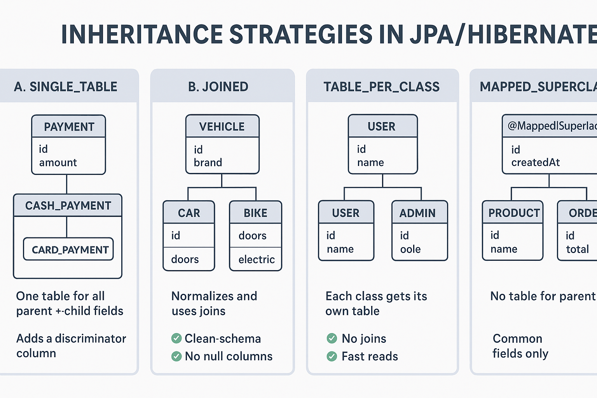

## ------------ Lecture | BE: DB: Queries, Inheritance, Relations --------
# --------- representing cardinalities and representing inheritance ---
1) Cardinality and inheritance are two fundamental concepts used in different aspects of system design and programming:
2) 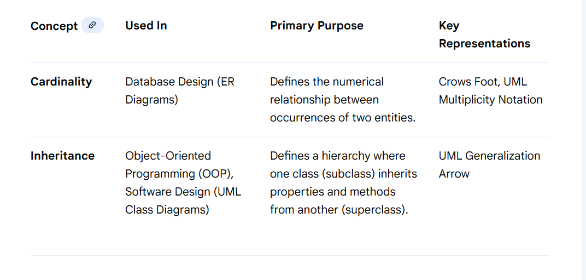
   Here are the **two terms explained clearly** — **Representing Cardinalities** and **Representing Inheritance** — with **full notes**, diagrams (text-based), and examples from **Spring Boot + JPA/Hibernate + Database modeling**.

---

# ✅ **1. Representing Cardinalities**

**Cardinality** means **how many instances of one entity relate to how many instances of another entity**.

It is used in:
✔ Database design
✔ ER diagrams
✔ JPA / Hibernate (Spring Boot) relationship mappings
✔ UML diagrams

---

## **📌 Types of Cardinalities**

### **1. One-to-One (1:1)**

One record in A is linked to exactly one record in B.

**Example:**
A person has exactly one passport.

**JPA Example:**

```java
@OneToOne
@JoinColumn(name = "passport_id")
private Passport passport;
```

**ER Diagram (ASCII):**

```
Person 1 ---- 1 Passport
```

---

### **2. One-to-Many (1:N)**

One record in A relates to multiple records in B.

**Example:**
One department has many employees.

**JPA Example:**

```java
@OneToMany(mappedBy = "department")
private List<Employee> employees;
```

**ER Diagram:**

```
Department 1 ----< Employees (N)
```

---

### **3. Many-to-One (N:1)**

Multiple rows in A refer to a single row in B.

Often the reverse of 1:N.

**JPA Example:**

```java
@ManyToOne
@JoinColumn(name = "department_id")
private Department department;
```

---

### **4. Many-to-Many (M:N)**

Records in A relate to multiple records in B, and vice-versa.

**Example:**
A student can take many courses, and a course has many students.

**JPA Example:**

```java
@ManyToMany
@JoinTable(
    name = "student_course",
    joinColumns = @JoinColumn(name = "student_id"),
    inverseJoinColumns = @JoinColumn(name = "course_id")
)
private List<Course> courses;
```

**Diagram:**

```
Students >----< Courses
```

---

# 📌 Why Cardinalities are Important?

| Reason                         | Explanation                                               |
| ------------------------------ | --------------------------------------------------------- |
| Database normalization         | Helps to structure tables correctly                       |
| JPA Relationship configuration | Determines annotations (`@OneToMany`, `@ManyToOne`, etc.) |
| Foreign key creation           | FK comes from cardinality mapping                         |
| Performance                    | Affects lazy/eager fetching                               |
| Real-world modeling            | Helps match software to real data flow                    |

---

# ✅ **2. Representing Inheritance**

**Inheritance** = modeling a parent–child structure among entities.

Used in:
✔ OOP (Java classes)
✔ JPA/Hibernate entity mapping
✔ UML diagrams
✔ Database design

---

## **📌 Types of JPA Inheritance Strategies**

### **1. SINGLE_TABLE**

All child classes stored in **one table**. beacuse it is going to create table for parent class object and in that combine all child
class object

**Pros:** Fast, simple,
**Cons:** Many null columns

**Example:**

```java
@Entity
@Inheritance(strategy = InheritanceType.SINGLE_TABLE)
@DiscriminatorColumn(name = "type")
public class User {}

@Entity
public class Admin extends User {}
```

**Diagram:**

```
User TABLE
-----------------------------
id | name | adminField | studentField | type
```

---
1) 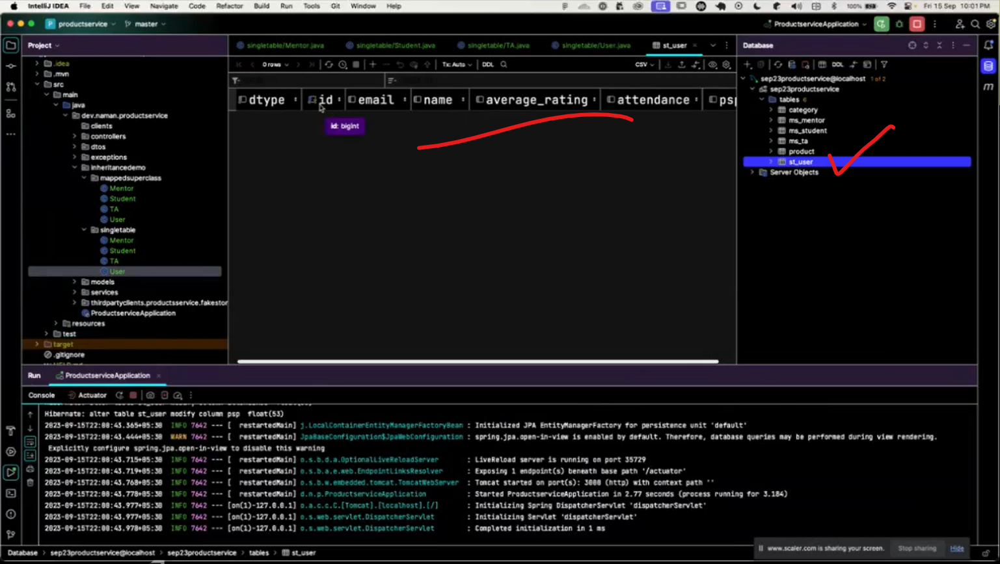
2) 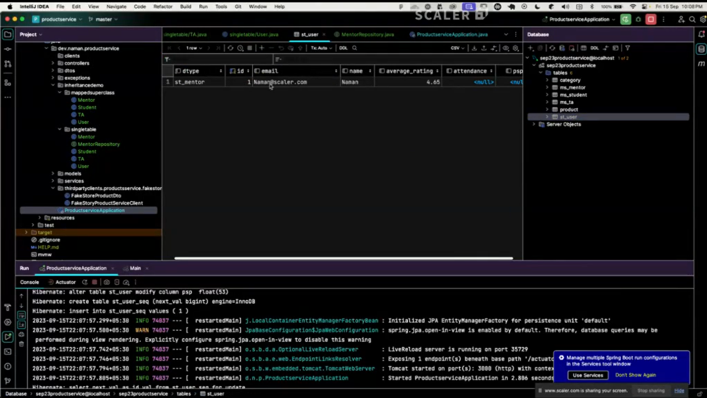


Your error is **100% correct and expected**:

```
Entity ... Mentor is a subclass in a SINGLE_TABLE hierarchy 
and may not be annotated @Table
```

---

# ✅ WHY ERROR IS COMING?

When you use:

```java
@Inheritance(strategy = InheritanceType.SINGLE_TABLE)
```

👉 **Only the PARENT class** is allowed to have:

* `@Table(name="...")`

👉 **Child classes MUST NOT have `@Table`**
because all children share **one single table** → the parent’s table.

---

# ❌ YOU DID WRONG:

You added:

```java
@Table(name = "st_mentor")
@Table(name = "st_student")
@Table(name = "st_ta")
```

This is NOT allowed in **SINGLE_TABLE** strategy.

---

# ✅ FIX (VERY SIMPLE)

### ❌ Remove `@Table` from child entities

### ✔ Keep only on parent

---

## ✅ Corrected Classes

### ✔ Base parent class => ALLOWED to have table mapping

```java
@Data
@Entity
@Table(name = "st_user")
@Inheritance(strategy = InheritanceType.SINGLE_TABLE)
@DiscriminatorColumn(name = "dtype")
public class User {

    @Id
    @GeneratedValue(strategy = GenerationType.UUID)
    private UUID id;

    private String name;
    private String email;
}
```

---

### ✔ Child class Mentor (NO @Table)

```java
@Data
@Entity
public class Mentor extends User {
    private double avg_rating;
}
```

---

### ✔ Child class Student (NO @Table)

```java
@Data
@Entity
public class Student extends User {
    private double psp;
    private double attendance;
}
```

---

### ✔ Child class TA (NO @Table)

```java
@Data
@Entity
public class TA extends User {
    private double ave_rating;
}
```

---

# 🔥 AFTER FIX

Hibernate will automatically generate a **single table**:

## **st_user table**

with columns:

| id   | name   | email  | avg_rating | psp    | attendance | ave_rating | dtype  |
| ---- | ------ | ------ | ---------- | ------ | ---------- | ---------- | ------ |
| UUID | string | string | DOUBLE     | DOUBLE | DOUBLE     | DOUBLE     | string |

---

# 🎉 Your INSERT will work:

```
insert into st_user (email, name, avg_rating, dtype, id)
values (...)
```

---

# ⚠️ IMPORTANT

You **must** add the following in application.properties if table not created:

```properties
spring.jpa.hibernate.ddl-auto=update
```

---

If you want, I can also generate:

✔ SQL schema for SINGLE_TABLE
✔ PNG diagram showing Single Table inheritance
✔ Samples for JOINED or TABLE_PER_CLASS inheritance

Just say **"generate diagram"**.

1) 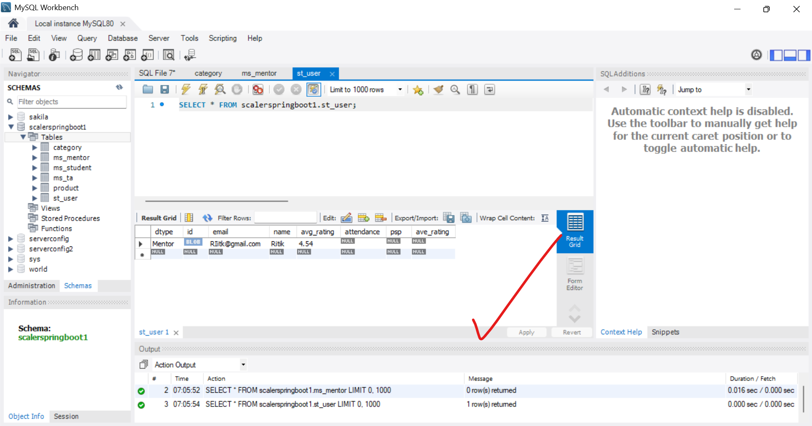
2) 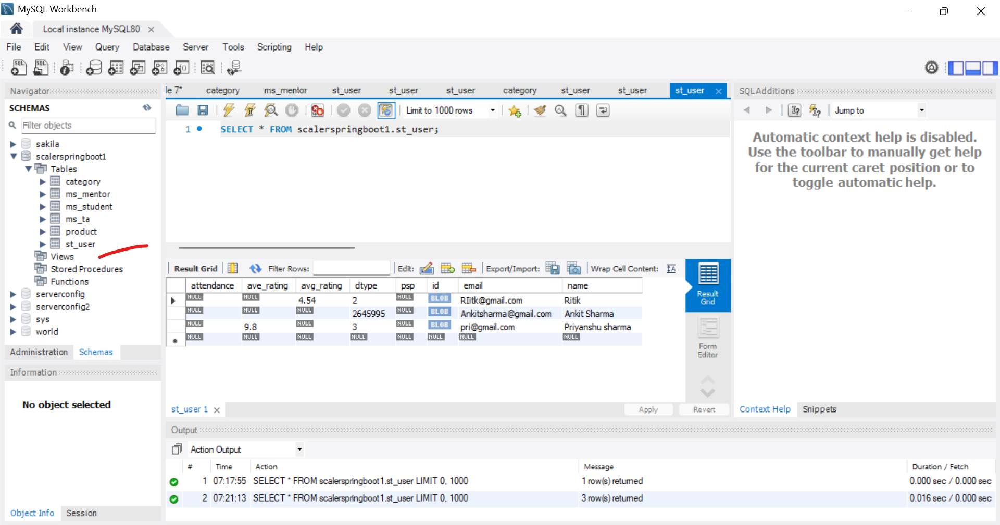

### **2. JOINED**

Parent table + separate child tables.

**Pros:** 
1) Normalized.
2) query on parent class object will fast beacuse at that time not required the Join
-----
**Cons:** 
1) More joins (slower).
2) query on child class object will show due to join


**Example:**

```java
@Entity
@Inheritance(strategy = InheritanceType.JOINED)
public class Payment {}

@Entity
public class CardPayment extends Payment {}
```

**Diagram:**

```
Payment Table ---- join ---- CardPayment Table
```

---

### **3. TABLE_PER_CLASS**

Each child table contains full data (no parent table join).

**Pros:** Fast reading
**Cons:** Data duplication

**Example:**

```java
@Entity
@Inheritance(strategy = InheritanceType.TABLE_PER_CLASS)
public class Vehicle {}

@Entity
public class Car extends Vehicle {}
```

---
example
Below is the **correct and complete setup for Table-Per-Class (TPC) inheritance** in Spring Boot + JPA **based on your existing code**, with **all changes required**, including:

✅ Correct annotations
✅ Correct ID types
✅ Correct table creation
✅ Fix for your exception:
**Table 'scalerspringboot1.st_user' doesn't exist** → caused because you still used `@Table(name = "st_user")` + `SINGLE_TABLE`
But **in Table-Per-Class, every subclass has its own Table.**

---

# ✅ **Final Working Code (TABLE PER CLASS)**

### **1. Base Class → User.java**

✔ No `@Table`
✔ No `@DiscriminatorColumn`
✔ Use `InheritanceType.TABLE_PER_CLASS`
✔ ID must be **GenerationType.AUTO** (TPC requires auto, not UUID)

```java
package com.scaler1.scalerProject_1.inheritanceDemo.TablePerClass;

import jakarta.persistence.*;
import lombok.Data;

@Data
@Entity
@Inheritance(strategy = InheritanceType.TABLE_PER_CLASS)
public abstract class User {

    @Id
    @GeneratedValue(strategy = GenerationType.AUTO)
    private Long id;

    private String name;
    private String email;
}
```

---

# **2. Mentor.java (child)**

✔ REMOVE `@DiscriminatorValue` (Not used in TPC)
✔ Each subclass becomes its own table: `mentorSingleTable`

```java
package com.scaler1.scalerProject_1.inheritanceDemo.TablePerClass;

import jakarta.persistence.Entity;
import lombok.Data;

@Data
@Entity
public class Mentor extends UserTPC {
    private double avg_rating;
}
```

---

# **3. Student.java (child)**

```java
package com.scaler1.scalerProject_1.inheritanceDemo.TablePerClass;

import jakarta.persistence.Entity;
import lombok.Data;

@Data
@Entity
public class Student extends UserTPC {
    private double psp;
    private double attendance;
}
```

---

# **4. TA.java (child)**

```java
package com.scaler1.scalerProject_1.inheritanceDemo.TablePerClass;

import jakarta.persistence.Entity;
import lombok.Data;

@Data
@Entity
public class TA extends UserTPC {
    private double ave_rating;
}
```

---

# **5. Repositories**

### **UserRepository.java**

⚠ For Table-Per-Class, use `Long` ID.

```java
package com.scaler1.scalerProject_1.inheritanceDemo.TablePerClass;

import org.springframework.data.jpa.repository.JpaRepository;

public interface UserRepository extends JpaRepository<UserTPC, Long> {
}
```

### **MentorRepository.java**

```java
package com.scaler1.scalerProject_1.inheritanceDemo.TablePerClass;

import org.springframework.data.jpa.repository.JpaRepository;

public interface MentorRepository extends JpaRepository<MentorTPC, Long> {
}
```

### **TARepository.java**

```java
package com.scaler1.scalerProject_1.inheritanceDemo.TablePerClass;

import org.springframework.data.jpa.repository.JpaRepository;

public interface TARepository extends JpaRepository<TATPC, Long> {
}
```

---

# **6. Main Class**

⚠ Fix imports (they must point to TablePerClass)
⚠ Your old code had wrong imports (`SingleTable`)

```java
package com.scaler1.scalerProject_1;

import com.scaler1.scalerProject_1.inheritanceDemo.TablePerClass.*;
import org.springframework.boot.CommandLineRunner;
import org.springframework.boot.SpringApplication;
import org.springframework.boot.autoconfigure.SpringBootApplication;

@SpringBootApplication
public class ScalerProject1Application implements CommandLineRunner {

    private final MentorRepositoryTPC mentorRepositorySingleTable;
    private final UserRepositoryTPC userRepositorySingleTable;
    private final TARepositoryTPC taRepositorySingleTable;

    public ScalerProject1Application(MentorRepositoryTPC mentorRepositorySingleTable,
                                     UserRepositoryTPC userRepositorySingleTable,
                                     TARepositoryTPC taRepositorySingleTable) {
        this.mentorRepositorySingleTable = mentorRepositorySingleTable;
        this.userRepositorySingleTable = userRepositorySingleTable;
        this.taRepositorySingleTable = taRepositorySingleTable;
    }

    public static void main(String[] args) {
        SpringApplication.run(ScalerProject1Application.class, args);
    }

    @Override
    public void run(String... args) throws Exception {

        MentorTPC mentorSingleTable = new MentorTPC();
        mentorSingleTable.setName("Ritik");
        mentorSingleTable.setEmail("RIitk@gmail.com");
        mentorSingleTable.setAvg_rating(4.54);
        mentorRepositorySingleTable.save(mentorSingleTable);

        UserTPC userSingleTable = new UserTPC() {
        }; // abstract class → anonymous object
        userSingleTable.setName("Ankit Sharma");
        userSingleTable.setEmail("Ankitsharma@gmail.com");
        userRepositorySingleTable.save(userSingleTable);

        TATPC taSingleTable = new TATPC();
        taSingleTable.setName("Priyanshu Sharma");
        taSingleTable.setEmail("pri@gmail.com");
        taSingleTable.setAve_rating(9.8);
        taRepositorySingleTable.save(taSingleTable);
    }
}
```

---

# ✅ **What Tables Will Be Created?**

In **Table Per Class**, JPA creates:

| Class   | Table Name |
| ------- | ---------- |
| Mentor  | mentorSingleTable     |
| Student | student    |
| TA      | taSingleTable         |
| User    | userSingleTable       |

Each table has **its own columns** even if duplicated.

---

# ❗Why Your Error Occurred?

Your original code had:

* `@Table(name = "st_user")`
* `@Inheritance(SINGLE_TABLE)`
* `@DiscriminatorValue` in subclasses

So Hibernate tried to insert:

```
INSERT INTO st_user (...)
```

But since you wanted **Table-Per-Class**, that table **does not exist**, causing:

```
Table 'scalerspringboot1.st_user' doesn't exist
```

---

# 🎉 DONE — Now your project is fully converted to **Table-Per-Class Inheritance**, and the error is fixed.

If you want, I can also generate:

✅ Diagrams for Table-Per-Class
✅ Notes explaining Table-Per-Class vs Single-Table vs Joined
✅ SQL table structure after Hibernate creation

Just tell me **"generate diagrams"** or **"give notes for all inheritance strategies"**.

-----
## - 4. Mappend super Class
1) 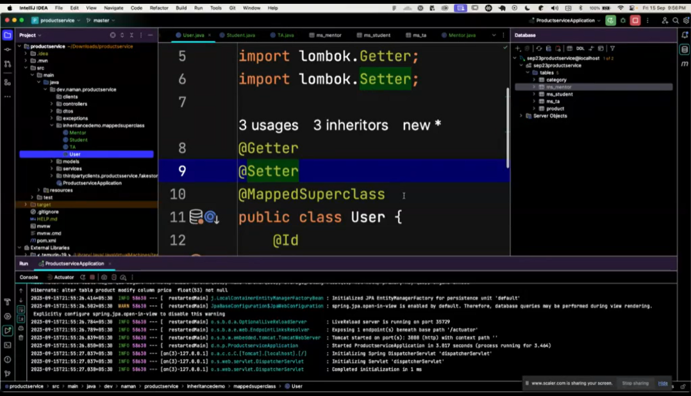
2) 
# 📌 Why Inheritance Is Used?

| Benefit                   | Explanation                          |
| ------------------------- | ------------------------------------ |
| Avoid duplicate fields    | Common fields kept in parent         |
| Clean OOP modeling        | Follows real-world concepts          |
| Reusing code              | Methods/fields inherited             |
| Better database structure | Based on chosen inheritance strategy |

---

# 🔥 **Difference Between Cardinality & Inheritance**

| Feature         | Cardinality                               | Inheritance                                        |
| --------------- | ----------------------------------------- | -------------------------------------------------- |
| Meaning         | Relationship between 2 different entities | Relationship between parent and child entity types |
| Use Case        | Mapping associations (1:N, M:N)           | Mapping hierarchy (User → Admin, Student)          |
| Annotation      | `@OneToMany`, `@ManyToOne`, etc.          | `@Inheritance`, `@MappedSuperclass`                |
| ER Diagram      | Lines connecting tables                   | Parent–child hierarchy trees                       |
| Database Effect | Creates foreign keys                      | Creates shared or separate tables for hierarchy    |

---

# ⭐ Final Summary

### **Representing Cardinalities**

* Describes **how many objects** are related (1:1, 1:N, N:1, M:N)
* Used in **database relationships**
* Implemented with **JPA relationship annotations**

### **Representing Inheritance**

* Describes **parent-child modelling**
* Used in **object oriented design & JPA**
* Implemented with **@Inheritance + strategy**

---

If you want, I can also generate:

✅ A PNG diagram of
**“Cardinalities + Inheritance Together”**
in one big architecture chart.

Just say **“generate combined diagram”**.
1) 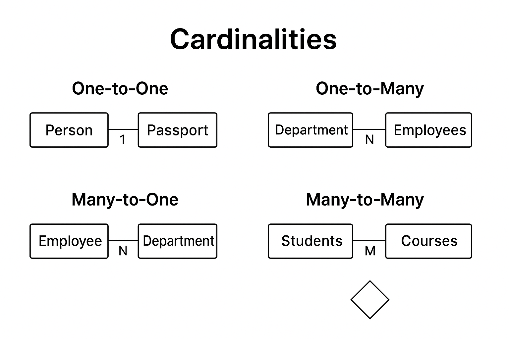
2) 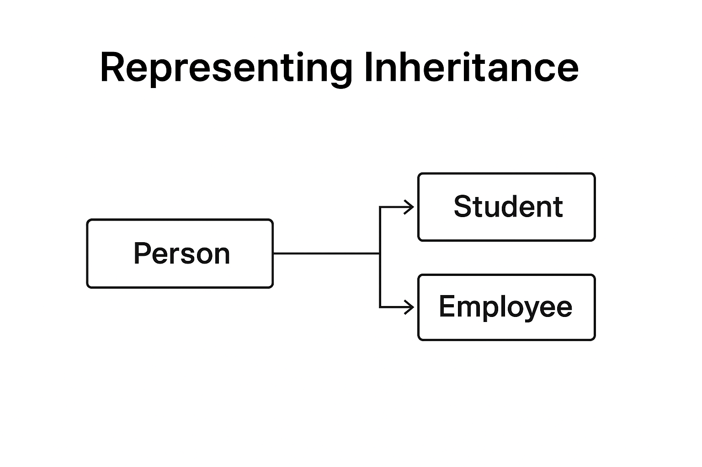

Let’s unravel this whole **inheritance carnival** in your Spring Boot app, Ritik, and walk through **what tables are created**, **why they exist**, and **how your run() method behaves** across all four inheritance strategies.
Think of this as a small parade of database tables, each with its own personality 🎭.

---

# 🌿 Part 1: How Spring Boot Executes Your Code

Your `ScalerProject1Application` class implements `CommandLineRunner`, so when Spring Boot starts:

1. ApplicationContext loads repositories.
2. Hibernate creates schema based on annotations.
3. `run()` executes.
4. It starts inserting sample data one block at a time.

If any table doesn’t exist, Hibernate panics and throws the error you got earlier.

---

# 🧬 Part 2: What Tables Are Created AND WHY

You have **4 different inheritance strategies**, each living in different packages.

Hibernate creates a complete set of tables for each strategy.

---

# 🍱 **1) SINGLE TABLE STRATEGY**

Annotations used:

```java
@Entity
@Inheritance(strategy = InheritanceType.SINGLE_TABLE)
@DiscriminatorColumn(name = "dtype")
```

### ✔ What tables will be created?

Only **ONE TABLE**:

### **st_user**

With columns like:

| Column     | Meaning                   |
| ---------- | ------------------------- |
| id         | PK                        |
| name       | parent                    |
| email      | parent                    |
| avg_rating | child field (Mentor)      |
| ave_rating | child field (TA)          |
| psp        | child field (Student)     |
| attendance | child field (Student)     |
| dtype      | which child type inserted |

### ✔ Why?

Because **all children share a single table**, and differences are tracked through `dtype`.

### ✔ What entries will be saved?

* MentorSingleTable row → dtype = `"st_mentor"`
* StudentSingleTable row → dtype = `"st_student"`
* TASingleTable row → dtype = `"st_ta"`

🌟 **Single table is the fastest and easiest, but the table becomes very wide.**

---

# 🧩 **2) JOINED STRATEGY**

Annotations:

```java
@Entity
@Inheritance(strategy = InheritanceType.JOINED)
```

### ✔ What tables are created?

1. **user_joined** (base table)
2. **mentor_joined** (child table)
3. **student_joined** (child table)
4. **ta_joined** (child table)

### ✔ Why?

Hibernate separates shared fields and child-specific fields.

### Example:

**user_joined**

| id | name | email |

**mentor_joined**

| id | avg_rating |

**student_joined**

| id | psp | attendance |

Child tables share the same PK (`id`).
Hibernate does an INNER JOIN when fetching child objects.

🌟 **Joined strategy = normalized and clean, but requires JOIN queries.**

---

# 🪞 **3) TABLE PER CLASS STRATEGY**

Annotations:

```java
@Entity
@Inheritance(strategy = InheritanceType.TABLE_PER_CLASS)
```

### ✔ What tables are created?

1. **mentor_tpc**
2. **student_tpc**
3. **ta_tpc**

There is **NO PARENT TABLE**, because shared fields are copied into each child table.

### ✔ Why?

Because each child is treated as a separate table with duplicated parent columns.

### Example: mentor_tpc fields:

| id | name | email | avg_rating |

student_tpc fields:

| id | name | email | psp | attendance |

🌟 **Fast for reading child tables, but duplicates columns across tables.**

---

# 🏛 **4) MAPPED SUPERCLASS STRATEGY**

Annotations:

```java
@MappedSuperclass
```

### ✔ What tables are created?

ONLY CHILD TABLES:

1. **mentor_msc**
2. **student_msc**
3. **ta_msc**

### ✔ Why?

MappedSuperclass is NOT an entity.
It means:

* No table for the parent
* Child tables copy parent fields

Example: mentor_msc
| id | name | email | avg_rating |

🌟 Most flexible choice; parent only acts as a reusable code template.

---

# 📦 FINAL SUMMARY OF ALL TABLES CREATED

### **1) SINGLE TABLE**

| Table   | Purpose                    |
| ------- | -------------------------- |
| st_user | One table for all children |

---

### **2) JOINED**

| Table          | Purpose                    |
| -------------- | -------------------------- |
| user_joined    | Parent table               |
| mentor_joined  | Child (mentor fields only) |
| student_joined | Child                      |
| ta_joined      | Child                      |

---

### **3) TABLE PER CLASS**

| Table       | Purpose           |
| ----------- | ----------------- |
| mentor_tpc  | Independent child |
| student_tpc | Independent child |
| ta_tpc      | Independent child |

---

### **4) MAPPED SUPERCLASS**

| Table       | Purpose                            |
| ----------- | ---------------------------------- |
| mentor_msc  | Child with inherited fields copied |
| student_msc | Child                              |
| ta_msc      | Child                              |

---

# ⚙️ What Happens When run() Executes

Your code inserts:

* 3 objects in **Single Table**
* 3 objects in **Joined**
* 3 objects in **Table Per Class**
* 3 objects in **MappedSuperClass**

Hibernate saves the right fields into the right tables according to the inheritance strategy.

---

# 🎉 If You Want, I Can Also Create:

✓ Diagrams for each strategy
✓ Explanation of pros and cons
✓ Why your earlier error occurred (table missing)
✓ Complete ERD for all tables
red: https://www.baeldung.com/hibernate-inheritance
Just tell me.


Below are **clear explanations + diagrams** for **ALL 4 JPA inheritance strategies** you implemented:

* **Single Table**
* **Joined Table**
* **Table Per Class**
* **Mapped Super Class**

I will explain:

✔ How each strategy works
✔ What tables will be created
✔ Why those tables are created
✔ Easy ASCII diagrams
✔ Where your data will be saved

---

# 🟦 **1. SINGLE TABLE INHERITANCE**

Annotation used:

```java
@Inheritance(strategy = InheritanceType.SINGLE_TABLE)
@DiscriminatorColumn(name = "dtype")
```

---

## ✅ How It Works

* Only **ONE TABLE** is created for **all parent + child** classes.
* Hibernate adds **dtype** column to identify child type.
* All fields of all subclasses stay in the same table.
* Columns unused by some subclasses stay **NULL**.

---

## 📌 Tables Created

### ✔ **Table: st_user**

(Single table for User, Mentor, Student, TA)

```
st_user
│ id (PK)
│ name
│ email
│ dtype  ← ("Mentor", "Student", "TA")
│ avg_rating      ← Mentor fields
│ psp, attendance ← Student fields
│ ave_rating      ← TA fields
└──────────────────────────────────────
```

---

## 📌 Diagram

```
            User (Parent)
     /         |         \
Mentor     Student        TA
    \         |           /
        SINGLE TABLE
            st_user
```

---

## 📌 Why This Table?

Because SINGLE_TABLE means:

➡ Combine **everything into ONE table**
➡ Hibernate must add a discriminator (dtype)
➡ Nulls will appear for irrelevant fields

---

# 🟩 **2. JOINED TABLE INHERITANCE**

```java
@Inheritance(strategy = InheritanceType.JOINED)
```

---

## ✅ How It Works

* Base class has **1 table**.
* Each child has **its own table**.
* Child table uses a **foreign key = SAME primary key as parent row**.
* This is the most normalized strategy.

---

## 📌 Tables Created

### ✔ **Table: st_user_joined**

```
id (PK)
name
email
dtype   ← optional
```

### ✔ **Table: st_mentor_joined**

```
id (PK + FK to st_user_joined.id)
avg_rating
```

### ✔ **Table: st_student_joined**

```
id (PK + FK)
psp
attendance
```

### ✔ **Table: st_ta_joined**

```
id (PK + FK)
ave_rating
```

---

## 📌 Diagram

```
                     User (Parent)
                          │
    ┌─────────────────────┼──────────────────────┐
 st_user_joined (Parent Table)                   │
       │ PK=1                                     │
       │                                           │
   ┌───┴────────┬───────────────┬───────────────┐
   │             │               │               │
Mentor        Student            TA            ...
st_mentor     st_student         st_ta
 id=1 FK       id=1 FK           id=1 FK
```

---

## 📌 Why These Tables?

Because JOINED strategy means:

➡ Each child table extends the parent table
➡ Child table stores only **extra fields**
➡ Parent table stores **common fields**

---

# 🟨 **3. TABLE PER CLASS STRATEGY**

```java
@Inheritance(strategy = InheritanceType.TABLE_PER_CLASS)
```

---

## 🔥 VERY IMPORTANT

TablePerClass **does NOT support IDENTITY** (auto-increment), so you fixed it using **UUID**, which is required.

---

## ✅ How It Works

* Every child class gets **its own independent table**.
* Parent table is optional or abstract.
* No joins happen.
* **Each child table contains parent fields also**.

---

## 📌 Tables Created

### ✔ Table: **st_mentor_tpc**

```
id (UUID PK)
name
email
avg_rating
```

### ✔ Table: **st_student_tpc**

```
id
name
email
psp
attendance
```

### ✔ Table: **st_ta_tpc**

```
id
name
email
ave_rating
```

💡 **No parent table is created** (for concrete parent).

---

## 📌 Diagram

```
             UserTPC (Parent)
          /         |         \
     MentorTPC   StudentTPC   TATPC

Each creates its OWN table:

st_mentor_tpc
st_student_tpc
st_ta_tpc
```

Every table contains:

✔ parent fields (name, email)
✔ child-specific fields

---

## 📌 Why These Tables?

Because TABLE_PER_CLASS means:

➡ No shared parent table
➡ Duplicate columns in each child table
➡ Fast SELECT for one table
➡ Slow polymorphic queries (UNION ALL)

---

# 🟫 **4. MAPPED SUPERCLASS**

```java
@MappedSuperclass
```

---

## ❗ Very important:

📌 **MappedSuperclass is NOT an entity**
📌 **No table created for parent class**
📌 Child tables contain the parent fields

---

## 📌 Tables Created

### ✔ st_mentor_msc

### ✔ st_student_msc

### ✔ st_ta_msc

Each contains:

* id, name, email (from MappedSuperClass)
* child-specific fields

---

## 📌 Diagram

```
UserMSC (NOT A TABLE)
(name, email)

      ↓          ↓            ↓
st_mentor_msc  st_student_msc  st_ta_msc
  +avg_rating     +psp            +ave_rating
```

---

## 📌 Why These Tables?

Because MappedSuperclass means:

➡ Use parent fields but DO NOT CREATE a parent table
➡ Add parent fields into every child table

---

# 🎉 **Final Summary Table**

| Strategy             | Parent Table? | Child Table? | Null Columns? | Best For                                   |
| -------------------- | ------------- | ------------ | ------------- | ------------------------------------------ |
| **Single Table**     | ✅ Yes         | ❌ No         | ❗ Yes many    | Speed + simplicity                         |
| **Joined**           | ✅ Yes         | ✅ Yes        | ❌ No          | Normalized data                            |
| **Table Per Class**  | ❌ No          | ✅ Yes        | ❌ No          | Fast read by type                          |
| **MappedSuperclass** | ❌ No          | ✅ Yes        | ❌ No          | Only reuse fields, not inheritance queries |

---

# If you want, I can also generate:

### ✔ Clean ERD diagrams (graphics)

### ✔ Full UML class diagram

### ✔ SQL scripts for all tables

### ✔ A PDF with full explanation

Just say **"Generate full diagrams"** or **"Generate SQL"**.


## ---- what is use of cascade = CascadeType.PERSIST with full ntoes -------
Here is **the full, clean, and complete explanation** of
`cascade = CascadeType.PERSIST` — **what it is, why we use it, when we need it, and how it works**, with examples and notes.

---

# ✅ **What is `cascade = CascadeType.PERSIST`?**

`CascadeType.PERSIST` is a JPA/Hibernate setting that tells Hibernate:

> **When you save (persist) the parent entity, automatically save its related child entity also.**

So if your class is:

```java
@ManyToOne(cascade = CascadeType.PERSIST)
private Category category;
```

Then:

```java
productRepository.save(product);
```

will **also save the category automatically**, **if the category is new**.

---

# 🎯 **Why do we use CascadeType.PERSIST?**

We use it when:

### ✔ You want to save parent + child together

### ✔ Without manually saving the child

### ✔ And the child is NOT already stored in the database

---

# 📌 Example Without Cascade

```java
Product p = new Product();
p.setTitle("Shoes");

Category c = new Category();
c.setName("Footwear");

// ❌ ERROR: category is not saved yet
productRepository.save(p);
```

If cascade is *not* enabled — Hibernate will throw an error:

```
TransientObjectException: object references an unsaved transient instance
```

Because `Category` is not saved yet.

---

# 📌 Example With CascadeType.PERSIST

```java
@ManyToOne(cascade = CascadeType.PERSIST)
private Category category;
```

Now:

```java
Product p = new Product("Shoes");
Category c = new Category("Footwear");

p.setCategory(c);

// ✔ Hibernate saves Product
// ✔ AND also saves Category automatically
productRepository.save(p);
```

### Hibernate executes:

```
INSERT INTO category ...
INSERT INTO product ...
```

---

# 📚 **When should you use CascadeType.PERSIST?**

### ✔ Use when:

* Parent **owns** the relationship
* Child is created **new every time**
* You want to save child automatically
* Parent and child lifecycle is similar

For example:

* Product → Price
* Order → Payment
* Cart → CartItem
* Invoice → InvoiceItem

---

### ❌ Do NOT use when:

* The child is a **shared object**
  Example: Category, Country, Role
* Child should be **manually created**
* Child must **not be recreated every time**

For example:

* Category is often shared → Do NOT use cascade
* Role is shared → Do NOT use cascade

Because saving a product should not create a new category every time.

---

# ❗ Your Specific Case — Important Warning

Your model:

```java
@ManyToOne(cascade = CascadeType.PERSIST)
@JoinColumn(name = "category")
private Category category;
```

### ⚠ Problem

`Category` is usually **shared** by many products:

* Electronics
* Clothing
* Mobile Phones
* Books

Not a new category every time.

### So using `CascadeType.PERSIST` here may cause:

✔ Duplicate categories
❌ Constraint violation
❌ “Duplicate entry” error
❌ Prevents reuse of existing category

Which is exactly the error you got:

```
Duplicate entry '1' for key 'product.UK...'
```

### 🔥 BEST PRACTICE

Remove cascade from category.

```java
@ManyToOne
@JoinColumn(name = "category_id")
private Category category;
```

But **keep cascade for OneToOne (Price)** because Price belongs only to Product.

---

# ⭐ Summary Notes

| Cascade Type | Meaning                           |
| ------------ | --------------------------------- |
| **PERSIST**  | Saves child when parent is saved  |
| MERGE        | Updates child when parent updated |
| REMOVE       | Deletes child when parent deleted |
| ALL          | Applies ALL cascades              |
| DETACH       | Detaches child                    |
| REFRESH      | Reloads child                     |

---

# 🧠 Quick Revision (2 Lines)

### **CascadeType.PERSIST** =

"When you save parent → automatically save child."

Use it for **owned child entities**, not for **shared** entities.

---

If you want, I can also explain:

✅ CascadeType.ALL
✅ CascadeType.MERGE
✅ CascadeType.REMOVE
✅ Best practices for cascade
✅ Where to use cascade in real world projects

Just tell me: **“Explain all cascade types”**

```
so shpuld i 
Category category = new Category(); 
category.setName("cloths"); 
Category saveCategory = categoryRepository.save(category); 
 do Category saveCategory = categoryRepository.save(category); then product.setCategory(saveCategory); or product.setCategory(category);
```
Here is the **correct explanation** and **what you should do** with **cascade = CascadeType.PERSIST** — in very simple and full notes.

---

# ✅ **What is the use of `cascade = CascadeType.PERSIST`? (Full Notes)**

When you use:

```java
@ManyToOne(cascade = CascadeType.PERSIST)
private Category category;
```

It means:

👉 **Whenever you save a Product, Hibernate will automatically save the Category also**
IF that Category is **new** (not saved earlier).

### ✔ Example

```java
Product p = new Product();
p.setTitle("Shirt");

Category c = new Category();
c.setName("Clothes");

p.setCategory(c);

// Because of CascadeType.PERSIST:
// Saving product will ALSO save category
productRepository.save(p);
```

### Without Cascade PERSIST (Normal behavior)

* You MUST save the category first
* Then assign it to product

### With Cascade PERSIST

* You do NOT need to manually save the category
* Hibernate automatically inserts into **category table** when saving product

---

# 🔥 **When should you use CascadeType.PERSIST?**

Use it only when:

✔ A product **always belongs to a new category**
✔ And category should be saved automatically

Do NOT use it when:

❌ Category is shared between multiple products
(Example: All shirts belong to the same category "Clothes")

Because then it can accidentally create **duplicate categories**.

---

# ⚠ Why your error happened?

Your error:

```
Duplicate entry for key product.UK...
```

Means:

* Hibernate was trying to **insert category again**
* But category already exists
* Because cascade persist tries to SAVE AGAIN

➡ So you got a unique constraint error

---

# 👉 Your Question:

### **Should I do this?**

❓ Option A:

```java
Category category = new Category();
category.setName("cloths");
Category saveCategory = categoryRepository.save(category);
product.setCategory(saveCategory);
```

❓ Option B:

```java
product.setCategory(category);
```

(Without saving category separately)

---

# ✅ **Correct Answer Depends on Your Requirement**

## ✔ If category already exists in DB:

Use **Option A**
You must save or fetch the category first.

### Example:

```java
Category category = categoryRepository.findByName("cloths");
product.setCategory(category);
productRepository.save(product);
```

## ✔ If category is new AND cascade = PERSIST:

Use **Option B**

```java
Category category = new Category();
category.setName("cloths");

product.setCategory(category);

productRepository.save(product);  // cascade persist handles category
```

## ❌ But do NOT mix both

If you save category manually AND cascade persist is used, then:

* On saving product, Hibernate again tries to save category
* Causes **duplicate entry error**

---

# 🎯 Final Recommended Practice

### ⭐ Best Option:

If category is reused (common in apps)

👉 **Remove cascade = PERSIST**
and always save category separately.

```java
@ManyToOne
@JoinColumn(name = "category_id")
private Category category;
```

Then use:

```java
Category cat = categoryRepository.findById(1L).get();
product.setCategory(cat);
productRepository.save(product);
```

---

# ✔ Summary Table

| Case                      | Use cascade persist?       | What to do                                   |
| ------------------------- | -------------------------- | -------------------------------------------- |
| New category              | Yes                        | product.setCategory(category); save(product) |
| Existing category         | No                         | save category first, then setCategory        |
| Shared category           | Never                      | Remove cascade persist                       |
| Duplicate category issues | cascade is causing problem | Remove cascade persist                       |

---

If you want, I can check your **full Product, Category, Order mapping** and fix all issues cleanly.


# ------------ fetch types in spring boot with full notes ---------
Here is a **complete, clear, and exam-level explanation** of **Fetch Types in Spring Boot (JPA/Hibernate)** along with diagrams, examples, pros/cons, and best practices.

---

# ✅ **FETCH TYPES IN SPRING BOOT (JPA/HIBERNATE) — FULL NOTES**

In Spring Boot using JPA/Hibernate, **Fetch Type** defines **how related data is loaded from the database** when you load an entity.

JPA provides two fetch types:

### ✔ `FetchType.LAZY`

### ✔ `FetchType.EAGER`

---

# 🎯 **1. WHY FETCH TYPES EXIST?**

Entities in JPA often have relationships:

* `@OneToOne`
* `@OneToMany`
* `@ManyToOne`
* `@ManyToMany`

When you fetch a parent entity, JPA needs to decide:

👉 **Should related entities be loaded immediately? (EAGER)**
👉 **Should related entities load only when accessed? (LAZY)**

---

# 🎯 **2. FETCHTYPE.EAGER**

### 📌 **Definition**

Loads the child relationships **immediately** when the parent entity is fetched.

### ⚡ Example

```java
@OneToOne(fetch = FetchType.EAGER)
private Address address;
```

### ⭐ Behaviour:

If you run:

```java
User userSingleTable = userRepositorySingleTable.findById(1L).get();
```

Hibernate will generate **JOIN queries** and fetch User + Address at the same time.

---

# ⚡ **EAGER FETCH DIAGRAM**

```
 User Entity -------> Address Entity  
      |                      |
      -------- (JOIN) -------
```

---

# ⭐ PROS of EAGER

* Simple — you always get the full object
* No LazyInitializationException

# ❌ CONS of EAGER

* Generates heavy JOIN queries
* Loads large graphs unnecessarily
* Causes performance issues
* May trigger **N+1 select problems**

---

# 🎯 **3. FETCHTYPE.LAZY (DEFAULT)**

### 📌 **Definition**

Loads child entities **only when you access them**.

### ⚡ Example

```java
@OneToMany(mappedBy = "userSingleTable", fetch = FetchType.LAZY)
private List<Order> orders;
```

### ⭐ Behaviour:

When you run:

```java
User userSingleTable = userRepositorySingleTable.findById(1L).get();
```

👉 **Orders are NOT loaded yet!**

Orders will load only when you access:

```java
userSingleTable.getOrders().size();
```

Now Hibernate fires **a separate SQL query**.

---

# ⚡ LAZY FETCH DIAGRAM

```
User Entity -------> orders (Proxy)
                    |
                    |   (loads only when used)
                    v
                Order Table
```

---

# ⭐ PROS of LAZY

* Better performance
* Loads only required data
* Avoids heavy JOIN queries
* Ideal for large collections

# ❌ CONS of LAZY

* May cause `LazyInitializationException`
  if accessed outside a transaction (ex: in controller)

---

# 🎯 **4. DEFAULT FETCH TYPES**

| Relationship Type | Default FetchType |
| ----------------- | ----------------- |
| @OneToOne         | EAGER             |
| @ManyToOne        | EAGER             |
| @OneToMany        | LAZY              |
| @ManyToMany       | LAZY              |

---

# 🎯 **5. LAZYINITIALIZATIONEXCEPTION — Meaning**

Occurs when:

* You fetch entity in service
* Transaction closes
* You return entity to controller
* Controller tries to access lazy field

❌ Hibernate cannot load child data outside transaction → exception occurs.

### ✔ Solutions:

1. Use `@Transactional` in service
2. Use DTO pattern (recommended)
3. Use fetch join:

```java
@Query("SELECT u FROM User u JOIN FETCH u.orders WHERE u.id = :id")
```

---

# 🎯 **6. REAL WORLD EXAMPLE**

### Entities

#### ⭐ **Product**

```java
@Entity
public class Product {
    @Id
    private Long id;

    @ManyToOne(fetch = FetchType.LAZY)
    private Category category;
}
```

#### ⭐ **Category**

```java
@Entity
public class Category {
    @Id
    private Long id;

    private String name;
}
```

### Query:

```java
Product p = productRepo.findById(1L).get();
```

👉 Category will **not load** until:

```java
p.getCategory().getName();
```

---

# 🎯 **7. PERFORMANCE IMPACT**

### ⚡ EAGER

Loads extra data even if you don’t use it.
Bad for large relational graphs.

### ⚡ LAZY

Loads data only when needed.
Best for web applications.

---

# 🎯 **8. WHEN TO USE WHAT?**

## ✔ Use EAGER When:

* Always required field
* Small relational graph
* One-to-one essential data

## ✔ Use LAZY When:

* Large collections
* Not always needed
* One-to-many or many-to-many

---

# 🎯 **9. Very Important — With Collections Use Only LAZY**

Using `EAGER` on:

* List
* Set
* Map

is dangerous because Hibernate loads everything at once → performance disaster.

---

# 🎯 **10. Summary Table**

| Feature                 | LAZY      | EAGER     |
| ----------------------- | --------- | --------- |
| Performance             | Better    | Worse     |
| SQL Queries             | On demand | Immediate |
| Memory usage            | Low       | High      |
| N+1 problem             | Possible  | Common    |
| Default for Collections | Yes       | No        |

---

# 🎉 **If you want, I can also generate a PNG DIAGRAM showing LAZY vs EAGER loading visually.**
1) 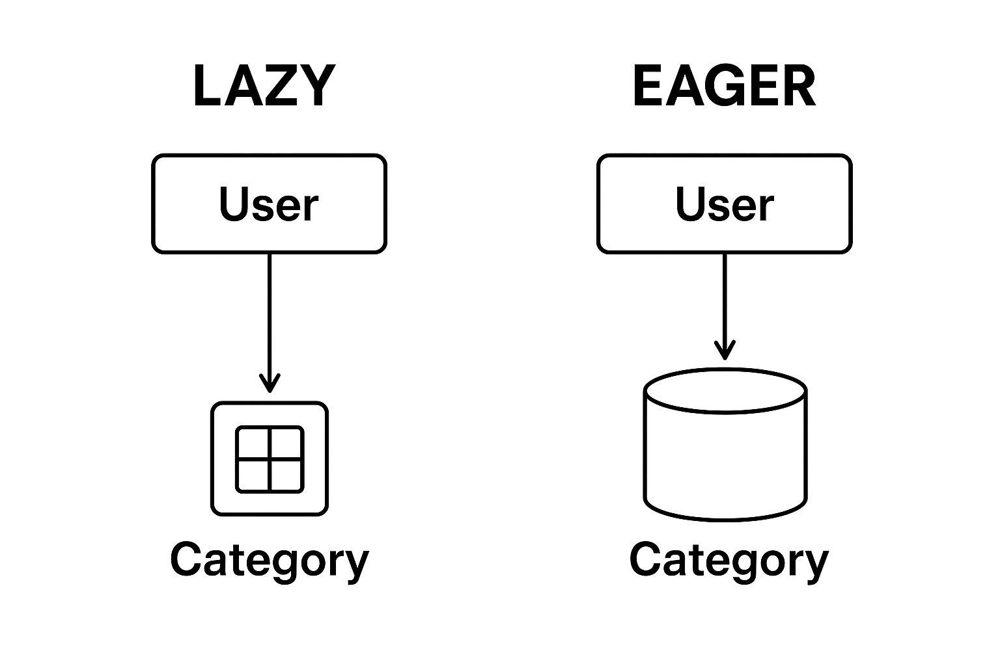
2) https://www.baeldung.com/hibernate-lazy-eager-loading
3) 