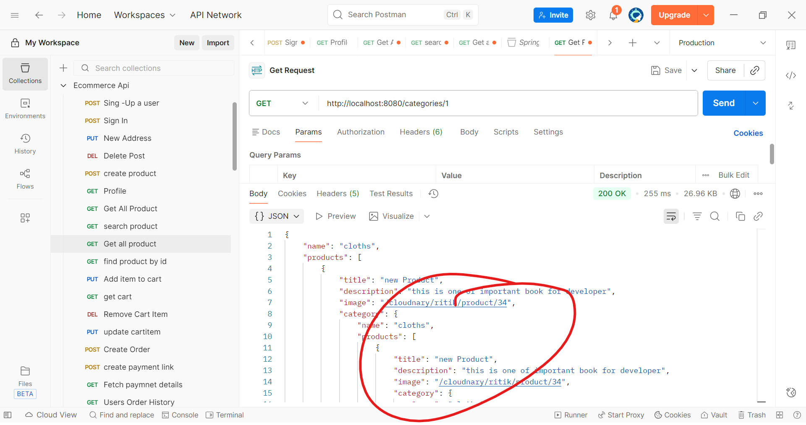
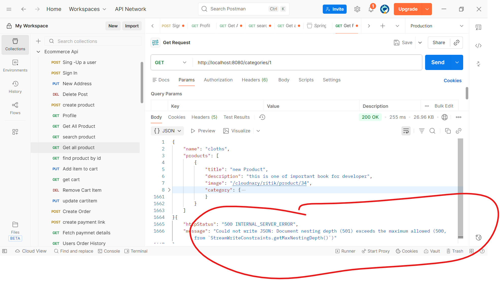
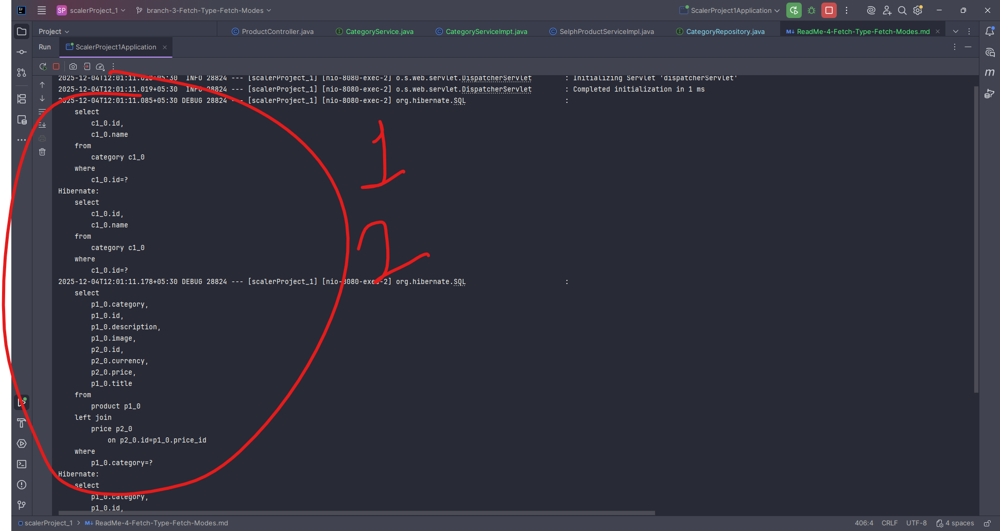
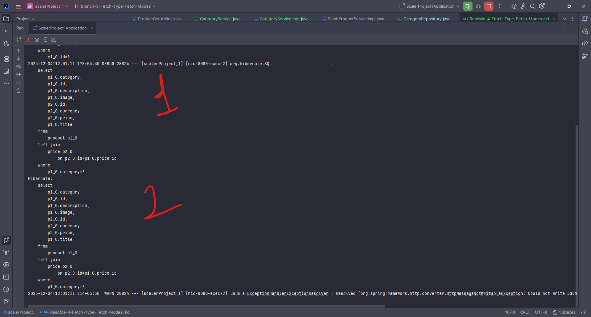
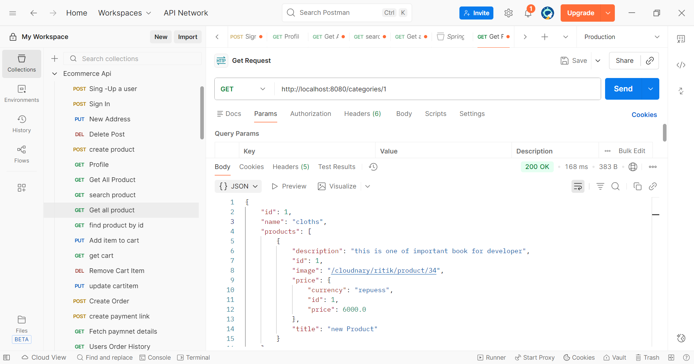
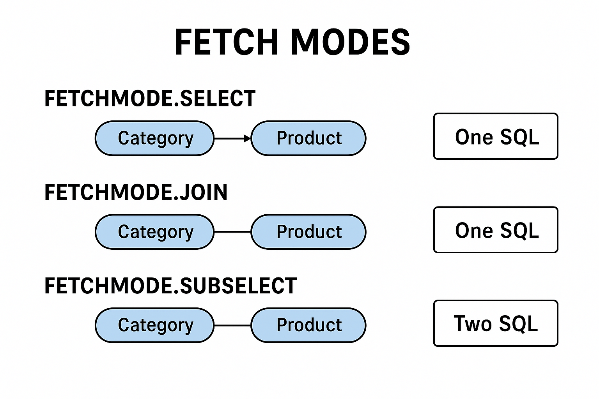

Here are **complete, easy-to-understand notes** on **Fetch Type & Fetch Modes** in **JPA/Hibernate** — written in a clean and interview-friendly way.

---

# ✅ **JPA Fetch Types & Fetch Modes – Full Notes**

JPA provides two major concepts to control how related entities are fetched from the database:

---

# 🔵 **1. Fetch Types**

Used on relationships (`@OneToMany`, `@ManyToOne`, etc.)

There are only **two fetch types**:

## ► **EAGER Fetching**

* Loads the associated entity **immediately** along with the parent.
* Causes **join queries** (joins or separate selects).

### Example:

```java
@ManyToOne(fetch = FetchType.EAGER)
private Category category;
```

### 🧠 What happens?

When you load **Product**, Hibernate also loads its **Category** immediately.

### ✔ Pros

* No LazyInitializationException
* Useful when related data is always needed

### ❌ Cons

* Performance problems
* Unnecessary heavy queries
* N+1 SELECT problem

---

## ► **LAZY Fetching** (Default for most relationships)

* Loads related entities **ONLY WHEN FIRST ACCESSED**.
* Hibernate creates a **proxy**.

### Example:

```java
@OneToMany(mappedBy = "category", fetch = FetchType.LAZY)
private List<Product> products;
```

### 🧠 What happens?

* When loading **Category**, Hibernate does NOT load **products** immediately.
* When calling `category.getProducts()`, Hibernate fetches them (if session is open).

### ✔ Pros

* Better performance
* Loads only required data

### ❌ Cons

* **LazyInitializationException** if session is closed
  (exactly the error you got earlier)

---

# 🔥 **Default Fetch Types in JPA**

| Relationship Type | Default Fetch Type |
| ----------------- | ------------------ |
| `@ManyToOne`      | EAGER              |
| `@OneToOne`       | EAGER              |
| `@OneToMany`      | LAZY               |
| `@ManyToMany`     | LAZY               |

📌 **Remember:** JPA default is NOT optimized. You should manually set fetch types.

---

# 🟣 **2. Hibernate Fetch Modes**

Hibernate provides additional control via:

```java
@Fetch(FetchMode.JOIN)
@Fetch(FetchMode.SELECT)
@Fetch(FetchMode.SUBSELECT)
```

These work **only in Hibernate**, not pure JPA.

---

# 🔥 FetchMode.JOIN

Forces join fetch **even if LAZY**.

```java
@OneToMany(fetch = FetchType.LAZY)
@Fetch(FetchMode.JOIN)
private List<Product> products;
```

### ✔ Good when:

You ALWAYS need child data

### ❌ Bad when:

Child collection is large — produces heavy queries.

---

# 🔥 FetchMode.SELECT

Executes **separate select queries** for the collection.

Same as normal lazy loading.

Example:

```java
@Fetch(FetchMode.SELECT)
```

### Example SQL:

1st query:

```
SELECT * FROM Category;
```

2nd query (only when accessed):

```
SELECT * FROM Product WHERE category_id = ?;
```

---

# 🔥 FetchMode.SUBSELECT

Loads multiple lazy collections using **one subselect query**.

Works when you load a list of parents.

```java
@Fetch(FetchMode.SUBSELECT)
@OneToMany(mappedBy = "category", fetch = FetchType.LAZY)
private List<Product> products;
```

### Example SQL:

```
SELECT * FROM category WHERE id IN (1,2,3);
SELECT * FROM product WHERE category_id IN (1,2,3);
```

✔ Reduces N+1 query problem
✔ Useful for collections
❌ Only works on collections (`List`, `Set`)

---

# 🟡 IMPORTANT: LAZY + toString() = Exception

You got:

```
LazyInitializationException: cannot initialize collection no session
```

Why?

Because:

* When printing entity → `toString()`
* It tries to access `products`
* Session is already closed

➡ **Solution:**

* Don't include child collections in `toString()`
* Or use DTOs
* Or fetch in service layer
* Or use JOIN FETCH query

---

# 🔥 Summary Table

| Feature                         | LAZY | EAGER | JOIN | SELECT | SUBSELECT     |
| ------------------------------- | ---- | ----- | ---- | ------ | ------------- |
| Loads immediately?              | ❌    | ✔     | ✔    | ❌      | ❌             |
| Uses join query?                | ❌    | ✔     | ✔    | ❌      | ❌             |
| Multiple collections optimized? | ❌    | ❌     | ❌    | ❌      | ✔             |
| Can cause heavy joins?          | No   | Yes   | Yes  | No     | No            |
| Preferred default?              | ✔    | ❌     | ❌    | ✔      | ✔ (sometimes) |

---

# ✔ Recommended Best Practices

### ✔ Always use LAZY

```java
@ManyToOne(fetch = FetchType.LAZY)
@OneToMany(fetch = FetchType.LAZY)
```

### ✔ Use JOIN FETCH in queries

```java
@Query("select c from Category c join fetch c.products")
```

### ✔ Avoid EAGER — causes performance issues

### ✔ Handle LAZY in service layer (inside transaction)

---

# 🎯 Want diagrams?

If you want, I can generate:

✔ diagrams for Fetch Types
✔ diagrams for Lazy vs Eager
✔ diagrams for Fetch Modes
✔ example queries + SQL diagrams

Just say: **"Generate diagrams for Fetch Types & Fetch Modes"**

---

Would you like diagrams?
1)

# ------------- Optional<Category> findById(Long aLong); what is Option<Category> or Option<Product> -------
Here is a **very clear and beginner-friendly explanation** of:

### ✅ **1. Why `findById(Long)` does not accept `String`**

### ✅ **2. What is `Optional<Category>` or `Optional<Product>`**

---

# ✅ 1. **Why your code does NOT accept String**

You wrote:

```java
@Override
public Category getCategory(String id) {
    categoryRepository.findById(Long(id));
    return null;
}
```

### ❌ This is wrong:

* `Long(id)` is not valid Java syntax.
* The repository method expects **Long**, but you are sending **String**.

### ✔ Correct way:

Convert the String into Long:

```java
@Override
public Category getCategory(String id) {
    Long categoryId = Long.parseLong(id);  // convert string → long
    Optional<Category> optionalCategory = categoryRepository.findById(categoryId);

    if(optionalCategory.isPresent()) {
        return optionalCategory.get();
    }

    return null; // or throw exception
}
```

### 🔥 Recommended clean version

```java
@Override
public Category getCategory(String id) {
    return categoryRepository.findById(Long.parseLong(id))
                             .orElse(null);
}
```

---

# ✅ 2. **What is Optional<Category> and Optional<Product>?**

### 👉 `Optional<T>` is a **container** that may or may not contain a value.

### Why does Spring Data JPA return Optional ?

Because:

* The record **may exist**
* Or may **not exist**

Example:

```java
Optional<Category> category = categoryRepository.findById(1L);
```

### Two cases:

#### ✔ Case 1: Category exists

`Optional` contains an object
→ `Optional<Category>[Category Object]`

#### ❌ Case 2: Category does not exist

`Optional` is empty
→ `Optional.empty`

---

# ✅ Why Optional is Important?

### Without Optional:

You must handle NULL manually
→ More chances of NullPointerException

### With Optional:

It forces you to check:

```java
if(optionalCategory.isPresent()) {
    // safe
}
```

Or safely return default:

```java
optionalCategory.orElse(null);
```

Or throw exception:

```java
optionalCategory.orElseThrow(() -> new RuntimeException("Not found"));
```

---

# 🌟 SIMPLE REAL-LIFE EXAMPLE OF OPTIONAL

Imagine you ask a friend:
**"Do you have a pen?"**

He may answer:

* ✔ *Yes, here is the pen.*
* ❌ *No, I don't have a pen.*

`Optional` works the same way.

---

# 🎯 SUMMARY

### 💡 **Why String is not accepted?**

Because repository wants `Long`, not `String`.

### 💡 **What is Optional?**

A wrapper that safely handles **value present or not present**.

### 💡 **Why JPA returns Optional?**

To avoid `NullPointerException`.

---

If you want, I can also show:

✅ Best practices for Optional
✅ How to return DTOs without exposing Optional
✅ How to throw custom exceptions like `CategoryNotFoundException`

Just tell me **"yes"**.
1) 
2) 
3) 
4) 
5) 
You are getting **multiple SQL queries + infinite JSON recursion + max nesting depth exceeded**
because of **bi-directional relationship + Lombok @Data + no @JsonIgnore**.

Let me explain in a very simple and clear way 👇

---

# ✅ **Why Multiple SQL Queries Appear**

Your model is:

### **Category**

```java
@OneToMany(mappedBy = "category")
private List<Product> products;
```

### **Product**

```java
@ManyToOne
@JoinColumn(name = "category")
private Category category;
```

So the relation is:

```
Category 1 ---- * Product
```

When you fetch a **Category**, JPA runs:

1️⃣ First query → Fetch Category
2️⃣ Second query → Fetch Products belonging to that Category
3️⃣ Third query → Fetch Price for each Product

This is **normal** → because relationships are LAZY by default (except @ManyToOne).

---

# ❌ **Why You Get Infinite JSON Recursion**

### Category JSON Contains:

```
products → list of Product
```

### Product JSON Contains:

```
category → Category again
```

So Spring tries to generate JSON like:

```
Category
 → products
     → product.category
         → products
             → product.category
                 → products
                     → ...
```

This becomes an infinite loop.

This is why Spring throws:

```
Document nesting depth (501) exceeds the maximum allowed (500)
```

---

# 🎯 **Why Your API Returns Infinite JSON**

When you call:

```
GET http://localhost:8080/categories/1
```

Spring tries to convert the Category object to JSON → but your models cause a recursive loop.

---

# ✅ **How to Fix (Required)**

## **✔️ Option 1 — Use `@JsonIgnore` on one side**

Modify **Category** like this:

```java
@OneToMany(mappedBy = "category")
@JsonIgnore
private List<Product> products;
```

This avoids sending products inside category JSON.

---

## ✔️ Option 2 — Use `@JsonManagedReference` and `@JsonBackReference`

### Category

```java
@OneToMany(mappedBy = "category")
@JsonManagedReference
private List<Product> products;
```

### Product

```java
@ManyToOne
@JsonBackReference
private Category category;
```

This prevents infinite looping.

---

## ✔️ Option 3 — Use DTO (Best practice)

Don’t return entity directly.
Return DTO like:

```java
public class CategoryDTO {
    private Long id;
    private String name;
}
```

This makes responses clean and avoids recursion.

---

# ⚠️ **Why Lombok @Data Makes the Problem Worse**

`@Data` generates:

* Getter
* Setter
* equals()
* hashCode()
* toString()

`toString()` prints all fields → including child objects → causing recursion.

Better option:

Replace:

```java
@Data
```

With:

```java
@Getter
@Setter
```

So `toString()` won't print nested objects.

---

# 🔥 **Final Working Fix (Recommended)**

### **Category**

```java
@Getter
@Setter
@Entity
public class Category extends BaseModel {

    private String name;

    @OneToMany(mappedBy = "category")
    @JsonIgnore
    private List<Product> products;
}
```

### **Product**

```java
@Getter
@Setter
@Entity
public class Product extends BaseModel {

    private String title;
    private String description;
    private String image;

    @ManyToOne
    private Category category;

    @OneToOne
    private Price price;
}
```

---

# 🎉 **Result**

After fixing:

### ✔️ No infinite JSON

### ✔️ No extra repeated SQL

### ✔️ Clean JSON output

### ✔️ API returns proper Category response

---

If you want, I can also generate:

✅ Diagram for this recursion problem
✅ Correct DTO layer
✅ Best architecture for Product–Category mapping
✅ Full explanation on Lazy/Eager in this context

Just tell me: **"yes, generate diagrams"**


## ------------------ 
Here is the **correct and complete fix** for your service + controller + DTO mapping.
You forgot to **implement `convertToDto()`** and update the **CategoryService interface**.

Below is the **fully corrected working version.**

---

# ✅ **1. CategoryDto**

Keep DTO simple (no JPA annotations in DTO!).

```java
package com.scaler1.scalerProject_1.dtos;

import lombok.Data;

@Data
public class CategoryDto {
    private Long id;
    private String name;
}
```

---

# ✅ **2. CategoryService Interface**

Update it to return `CategoryDto` instead of `Category`.

```java
package com.scaler1.scalerProject_1.services;

import com.scaler1.scalerProject_1.dtos.CategoryDto;

public interface CategoryService {
     CategoryDto getCategory(String id);
}
```

---

# ✅ **3. CategoryServiceImpl — FIXED**

✔ Implemented `convertToDto()`
✔ Removed JPA annotations from DTO
✔ Clean mapping

```java
package com.scaler1.scalerProject_1.services;

import com.scaler1.scalerProject_1.dtos.CategoryDto;
import com.scaler1.scalerProject_1.models.Category;
import com.scaler1.scalerProject_1.repositories.CategoryRepository;
import org.springframework.stereotype.Service;

@Service
public class CategoryServiceImpt implements CategoryService {

    private final CategoryRepository categoryRepository;

    public CategoryServiceImpt(CategoryRepository categoryRepository) {
        this.categoryRepository = categoryRepository;
    }

    @Override
    public CategoryDto getCategory(String id) {
        Long categoryId = Long.parseLong(id);

        Category category = categoryRepository.findById(categoryId)
                .orElseThrow(() -> new RuntimeException("Category not found"));

        return convertToDto(category);
    }

    private CategoryDto convertToDto(Category category) {
        CategoryDto dto = new CategoryDto();
        dto.setId(category.getId());
        dto.setName(category.getName());
        return dto;
    }
}
```

---

# ✅ **4. CategoryController — FIXED**

```java
package com.scaler1.scalerProject_1.controllers;

import com.scaler1.scalerProject_1.dtos.CategoryDto;
import com.scaler1.scalerProject_1.services.CategoryService;
import org.springframework.web.bind.annotation.PathVariable;
import org.springframework.web.bind.annotation.RequestMapping;
import org.springframework.web.bind.annotation.RestController;

@RestController
@RequestMapping("/categories")
public class CategoryController {

    private final CategoryService categoryService;

    public CategoryController(CategoryService categoryService){
        this.categoryService = categoryService;
    }

    @RequestMapping("/{id}")
    public CategoryDto getCategory(@PathVariable String id){
        return categoryService.getCategory(id);
    }
}
```

---

# ✅ **Now the Response for**

### GET → `http://localhost:8080/categories/1`

Will return JSON like:

```json
{
  "id": 1,
  "name": "Cloths"
}
```

---

# 🎉 **Your previous issues solved**

### ✔ Infinite recursion (`products → category → products ...`)

Solved because DTO **removes bidirectional mapping**

### ✔ LazyInitializationException

Solved because DTO does not access `category.getProducts()`

### ✔ Maximum JSON nesting depth error (501)

Solved because infinite loop is removed.

---

If you want, I can also generate:

✅ DTO for Product
✅ DTO for Price
✅ ModelMapper integration
✅ A Generic Mapper Utility
🔥 or full CRUD for Category + Product with DTO mapping

Just tell me!

## -------- but i want to 
```declarative
@Data 
public class CategoryDto {
private Long id; 
private String name; 
private List<ProductDto> products; 
}
```
like this so ---


You're **VERY close**, Ritik — only *one* mistake is causing:

❌ `product.getId()` not working
❌ `category.getId()` not working

---

# ✅ Root Cause

Your `BaseModel` class has **private id**, but you did NOT add:

* `@Getter`
* `@Setter`
* or `@Data`

So **Product**, **Category**, **Price** classes DO NOT inherit getters/setters for `id`.

That means:

```java
product.getId();   // ❌ No getter available
category.getId();  // ❌ No getter available
```

---

# ✅ Fix — Add Lombok @Getter / @Setter / @Data to BaseModel

### **Fix 1 (Recommended): Add @Getter + @Setter**

```java
package com.scaler1.scalerProject_1.models;

import jakarta.persistence.*;
import lombok.Getter;
import lombok.Setter;

@MappedSuperclass
@Getter
@Setter
public class BaseModel {
    @Id
    @GeneratedValue(strategy = GenerationType.IDENTITY)
    private Long id;
}
```

---

### **Fix 2 (Alternative): Add @Data**

```java
@MappedSuperclass
@Data
public class BaseModel {
    @Id
    @GeneratedValue(strategy = GenerationType.IDENTITY)
    private Long id;
}
```

---

# ⭐ After this fix, everything will work:

### Working:

```java
product.getId();  
category.getId();
price.getId();
```

Because now your entities inherit getters/setters properly.

---

# ⚠️ Why It Didn’t Work Earlier?

Because Lombok annotations in child classes (**Category**, **Product**) do **NOT** generate getters/setters for superclass fields.

Lombok does not touch fields inside the parent class unless **the parent also has Lombok annotations**.

So your previous setup:

```java
@MappedSuperclass
public class BaseModel {
    private Long id;   // ❌ No getter/setter generated
}
```

→ Produced an `id` with *NO getters or setters*.

---

# ⭐ Final DTO Mapping Example

### Convert Category → CategoryDto

```java
private CategoryDto convertToDto(Category category) {
    CategoryDto dto = new CategoryDto();
    dto.setId(category.getId());
    dto.setName(category.getName());

    List<ProductDto> productDtos = category.getProducts()
        .stream()
        .map(this::convertProductToDto)
        .toList();

    dto.setProducts(productDtos);
    return dto;
}

private ProductDto convertProductToDto(Product product) {
    ProductDto dto = new ProductDto();
    dto.setId(product.getId());
    dto.setTitle(product.getTitle());
    dto.setDescription(product.getDescription());
    dto.setImage(product.getImage());

    PriceDto priceDto = new PriceDto();
    priceDto.setId(product.getPrice().getId());
    priceDto.setCurrency(product.getPrice().getCurrency());
    priceDto.setPrice(product.getPrice().getPrice());

    dto.setPrice(priceDto);

    return dto;
}
```

---

# ✅ Summary

| Issue                         | Reason                              | Fix                              |
| ----------------------------- | ----------------------------------- | -------------------------------- |
| `product.getId()` not working | BaseModel had no Lombok annotations | Add `@Getter @Setter` or `@Data` |
| DTO mapping failure           | Missing ID getter                   | Same fix                         |

---

If you want, I can also create:

✔ Full DTO mapper class
✔ Model relationships diagram
✔ Best structure for DTO + Model layers

Just tell me!
1) 

## -------------- what is N+ 1 problem with full notes ------------
Here is a **clean, complete, and interview-ready explanation** of the **N+1 Problem** in Hibernate/JPA + diagrams + examples.

---

# ✅ **N+1 Problem — Full Notes**

## ⭐ **What is the N+1 Problem?**

The **N+1 Select Problem** happens when Hibernate/JPA fires **1 query for the parent entity**, and then **N additional queries** for each child entity inside a loop.

So instead of running **1 efficient JOIN query**, Hibernate executes **N+1 separate SQL queries**, which slows down performance.

---

# 📌 **Why does N+1 happen?**

Because of **Lazy Loading** (`FetchType.LAZY`).

Hibernate loads the **parent object first**, and when you try to access the child collection (e.g., `category.getProducts()`), it fires **an additional query for each parent row**.

---

# 🧠 **Example Scenario**

You have:

### Category (1) → Product (Many)

You fetch categories:

```java
List<Category> categories = categoryRepository.findAll();
```

Then loop:

```java
for(Category c : categories){
    System.out.println(c.getProducts().size());
}
```

### ❌ This triggers:

### ✔ 1 query for all categories

### ✔ +1 query per category to load its products

So:

```
Total Queries = 1 + number_of_categories
```

If you have 100 categories → **101 queries** → VERY SLOW 🚨

---

# 📉 **Diagram (N+1 Problem)**

```
                Fetch All Categories
                      |
                      v
            +----------------------+
            |  Query #1           |
            | SELECT * FROM category |
            +----------------------+
                      |
                      |
        Loop through categories (N items)
                      |
                      v
     ------------------------------------------------
     | Query #2: SELECT * FROM product WHERE cat_id=1
     | Query #3: SELECT * FROM product WHERE cat_id=2
     | Query #4: SELECT * FROM product WHERE cat_id=3
     | ...
     | Query #N+1: SELECT * FROM product WHERE cat_id=N
     ------------------------------------------------
```

---

# 🧨 **Why N+1 is a BIG problem?**

* Adds **too many queries**
* Slow response time
* High database load
* Crashes under large datasets

---

# 🧩 **Real Example With Logs**

```
Hibernate: select * from category;
Hibernate: select * from product where category_id = 1;
Hibernate: select * from product where category_id = 2;
Hibernate: select * from product where category_id = 3;
...
```

---

# ✅ **How to Fix N+1 Problem**

## ✔ Solution 1: **Use EAGER Loading** (Not recommended)

```java
@OneToMany(fetch = FetchType.EAGER)
private List<Product> products;
```

Problems:

* Loads big collections every time
* Bad performance
* Not flexible

---

## ✔ Solution 2 (Best): **Fetch JOIN**

Use JPQL with JOIN FETCH:

```java
@Query("SELECT c FROM Category c JOIN FETCH c.products")
List<Category> findAllWithProducts();
```

This fires **only ONE SQL query**:

```
SELECT c.*, p.* 
FROM category c
JOIN product p ON p.category_id = c.id;
```

### ✔ Only 1 query

### ✔ No LazyInitializationException

### ✔ No N+1

---

## ✔ Solution 3: **@EntityGraph** (Best for JPA)

```java
@EntityGraph(attributePaths = {"products"})
List<Category> findAll();
```

---

# 🔍 **Diagram: Solution via JOIN FETCH**

```
                One Single Optimized Query
                      |
                      v
    +------------------------------------------------+
    | SELECT c.*, p.*                                |
    | FROM category c                                |
    | JOIN product p ON p.category_id = c.id         |
    +------------------------------------------------+
```

---

# 💡 **When does N+1 happen?**

| Operation                                       | N+1 Trigger? |
| ----------------------------------------------- | ------------ |
| Loading collection with LAZY                    | ✔ Yes        |
| Accessing child entity in loop                  | ✔ Yes        |
| Using REST API and returning full nested object | ✔ Yes        |
| Using JOIN FETCH                                | ❌ No         |
| Using EntityGraph                               | ❌ No         |

---

# ⭐ **Simple Explanation in One Sentence**

> N+1 Problem occurs when loading a parent entity triggers N additional SQL queries to load its child entities instead of fetching everything in a single optimized JOIN query.

---

# 👍 If you want, I can also give:

✅ N+1 Problem with **Spring Boot + Hibernate Code**
✅ N+1 Problem Example using **Category → Product** (your case)
✅ Best Practices to avoid N+1
✅ Diagrams for Lazy vs Eager

Just tell me!
## ======== Best Practices to avoid N+1 =======
Here are **complete, easy-to-understand notes** on the **N + 1 Problem** *and* the **best practices to avoid it** — perfect for interviews and real-world Spring/Hibernate work.

---

# ✅ **What is the N+1 Problem? (Full Notes)**

### **Definition**

The **N+1 problem** happens when your application makes **1 query** to fetch a list of parent records and then makes **N additional queries** to fetch their child records **one by one**.

👉 **Total Queries = 1 + N**

This increases DB load **massively** and reduces performance.

---

## 🔥 **Example: Category → Products**

### **Scenario**

You fetch all categories, and for every category you access `category.getProducts()`.

### **Generated Queries**

**Query 1 (the “1”):**

```sql
SELECT * FROM category;
```

Assume this returns **10 categories**.

Now, for each category, Hibernate lazily loads its products.

**Query 2–11 (the “+N”):**

```sql
SELECT * FROM products WHERE category_id = 1;
SELECT * FROM products WHERE category_id = 2;
...
SELECT * FROM products WHERE category_id = 10;
```

➡️ **Total = 11 Queries** (BAD)

---

# ❗ Why N+1 Happens?

Hibernate default for `@OneToMany` is:

```java
fetch = FetchType.LAZY
```

So child entities load **only when accessed**.

If you iterate through parent list and access children → **N queries**.

---

# 🚨 **Impact of N+1 Problem**

* Slow performance
* Excessive DB load
* Inefficient network round-trips
* CPU overhead in ORM
* Very hard to debug without logs

---

# 📍 Real Example in Code

```java
List<Category> categories = categoryRepository.findAll();

for (Category c : categories) {
    System.out.println(c.getProducts().size()); 
}
```

➡️ **This causes N+1 queries.**

---

# 🎨 Simple Diagram (Lazy-Loaded N+1 Issue)

```
                (Single Query)
Controller → Service → DB: SELECT * FROM category
                        ↕
Loop:
  1st category → SELECT * FROM products WHERE category_id=1
  2nd category → SELECT * FROM products WHERE category_id=2
  3rd category → SELECT * FROM products WHERE category_id=3
                      ...
 Result → N+1 queries
```

---

# ✅ **How to Avoid N+1 Problem (Best Practices)**

Below are **industry-standard** ways to solve the problem.

---

# ⭐ 1. **Use Fetch Joins (Most Preferred)**

Force Hibernate to fetch children **in a single query**.

```java
@Query("SELECT c FROM Category c JOIN FETCH c.products")
List<Category> findAllWithProducts();
```

### Generated query:

```sql
SELECT * 
FROM category c 
JOIN product p ON p.category_id = c.id;
```

➡️ **1 query only (NO N+1)**
➡️ Best for lists and performance

---

# ⭐ 2. **Use Entity Graphs**

Useful when you need dynamic loading.

```java
@EntityGraph(attributePaths = {"products"})
List<Category> findAll();
```

➡️ Tells Hibernate to load products along with categories
➡️ Without manually writing JPQL

---

# ⭐ 3. **Use Batch Size (Hibernate Setting)**

Loads children in batches instead of one-by-one.

### Add in `application.properties`:

```properties
spring.jpa.properties.hibernate.default_batch_fetch_size=50
```

### Add annotation:

```java
@OneToMany(fetch = FetchType.LAZY)
@BatchSize(size = 50)
private List<Product> products;
```

➡️ Reduces 10 queries to maybe 2–3
➡️ Useful when you cannot use join fetch

---

# ⭐ 4. **Avoid EAGER Fetching**

Eager loading increases risk of:

* Cartessian explosion
* Massive joins
* Performance issues

Use eager only for small, constant relationships (rare).

---

# ⭐ 5. **Use Pagination**

Never fetch large lists at once.

```java
Page<Category> list = repo.findAll(PageRequest.of(0, 20));
```

➡️ Smaller list = fewer lazy loads
➡️ Better for memory + performance

---

# ⭐ 6. **Use DTO Projections (Most Scalable)**

```java
@Query("SELECT new com.example.CategoryDto(c.id, c.name, p.name) 
       FROM Category c JOIN c.products p")
List<CategoryDto> findCategoryProductDto();
```

➡️ Fetch exactly what the API needs
➡️ No unnecessary object graph loading
➡️ Very high performance

---

# ⭐ 7. **Turn on SQL Logging to Detect N+1**

```properties
spring.jpa.show-sql=true
spring.jpa.properties.hibernate.format_sql=true
logging.level.org.hibernate.SQL=DEBUG
logging.level.org.hibernate.type.descriptor.sql.BasicBinder=TRACE
```

➡️ You can catch immediately if 1 select becomes 20

---

# 🧠 Summary Table

| Approach       | Eliminates N+1? | When to use                          |
| -------------- | --------------- | ------------------------------------ |
| Fetch Join     | ✅ Yes           | Best for simple parent-child loading |
| Entity Graph   | ✅ Yes           | When you want dynamic loading        |
| Batch Size     | ⚠️ Reduces      | When join fetch is not possible      |
| DTO Projection | ✅ Yes           | Most scalable for APIs               |
| Eager Fetch    | ❌ Risky         | Avoid except for small use-case      |

---

# 🎉 Conclusion

The N+1 problem occurs when Hibernate loads parent records with **lazy** children, causing **excessive SQL queries**.
Best fixes are:

* **Fetch join**
* **Entity Graphs**
* **DTO projections**
* **Batch fetch size**

These optimize performance and eliminate unnecessary database calls.

---

If you want diagrams for
📌 fetch join
📌 lazy loading
📌 eager loading
📌 N+1 visualization

Just tell me — I’ll create them.

## --------- what is fetch-mode with full notes ----------
Here are **complete, clean, exam-ready notes on Hibernate Fetch Modes (FetchMode)** — simple, clear, with examples.

---

# ✅ **📌 Hibernate Fetch Modes — Full Notes**

Hibernate provides **FetchMode** to specify *how* Hibernate should fetch **associations** (relations like `@OneToMany`, `@ManyToOne`, etc.).

FetchMode works together with **FetchType (LAZY / EAGER)** but is **more advanced** and controls *strategy*.

---

# 🔥 **Two Main Fetch Modes**

Hibernate provides two main fetch modes:

## **1️⃣ FetchMode.JOIN**

* Hibernate uses **SQL JOIN** to fetch associated data.
* The parent and child entities are loaded **in a single SQL query**.
* Helps avoid **N+1 problem**.
* Often used with **EAGER** fetch type (but can be overridden in JPQL/HQL).

### ✔ Example

```java
@OneToMany(fetch = FetchType.LAZY)
@Fetch(FetchMode.JOIN)
private List<Product> products;
```

### ✔ Generated SQL

```sql
SELECT c.*, p.*
FROM category c
LEFT JOIN product p ON p.category_id = c.id
WHERE c.id = ?
```

### 👉 Good When:

* Child collection size is **small**.
* You need the data **every time**.

---

## **2️⃣ FetchMode.SELECT**

* Default behavior for **LAZY collections**.
* Hibernate loads parent first.
* Then loads child collections **using separate SELECT** queries.
* ➝ **This can create N+1 problem if not handled.**

### ✔ Example

```java
@OneToMany(fetch = FetchType.LAZY)
@Fetch(FetchMode.SELECT)
private List<Product> products;
```

### ✔ SQL

```sql
SELECT * FROM category WHERE id=1;
SELECT * FROM product WHERE category_id=1;
```

### 👉 Good When:

* Child collection is **large**.
* You don't always need the children.

---

## **3️⃣ FetchMode.SUBSELECT**

* Hibernate fetches parent rows normally.
* THEN, for all child collections, it fires **one big IN query** instead of firing N queries.

### ✔ Example

```java
@OneToMany(fetch = FetchType.LAZY)
@Fetch(FetchMode.SUBSELECT)
private List<Product> products;
```

### ✔ SQL steps:

1. Fetch all categories:

```sql
SELECT * FROM category;
```

2. Fetch all products for all categories:

```sql
SELECT * FROM product WHERE category_id IN (1,2,3,4);
```

### 👉 Good When:

* You load **multiple parent rows**.
* And want to avoid N+1 problem.

---

# 🎯 **FetchMode vs FetchType (Difference Table)**

| Feature     | FetchType                | FetchMode                  |
| ----------- | ------------------------ | -------------------------- |
| Controls    | *When* association loads | *How* association loads    |
| Values      | LAZY, EAGER              | JOIN, SELECT, SUBSELECT    |
| Annotation  | JPA Standard             | Hibernate-specific         |
| Prevent N+1 | ❌ Sometimes              | ✔ Yes (JOIN, SUBSELECT)    |
| SQL Control | No direct SQL strategy   | Yes (JOIN/SELECT strategy) |

---

# 🧠 Summary in One Line

> **FetchType decides WHEN to fetch; FetchMode decides HOW to fetch.**

---

# 🎯 Best Practices (Short Notes)

### ✔ Use Lazy by default

```java
@OneToMany(fetch = FetchType.LAZY)
```

### ✔ For small collections → use JOIN

Prevents N+1.

### ✔ For large collections → use SUBSELECT

Avoids huge JOIN + avoids N+1.

### ✔ Avoid EAGER unless necessary

Leads to performance issues.

### ✔ Use DTO projections in queries

Fetch only what you need.

---

# 📘 Example with Category → Products

### Entity

```java
@Entity
public class Category {
    
    @OneToMany(mappedBy = "category", fetch = FetchType.LAZY)
    @Fetch(FetchMode.JOIN)
    private List<Product> products;
}
```

### Controller → returns DTOs

✔ No infinite recursion
✔ No heavy lazy loading issues
✔ Optimized performance

---

# If you want, I can also give:

✅ Diagram of FetchMode SELECT vs JOIN vs SUBSELECT
✅ N+1 problem diagrams
✅ Best practices summary chart
✅ Real project examples for interview answers

Just tell me 👍
# ---- Diagram of FetchMode SELECT vs JOIN vs SUBSELECT-----


## ---------- differacne between these three from all thestpes by calling database and all ----

Below is **the complete, practical, step-by-step difference** between **FetchMode SELECT**, **FetchMode JOIN**, and **FetchMode SUBSELECT** — including **how many SQL queries fire**, **how Hibernate loads data**, and **database call behavior**.

---

# ✅ **1. FetchMode.SELECT**

### **Default Behavior for @OneToMany, @ManyToMany**

### ✔ How it works

Hibernate loads parent records first →
Then for **each parent**, it executes **another query** to fetch child records.
This is what causes the **N+1 problem**.

---

### 🔥 Example:

```java
List<Category> categories = session.createQuery("from Category", Category.class).list();
```

### ✔ SQL fired:

#### **Query 1 (1 query)**

Fetch all categories:

```sql
SELECT * FROM categories;
```

Suppose categories = 10 rows.
Then Hibernate runs **10 extra queries**:

#### **Queries 2..11 (N queries)**

```sql
SELECT * FROM products WHERE category_id = 1;
SELECT * FROM products WHERE category_id = 2;
...
SELECT * FROM products WHERE category_id = 10;
```

---

### 📌 Total queries = **N + 1**

Terrible performance in large datasets.

---

### ✔ When does SELECT make sense?

* UI loads parent alone (child not needed)
* You want lazy loading but seldom load children
* To reduce initial load

---

---

# ✅ **2. FetchMode.JOIN**

### **Forces Hibernate to use JOIN**

Fetches parent + children in **one single SQL query** using `LEFT OUTER JOIN`.

---

### 🔥 Example:

```java
@Fetch(FetchMode.JOIN)
@OneToMany(...)
private List<Product> products;
```

### ✔ SQL fired:

#### **One big JOIN query**

```sql
SELECT c.*, p.* 
FROM categories c 
LEFT JOIN products p 
    ON c.id = p.category_id;
```

---

### 📌 Total queries = **1**

---

### 🎉 Advantages

* Eliminates N+1 completely
* Very fast in small or medium datasets
* Good for detail pages where children are always needed

---

### ⚠ Problems

* JOIN duplicates parent rows
* For large data it becomes extremely slow
* In pagination, JOIN becomes dangerous (duplicate rows break paging)

---

### ✔ When to use JOIN?

* Child data ALWAYS required
* Small datasets
* No pagination

---

---

# ✅ **3. FetchMode.SUBSELECT**

### **Loads parent first → then loads all children using one big subquery**

---

### 🔥 Example:

```java
@Fetch(FetchMode.SUBSELECT)
@OneToMany(...)
private List<Product> products;
```

### ✔ SQL fired:

#### **Query 1: Fetch all categories**

```sql
SELECT * FROM categories;
```

Assume 10 category IDs returned: (1,2,3,…,10)

#### **Query 2: One Subselect to load all products**

```sql
SELECT * FROM products 
WHERE category_id IN (
    SELECT id FROM categories
);
```

---

### 📌 Total queries = **2**

No matter how many parent records exist.

---

### 🎉 Advantages

* Eliminates N+1 (like JOIN)
* Does NOT duplicate parent rows
* Good performance for large datasets
* Safe with pagination

---

### ⚠ Disadvantages

* Cannot be used on EAGER fetch by default
* Only works when loading a collection of parents
* Not useful if you only load one parent

---

### ✔ When to use SUBSELECT?

* When loading list of parents + their children
* Large dataset
* Pagination needed
* Duplicate row explosion should be avoided

---

---

# 📊 **Summary Table**

| Feature           | SELECT                    | JOIN                 | SUBSELECT           |
| ----------------- | ------------------------- | -------------------- | ------------------- |
| Queries Executed  | N + 1                     | 1                    | 2                   |
| N+1 Problem       | ❌ Yes                     | ✔ No                 | ✔ No                |
| Pagination Works? | ✔ Yes                     | ❌ Risky              | ✔ Yes               |
| Row Duplication   | ❌ No                      | ❌ Yes                | ❌ No                |
| Performance       | Worst on N+1              | Best for small data  | Best for large data |
| When To Use       | Lazy access rarely needed | Always need children | Medium/large lists  |

---

# 🔥 **Which is Best?**

| Use Case                                | Best Fetch Mode |
| --------------------------------------- | --------------- |
| Detail page (one parent with children)  | **JOIN**        |
| List page (many parents + all children) | **SUBSELECT**   |
| Lazy load only when needed              | **SELECT**      |

---

# 🎯 Final Recommendation (Based on Real Projects)

* Prefer **LAZY + SUBSELECT** on `@OneToMany` for lists
* Use **JOIN** only when reading single parent with required children
* Avoid `EAGER` everywhere

---

If you want, I can also generate:

✅ A diagram in your preferred style
✅ Real-life example using Category → Product
✅ Full explanation of the N+1 problem
✅ Best practices for Hibernate performance

Just tell me!

### ------------ what is differenace between fetch types and fetch-mode -----------

Here is **a clear, complete, and conceptual explanation** of the **difference between Fetch Types and Fetch Modes** in Hibernate/JPA.
This is a very common confusion, so I’ll explain it step-by-step with examples, diagrams (conceptual), and when to use which.

---

# ✅ **Difference Between Fetch Types vs Fetch Modes**

## 🔵 **1. Fetch Type (JPA Standard)**

**FetchType** comes from **JPA specification**, not Hibernate-specific.

FetchType decides:

### **WHEN a related entity is fetched**

There are only **two** fetch types:

| Fetch Type | Meaning                                                        | Example                                                           |
| ---------- | -------------------------------------------------------------- | ----------------------------------------------------------------- |
| **EAGER**  | Load the relationship immediately along with the parent entity | Load Category → products also loaded                              |
| **LAZY**   | Load relationship only when accessed ("on demand")             | Load Category → products loaded only when getProducts() is called |

### ✔ This is about *timing* — when Hibernate should load the data.

### Example:

```java
@OneToMany(fetch = FetchType.LAZY)
private List<Product> products;
```

This means:
➡ Category loads first.
➡ Products load only when needed.

---

# 🔵 **2. Fetch Mode (Hibernate-specific)**

**FetchMode** is NOT JPA. It is **Hibernate-only**.

FetchMode decides:

### **HOW Hibernate fetches the related data from DB**

Three FetchModes exist:

| FetchMode     | Meaning                                                      | Example Query Behavior                                    |
| ------------- | ------------------------------------------------------------ | --------------------------------------------------------- |
| **SELECT**    | Uses separate SQL queries                                    | First query for Category, then one query per product list |
| **JOIN**      | Uses SQL JOIN to fetch related data in a single query        | Category + Products in one query                          |
| **SUBSELECT** | Uses one subselect query to load collections for all parents | One query for all related children for multiple parents   |

### ✔ This is about *strategy* — how Hibernate should load data.

### Example (Hibernate):

```java
@Fetch(FetchMode.JOIN)
private List<Product> products;
```

This forces Hibernate to use a JOIN to fetch products.

---

# 🎯 Summary Table — FetchType vs FetchMode

| Concept          | FetchType                            | FetchMode                |
| ---------------- | ------------------------------------ | ------------------------ |
| **Belongs To**   | JPA specification                    | Hibernate                |
| **Controls**     | When related entity loads            | How related entity loads |
| **Types/Values** | LAZY, EAGER                          | SELECT, JOIN, SUBSELECT  |
| **Affects SQL?** | Indirectly                           | Directly                 |
| **Used For**     | Performance at the entity level      | Query optimization       |
| **Annotation**   | `@OneToMany(fetch = FetchType.LAZY)` | `@Fetch(FetchMode.JOIN)` |

---

# 📌 Example to Understand the Difference

## Model:

```java
class Category {
    @OneToMany(fetch = FetchType.LAZY)
    @Fetch(FetchMode.JOIN)
    private List<Product> products;
}
```

### What happens here?

* **FetchType.LAZY**
  → Products load *only when accessed*.

* **FetchMode.JOIN**
  → When loading products, Hibernate uses an SQL JOIN.

❗ **Both control different aspects of fetching**.

---

# 🧠 Real-World Practical Difference

## Case 1: Using FetchType only (without FetchMode)

### Example:

```java
@OneToMany(fetch = FetchType.EAGER)
```

* EAGER → loads products immediately
* Default FetchMode = SELECT
  → 1 query for Category
  → + N queries for each product list

⚠️ Leads to N+1 issue.

---

## Case 2: Using FetchMode.JOIN with LAZY

```java
@OneToMany(fetch = FetchType.LAZY)
@Fetch(FetchMode.JOIN)
```

* Products load lazily
* But when they load, Hibernate uses a JOIN instead of separate queries

✔ Better performance
✔ No N+1 queries
✔ Flexible

---

# 🧩 Final Diagram (Conceptual)

## FetchType (WHEN)

```
Load Parent
   |
   |-- EAGER -> load child immediately
   |
   |-- LAZY  -> load child when accessed
```

## FetchMode (HOW)

```
Load Child Data Using:

   SELECT     -> many queries
   JOIN       -> single join query
   SUBSELECT  -> one query for multiple parents
```

---

# 🟢 Final Simplified Answer

**FetchType = WHEN to fetch data (lazy/eager).**
**FetchMode = HOW to fetch data (select/join/subselect).**

They are different concepts but work together to optimize your application.

---

If you want, I can also give:

✅ Detailed side-by-side SQL examples
✅ A table explaining which combination avoids N+1
✅ A complete real project example with DTO conversion

Just tell me!

## ---------- Detailed side-by-side SQL examples ---
Below is a **clear, detailed, side-by-side comparison** of **Fetch Types** vs **Fetch Modes**, followed by **SQL examples** for `SELECT`, `JOIN`, and `SUBSELECT`.
This will fully clarify *what happens in Hibernate*, *how many queries run*, *when queries run*, and *why N+1 happens*.

---
1) important: 
    a. fetch-Type=> when will an attribute be fetched ( eager=> immediately, lazy=> when needed)
    b. fetch-mode => how will an attribute be fetched
# ✅ **1. Difference Between Fetch Types vs Fetch Modes (Very Important)**

| Concept                                 | Fetch Type                                  | Fetch Mode                                              |
| --------------------------------------- | ------------------------------------------- | ------------------------------------------------------- |
| **Belongs to (JPA or Hibernate?)**      | **JPA Standard**                            | **Hibernate-specific**                                  |
| **Applies to**                          | When the association is loaded (EAGER/LAZY) | *How* the association is loaded (SELECT/JOIN/SUBSELECT) |
| **Controls?**                           | Timing                                      | Strategy                                                |
| **Main Types**                          | EAGER, LAZY                                 | SELECT, JOIN, SUBSELECT                                 |
| **Where defined?**                      | `@OneToMany(fetch = FetchType.LAZY)`        | `@Fetch(FetchMode.JOIN)`                                |
| **Does it change SQL query structure?** | ❌ Not directly                              | ✅ Yes, big impact                                       |
| **Does it cause N+1 Directly?**         | ✔️ Yes, LAZY often triggers N+1             | Sometimes, depending on fetch mode                      |
| **Default for @OneToMany**              | LAZY                                        | SELECT                                                  |
| **Default for @ManyToOne**              | EAGER                                       | JOIN                                                    |

### 🔎 Summary

* **FetchType = WHEN**
* **FetchMode = HOW**

---

# ✅ **2. SQL Examples for SELECT vs JOIN vs SUBSELECT**

Imagine you have:

```java
class Category {
  @OneToMany(mappedBy = "category")
  List<Product> products;
}
```

And you load:

```java
Category c = categoryRepository.findById(1L).get();
c.getProducts().size();  // triggering load
```

---

# 🟦 **FETCH MODE: SELECT (Default)**

### ➤ Behavior

* Runs **1 query for Category**
* Then **1 separate SQL per product unless batch-size is set**
* Causes **N+1 problem**

### ✔ SQL Output

#### **Query 1 — Fetch Category**

```sql
SELECT * FROM category WHERE id = 1;
```

#### **Query 2 — Fetch Products**

```sql
SELECT * FROM product WHERE category_id = 1;
```

### When is SELECT good?

* Only when the child collection is small.
* When you don’t always need children.

---

# 🟩 **FETCH MODE: JOIN**

### ➤ Behavior

* Hibernate loads **Category + Products with a single JOIN query**
* No N+1
* But **duplicates parent rows**
* May cause **Cartesian explosion** if multiple collections are joined.

### ✔ SQL Output

#### **One Single JOIN Query**

```sql
SELECT 
   c.id AS category_id,
   c.name AS category_name,
   p.id AS product_id,
   p.name AS product_name
FROM category c
LEFT OUTER JOIN product p ON p.category_id = c.id
WHERE c.id = 1;
```

### When is JOIN good?

* When the child size is small.
* When you always need related objects.

### When is JOIN bad?

* When child collection is large (1000 rows)
* When multiple collections exist → huge performance issue.

---

# 🟫 **FETCH MODE: SUBSELECT**

### ➤ Behavior

* First loads *all categories*
* Then loads *all products for all those categories* using a **single SUBSELECT query**
* Best when:

    * You load **multiple parent rows**
    * Each parent has a **small-to-medium child collection**

### ✔ SQL Output

#### **Query 1 — Fetch All Categories**

```sql
SELECT * FROM category WHERE id IN (1,2,3,...);
```

#### **Query 2 — Fetch All Products with SUBSELECT**

```sql
SELECT * 
FROM product 
WHERE category_id IN (
    SELECT id FROM category WHERE id IN (1,2,3,...)
);
```

### Benefits

* Eliminates N+1
* Avoids huge JOIN result set
* Good for pagination

---

# 🟧 Full Side-by-Side Comparison

| Feature               | SELECT                  | JOIN                | SUBSELECT                 |
| --------------------- | ----------------------- | ------------------- | ------------------------- |
| Queries executed      | N+1                     | 1                   | 2                         |
| N+1 risk              | ✔ High                  | ❌ None              | ❌ None                    |
| Query size            | small                   | Possibly huge       | Medium                    |
| Performance           | Worst                   | Good for small sets | Best for batch-fetching   |
| When to use           | Only when needed rarely | Child always needed | Fetching multiple parents |
| Duplicate parent rows | ❌ No                    | ✔ Yes               | ❌ No                      |

---

# 🟥 **3. Example in Code**

### SELECT (default)

```java
@OneToMany(mappedBy = "category", fetch = FetchType.LAZY)
@Fetch(FetchMode.SELECT)
private List<Product> products;
```

### JOIN

```java
@OneToMany(mappedBy = "category", fetch = FetchType.EAGER)
@Fetch(FetchMode.JOIN)
private List<Product> products;
```

### SUBSELECT

```java
@OneToMany(mappedBy = "category", fetch = FetchType.LAZY)
@Fetch(FetchMode.SUBSELECT)
private List<Product> products;
```

---

# 🟦 **4. Best Practice Recommendations**

### ✔ Avoid EAGER everywhere

Always prefer `LAZY` unless absolutely needed.

### ✔ Avoid FETCH JOIN for large collections

JOIN causes big result sets.

### ✔ Use SUBSELECT for pages of parents

Great for dashboards.

### ✔ Use `@BatchSize(size = 10)` to avoid N+1 in SELECT mode

Example:

```java
@BatchSize(size = 10)
private List<Product> products;
```

---

# 🟨 **If you want, I can also prepare:**

### ✓ Visual diagram

### ✓ Real-world example (Category/Product)

### ✓ Performance test numbers

### ✓ Recommended patterns for Spring Boot + Hibernate

Just tell me: **"Show diagrams"**, **"Show real code"**, or **"Explain N+1 deeply"**.

