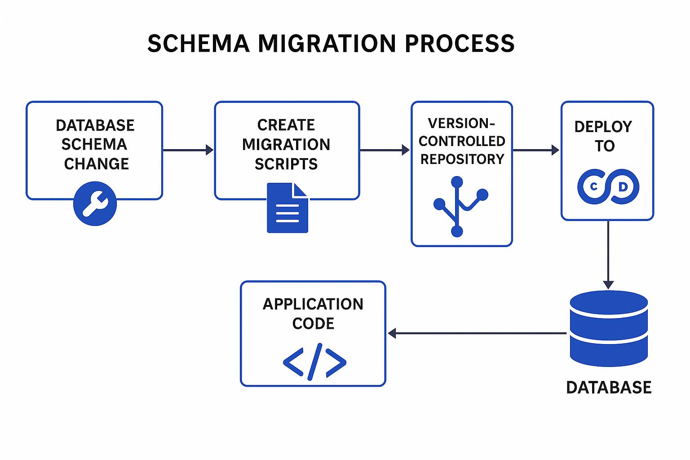
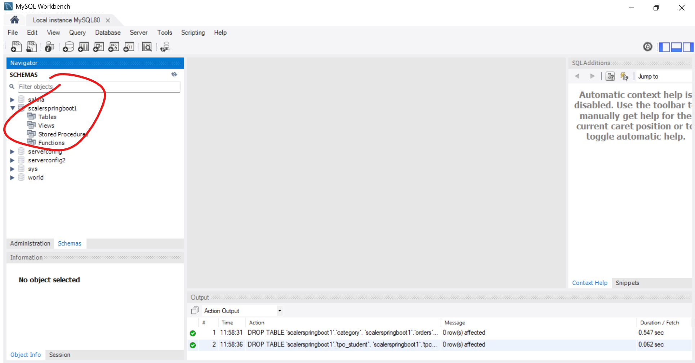
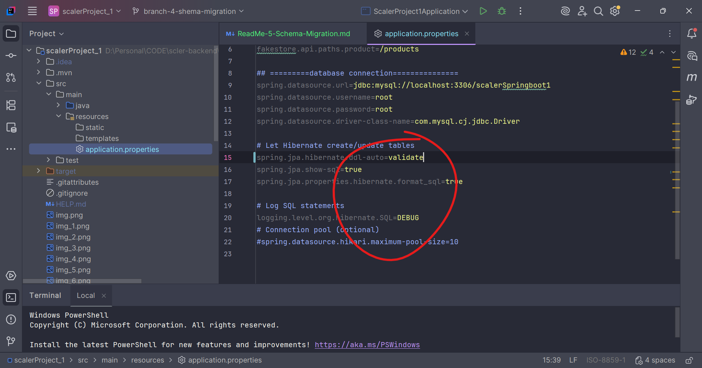
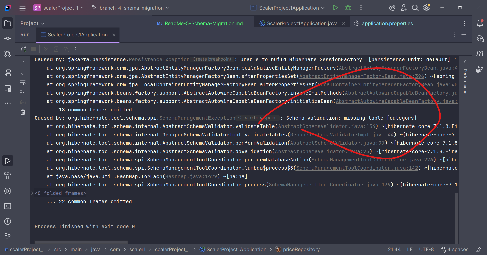

# ---------- what is shema migration --------
Here is a **clean, clear, industry-level explanation of Schema Migration** with proper notes and examples.

---

# ✅ **What is Schema Migration? (FULL NOTES)**

**Schema Migration** means *changing the structure of your database* in a controlled, versioned way — without losing existing data.

Whenever you modify your database tables — like adding a column, renaming a table, adding constraints — that change is called a **schema migration**.

It is a **version control system for database structures**.

---

# 🔥 **Why do we need Schema Migrations?**

Databases evolve as applications grow. Example:

* Add a new feature → need a new table
* Add new field → need a column
* Optimize performance → add indexes
* Fix relationships → modify foreign keys

Without migrations:

❌ Each developer manually writes SQL
❌ Hard to collaborate
❌ Difficult to rollback
❌ Production may break

With migrations:

✅ Automates schema updates
✅ Keeps DB consistent across all environments
(Developer → Staging → Production)
✅ Provides rollback
✅ Keeps schema version-controlled

---

# 🎯 **Where are schema migrations used?**

Almost every backend technology:

### 🔹 Java (Spring Boot) → Flyway, Liquibase

### 🔹 JavaScript (Node.js) → Sequelize, Knex

### 🔹 Python → Django ORM / Alembic

### 🔹 Ruby → ActiveRecord migrations

### 🔹 .NET → Entity Framework migrations

---

# 📌 **What a Schema Migration File Looks Like?**

A migration file normally contains:

### **UP script** → Apply changes

### **DOWN script** → Rollback changes

---

# 🧱 **Schema Migration Example (Flyway / Liquibase Style)**

## ✔ Example: Add a new column to product table

### **UP Migration**

```sql
ALTER TABLE products ADD COLUMN price DECIMAL(10,2);
```

### **DOWN Migration**

```sql
ALTER TABLE products DROP COLUMN price;
```

---

# 🔥 Full Example: Create Category Table + FK

## **UP Migration**

```sql
CREATE TABLE categories (
    id BIGINT PRIMARY KEY,
    name VARCHAR(255)
);

ALTER TABLE products
ADD COLUMN category_id BIGINT,
ADD CONSTRAINT fk_category
    FOREIGN KEY (category_id) REFERENCES categories(id);
```

## **DOWN Migration**

```sql
ALTER TABLE products DROP CONSTRAINT fk_category;
ALTER TABLE products DROP COLUMN category_id;
DROP TABLE categories;
```

---

# 📊 **Schema Migration vs Runtime ORM Sync**

| Feature                    | Schema Migration | ORM Auto-Sync (e.g., Hibernate hbm2ddl.auto=create/update) |
| -------------------------- | ---------------- | ---------------------------------------------------------- |
| Safe for production        | ✅ YES            | ❌ NO                                                       |
| Rollbacks                  | ✔ Possible       | ❌ Not possible                                             |
| Controlled changes         | ✔ YES            | ❌ NO                                                       |
| Team Collaboration         | ✔ Excellent      | ❌ Poor                                                     |
| Handles complex db changes | ✔ Yes            | ❌ Limited                                                  |
| Used by companies          | ✔ Always         | ❌ Never in prod                                            |

Hibernate `create/update/validate` is only for **development**, not production.

---

# 🧠 **Why Companies Always Use Schema Migration Tools**

### Because:

* They keep **history of changes**
* They allow **rollback**
* They guarantee DB stays **in sync** across dev, QA, staging, and prod
* They let teams work safely

---

# 🛠 Popular Schema Migration Tools

| Language | Tool                                  |
| -------- | ------------------------------------- |
| Java     | Flyway, Liquibase                     |
| Node.js  | Sequelize migrations, Knex migrations |
| Python   | Django Migrations, Alembic            |
| Ruby     | ActiveRecord migrations               |
| .NET     | EF Migrations                         |

---

# 📝 **Flyway Example With Versioning**

`V1__create_user_table.sql`

```sql
CREATE TABLE users (
  id BIGINT PRIMARY KEY,
  username VARCHAR(255)
);
```

`V2__add_email_column.sql`

```sql
ALTER TABLE users ADD COLUMN email VARCHAR(255);
```

The database is now versioned:

| Version | Description        |
| ------- | ------------------ |
| V1      | Create users table |
| V2      | Add email          |

---

# 💡 **Simple Definition for Interview**

**Schema migration is the process of version-controlling, applying, and rolling back changes to the database structure in a safe, automated, and trackable manner.**

---

# 🎤 If you want, I can also provide:

✅ Diagram of schema migration process
✅ Step-by-step workflow: Dev → Git → CI/CD → DB
✅ Flyway setup in Spring Boot
✅ Sequelize migration commands
✅ Real interview Q&A

Just tell me: **"Give diagram"**, **"Give Spring Boot example"**, or **"Give Sequelize migration guide"**.

## ------- Diagram of schema migration process ---



then run the application



Nice — here’s a compact, practical step-by-step guide to add **Flyway** to a Spring Boot (Java) project and use it correctly. I’ll show the Maven/Gradle dependencies, config, migration file naming, examples (SQL + Java), commands, environment tips and common troubleshooting / best practices.

# 1) Add Flyway dependency

**Maven**

```xml
<!-- pom.xml -->
<dependency>
  <groupId>org.flywaydb</groupId>
  <artifactId>flyway-core</artifactId>
  <version>9.21.0</version> <!-- pick a current stable version -->
</dependency>
```

**Gradle (Groovy DSL)**

```gradle
implementation 'org.flywaydb:flyway-core:9.21.0'
```

> Note: If you use Spring Boot Starter, Flyway is auto-detected when `flyway-core` is on the classpath and `spring.flyway.*` config is present.

---

# 2) Configure DB connection (application.properties / application.yml)

```properties
# application.properties
spring.datasource.url=jdbc:mysql://localhost:3306/mydb
spring.datasource.username=root
spring.datasource.password=root
spring.datasource.driver-class-name=com.mysql.cj.jdbc.Driver

# Flyway (defaults are fine, but explicit is clearer)
spring.flyway.enabled=true
spring.flyway.locations=classpath:db/migration
spring.flyway.baseline-on-migrate=true     # useful for existing DBs
spring.flyway.out-of-order=false
spring.flyway.validate-on-migrate=true
```

Or YAML:

```yaml
spring:
  datasource:
    url: jdbc:mysql://localhost:3306/mydb
    username: root
    password: root
  flyway:
    enabled: true
    locations: classpath:db/migration
    baseline-on-migrate: true
```

---

# 3) Migration file location & naming conventions

Create migrations under:

```
src/main/resources/db/migration/
```

**SQL (recommended)** — name versioned migrations like:

```
V1__create_category_table.sql
V2__create_price_table.sql
V3__create_product_table.sql
R__refresh_views.sql   # repeatable migration (prefix R__)
```

Important naming rules:

* `V<version>__<description>.sql` (double underscore)
* Version can be `1`, `1.1`, `20251201`, etc.
* Repeatable: `R__<description>.sql` — runs when checksum changes.

Example `V1__create_category_table.sql`:

```sql
CREATE TABLE category (
  id BIGINT AUTO_INCREMENT PRIMARY KEY,
  name VARCHAR(255) NOT NULL
);
```

Example `V2__create_price_table.sql`:

```sql
CREATE TABLE price (
  id BIGINT AUTO_INCREMENT PRIMARY KEY,
  currency VARCHAR(10),
  price DECIMAL(10,2)
);
```

Example `V3__create_product_table.sql`:

```sql
CREATE TABLE product (
  id BIGINT AUTO_INCREMENT PRIMARY KEY,
  title VARCHAR(255) NOT NULL,
  description TEXT,
  image VARCHAR(512),
  category_id BIGINT,
  price_id BIGINT,
  CONSTRAINT fk_product_category FOREIGN KEY (category_id) REFERENCES category(id),
  CONSTRAINT fk_product_price FOREIGN KEY (price_id) REFERENCES price(id)
);
```

---

# 4) How Flyway runs (what happens on app start)

* On app startup Flyway (Spring Boot auto-configuration) runs `migrate()` **before** JPA starts (so schema is ready).
* Flyway creates a metadata table `flyway_schema_history` (by default) that stores applied migrations and checksums.
* It applies any pending `V*` migrations in version order.
* Repeatable migrations (`R__`) run when their checksum changes.

---

# 5) Running migrations manually (CLI / Maven / Gradle)

**Maven plugin usage**

```xml
<!-- in pom.xml build->plugins -->
<plugin>
  <groupId>org.flywaydb</groupId>
  <artifactId>flyway-maven-plugin</artifactId>
  <version>9.21.0</version>
</plugin>
```

Then:

```
mvn flyway:migrate
mvn flyway:info
mvn flyway:repair
mvn flyway:clean   # DANGER: drops schemas
```

**Flyway CLI** (if installed):

```
flyway -url=jdbc:mysql://... -user=root -password=root migrate
```

**Gradle plugin** (if desired) provides `flywayMigrate`.

But with Spring Boot you usually let the app run and Flyway runs automatically.

---

# 6) Java-based migrations (optional)

You can write migrations in Java if you need logic:

```java
import org.flywaydb.core.api.migration.BaseJavaMigration;
import org.flywaydb.core.api.migration.Context;

public class V4__populate_default_data extends BaseJavaMigration {
  @Override
  public void migrate(Context context) throws Exception {
    try (var stmt = context.getConnection().createStatement()) {
      stmt.execute("INSERT INTO category(name) VALUES ('Clothing')");
    }
  }
}
```

Place Java migrations on the classpath (in `db/migration` package or configure `spring.flyway.locations` accordingly).

---

# 7) Placeholders (inject values into SQL)

Set placeholders in `application.properties`:

```properties
spring.flyway.placeholders.schemaName=public
```

In SQL:

```sql
CREATE TABLE ${schemaName}.mytable (...);
```

---

# 8) Handling an existing DB (baseline)

If the DB already has tables and you want Flyway to start managing versions:

```properties
spring.flyway.baseline-on-migrate=true
spring.flyway.baseline-version=1
```

Or run `mvn flyway:baseline`. Flyway will insert a baseline row so future `V*` migrations are applied after that version.

---

# 9) Useful Flyway settings (selected)

* `spring.flyway.locations` — where migrations live (default `classpath:db/migration`).
* `spring.flyway.baseline-on-migrate=true` — for existing DBs.
* `spring.flyway.out-of-order=true` — allow older versioned migrations after newer ones (not usually recommended).
* `spring.flyway.validate-on-migrate=true` — validate checksums before migrating.
* `spring.flyway.lock-retry-count` — for concurrency.
* `spring.flyway.schemas` — schema(s) to manage.
* `spring.flyway.table` — change metadata table name (default `flyway_schema_history`).

---

# 10) Common problems & fixes

* **`Table '...flyway_schema_history'` missing / baseline errors:** use `baseline-on-migrate=true` or run `flyway baseline`.
* **Duplicate/failed migration:** Fix SQL, increment version, run `flyway:repair` if you intentionally changed files (repair updates the metadata checksums; be careful).
* **Out of order / checksum mismatch:** Don’t edit already-applied SQL files; add a new migration instead. If you *must* update past migration in DEV only, you can `repair` + fix checksum — but avoid in production.
* **`clean` dropped tables accidentally:** `flyway.clean()` or `mvn flyway:clean` will drop schemas — dangerous in prod. Usually disabled.
* **Permission issues:** ensure DB user can create/alter tables and create the `flyway_schema_history` table.

---

# 11) Best practices

* Keep migrations immutable after they run in production. If you must change a migration that already ran in production, write a new migration to alter/correct.
* Use small, focused migrations (one change per file) for clarity and rollback ease.
* Keep SQL in version control (same repo as app).
* Use `baseline-on-migrate` for integrating Flyway with an existing DB.
* Use repeatable migrations for views/stored procedures if you want them re-applied when changed.
* Keep `validate-on-migrate=true` to catch drift early.
* Use CI to run `flyway:info`/`flyway:migrate` on staging before production deployment.

---

# 12) Example full flow (quick)

1. Add `flyway-core` to `pom.xml`.
2. Create `src/main/resources/db/migration/V1__create_category.sql` and `V2__create_product.sql`.
3. Configure DB in `application.properties`.
4. Start Spring Boot app — Flyway will auto-run and create `flyway_schema_history`.
5. Add `V3__add_price_table.sql`, restart/deploy — Flyway applies V3.

---

# 13) Example application.properties + sample migration

`application.properties`:

```properties
spring.datasource.url=jdbc:mysql://localhost:3306/mydb
spring.datasource.username=root
spring.datasource.password=root

spring.flyway.locations=classpath:db/migration
spring.flyway.baseline-on-migrate=true
spring.flyway.validate-on-migrate=true
```

`src/main/resources/db/migration/V1__create_category.sql`:

```sql
CREATE TABLE IF NOT EXISTS category (
  id BIGINT AUTO_INCREMENT PRIMARY KEY,
  name VARCHAR(255) NOT NULL
);
```

`V2__create_price.sql` and `V3__create_product.sql` as shown earlier.

---

# 14) Commands to inspect / repair / info

* `mvn flyway:info` — show applied/pending migrations
* `mvn flyway:migrate` — run migrations (if not using app startup)
* `mvn flyway:repair` — repair metadata table (use with caution)
* `mvn flyway:clean` — drop all (dangerous)

Or use Flyway CLI: `flyway info`, `flyway migrate`, `flyway repair`.

---

If you want, I can:

* generate a ready-to-run sample project structure (pom + application.properties + a couple of SQL migrations),
* or show how to configure Flyway Maven plugin in `pom.xml`,
* or demonstrate a Java migration example.

Which one would help you most next?
