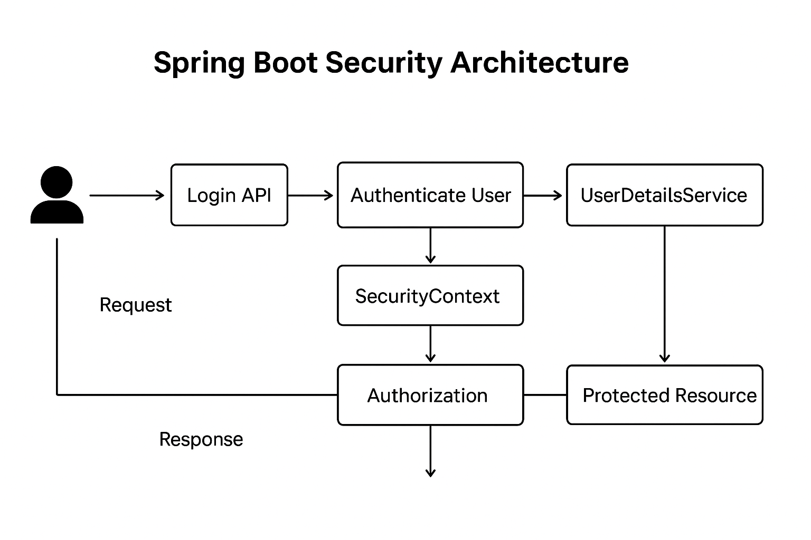

# ------- notes on Authentication and authorization with spring boot ---
Here is a **complete, clean, exam-ready + interview-ready** explanation of **Authentication and Authorization in Spring Boot**, with examples, diagrams (conceptual), and best practices.

---

# ✅ **Authentication vs Authorization in Spring Boot (Full Notes)**

Spring Security is the main framework used in Spring Boot for both **Authentication** (login) and **Authorization** (access control).

---

# 🌟 **1. What is Authentication?**

👉 **Authentication = Who are you? (Identity Verification)**
It checks whether the user is **real + valid**.

### Examples:

* Login with **username + password**
* OAuth login (Google, GitHub)
* Token-based login (JWT)
* Mobile OTP login

### Spring Boot Authentication Flow

```
Client → sends username/password →
AuthenticationManager →
UserDetailsService loads user →
PasswordEncoder validates password →
If valid: Authentication Success → creates SecurityContext
Else: Authentication Failure
```

### In Spring Boot:

* `AuthenticationManager` → performs authentication
* `UserDetailsService` → loads user from DB
* `PasswordEncoder` → hashes passwords

---

# 🌟 **2. What is Authorization?**

👉 **Authorization = What are you allowed to do? (Permissions)**
It checks whether the authenticated user has **roles/permissions**.

### Examples:

* Admin can add/update/delete
* User can only view
* Manager can approve/deny

### Spring Boot Authorization Methods:

* URL-based filtering
* Method-level authorization (`@PreAuthorize`)
* Role-based restrictions

---

# 🌟 **3. Authentication vs Authorization (Simple Table)**

| Feature | Authentication          | Authorization              |
| ------- | ----------------------- | -------------------------- |
| Meaning | Who are you?            | What can you do?           |
| Order   | Comes first             | Comes after authentication |
| Checks  | Password/Token validity | Roles/Permissions          |
| Example | Login                   | `/admin` only for ADMIN    |

---

# 🌟 **4. Spring Security Authentication Flow Diagram**

```
                 ┌──────────────────────────────┐
Request Login →  │ UsernamePasswordAuthentication │
                 └───────────────┬──────────────┘
                                 ↓
                      AuthenticationManager
                                 ↓
                      UserDetailsService
                                 ↓
                      Loads User From Database
                                 ↓
                        PasswordEncoder matches?
                         /                    \
                        Yes                  No
                        ↓                    ↓
                SecurityContext Created   Authentication Failed
                        ↓
               User Can Access Protected URLs
```

---

# 🌟 **5. Authentication in Spring Boot (Basic JWT Example)**

### 📌 Step 1: Add Spring Security dependency

```xml
<dependency>
    <groupId>org.springframework.boot</groupId>
    <artifactId>spring-boot-starter-security</artifactId>
</dependency>
```

---

### 📌 Step 2: Create `UserDetailsService`

```java
@Service
public class MyUserDetailsService implements UserDetailsService {

    @Autowired
    private UserRepository userRepository;

    @Override
    public UserDetails loadUserByUsername(String username)
            throws UsernameNotFoundException {

        User user = userRepository.findByUsername(username)
                .orElseThrow(() -> new UsernameNotFoundException("Not found"));

        return new org.springframework.security.core.userdetails.User(
                user.getUsername(),
                user.getPassword(),
                user.getAuthorities()
        );
    }
}
```

---

### 📌 Step 3: Configure Security (Spring Security 6 / Boot 3)

```java
@Configuration
@EnableWebSecurity
public class SecurityConfig {

    @Bean
    public SecurityFilterChain filterChain(HttpSecurity http) throws Exception {
        http.csrf().disable()
           .authorizeHttpRequests(auth -> auth
                   .requestMatchers("/auth/**").permitAll()
                   .anyRequest().authenticated()
           )
           .formLogin();
        return http.build();
    }
}
```

---

# 🌟 **6. Authorization in Spring Boot**

### Three ways:

---

## **A) URL-Based Authorization**

```java
.authorizeHttpRequests(auth -> auth
        .requestMatchers("/admin/**").hasRole("ADMIN")
        .requestMatchers("/user/**").hasAnyRole("USER", "ADMIN")
        .anyRequest().authenticated()
)
```

---

## **B) Method-Level Authorization**

1. Enable annotation:

```java
@EnableMethodSecurity
public class SecurityConfig {}
```

2. Use it on services:

```java
@PreAuthorize("hasRole('ADMIN')")
public void deleteProduct(Long id) {
}
```

---

## **C) Domain-Level Authorization (Advanced)**

Sometimes permission is based on logged-in user:

```java
@PreAuthorize("#id == authentication.principal.id")
User getProfile(Long id)
```

---

# 🌟 **7. JWT Authentication (Short Summary)**

JWT = JSON Web Token (stateless authentication)

Flow:

```
Client logs in → Server generates JWT → Client stores token →
Client sends token with every request → Server validates token
```

Advantages:

* No session management
* Works well for microservices
* Faster
* Mobile-friendly

---

# 🌟 **8. Common Security Components**

| Component                | Purpose                     |
| ------------------------ | --------------------------- |
| `SecurityFilterChain`    | Configure security rules    |
| `UserDetails`            | Represents the user         |
| `UserDetailsService`     | Fetch user from database    |
| `PasswordEncoder`        | Encrypts passwords          |
| `AuthenticationManager`  | Performs authentication     |
| `AuthenticationProvider` | Custom authentication logic |
| `JwtFilter`              | Validates JWT tokens        |

---

# 🌟 **9. Password Encoding Example**

```java
@Bean
public PasswordEncoder passwordEncoder() {
    return new BCryptPasswordEncoder();
}
```

---

# 🌟 **10. Best Practices for Authentication & Authorization**

### ✅ Do

✔ Always use **BCrypt**
✔ Always hide password field in response
✔ Always use DTOs (never expose entities)
✔ Validate JWT token in filter
✔ Add role-based security
✔ Use HTTPS in production

### ❌ Don’t

✘ Never store passwords in plain text
✘ Never return entire User entity (contains sensitive data)
✘ Never disable CSRF on form-based login
✘ Never trust client-side roles

---

# 🌟 **11. Simple Diagram (Authentication + Authorization)**

```
         ┌───────────────┐
         │   Login API    │
         └───────┬───────┘
                 ↓
        Authenticate User?
        /                \
       No                Yes
       ↓                 ↓
  Return Error     Create SecurityContext
                         ↓
                Apply Authorization Rules
                         ↓
            Allow or Block API Access
```

---

# ✔ **Do you want me to generate:**

✅ JWT authentication full code?
✅ Authorization using roles?
✅ Security architecture diagram?
✅ Full project structure?

Just tell me **"Give JWT version"** or **"Give role-based example"**.
# --- Security architecture diagram? ---


## -------------- what is benefites to use JWT token and compare it with others ways as well and what are the ebnefites to use the JWt and disadavnctage as well ---
Here is a clear, complete, **interview-ready** explanation of **JWT**, its **benefits**, **comparisons**, and **disadvantages**.

---

# ✅ **What is JWT (JSON Web Token)?**

A **JWT** is a **compact, URL-safe token** used to securely transmit information between client and server.
It contains:

1. **Header** – algorithm & token type
2. **Payload** – user data (claims)
3. **Signature** – verifies authenticity

It is **stateless**, meaning the server does **not store session data**.

---

# ✅ **Why do we use JWT? (Key Benefits)**

## **1. Stateless Authentication (no server memory needed)**

JWT tokens are verified using a **signature**, so the server does **not store session data**.

### Benefit:

* Works well in **distributed systems / microservices**
* Scales horizontally

---

## **2. Faster Authentication**

Since no database lookup is needed:

* Each request is authenticated by simply **verifying the signature**
* Much faster than session-based where server checks DB/cache

---

## **3. Portable (used across services & domains)**

JWT is **JSON-based**, understood universally.

### Benefit:

* Can be used across **multiple services**
* Ideal for **microservice communication**

---

## **4. Secure (if implemented properly)**

Uses:

* **HMAC SHA-256**
* **RSA public/private keys**

Preventing tampering.

---

## **5. Supports “claims”**

Can store any useful user info like:

* userId
* roles
* permissions
* expiration time

Allows your backend to **avoid database calls** for every request.

---

## **6. Works perfectly with SPA, Mobile apps**

Because it can be stored in:

* localStorage
* secure cookies
* sessionStorage
* mobile storage (iOS/Android)

---

# 🔥 **Comparison: JWT vs Other Authentication Methods**

---

# 1️⃣ **JWT vs Session-Based Authentication**

| Feature                | JWT         | Session-Based                     |
| ---------------------- | ----------- | --------------------------------- |
| Storage                | Client-side | Server-side (RAM/DB)              |
| Scalable?              | ✔ Yes       | ❌ No (server must store sessions) |
| Microservices friendly | ✔ Yes       | ❌ No                              |
| Speed                  | Faster      | Slower                            |
| Server Load            | Low         | High                              |
| Logout complexity      | Harder      | Easy                              |

---

# 2️⃣ **JWT vs OAuth2**

| Feature      | JWT                 | OAuth2                                 |
| ------------ | ------------------- | -------------------------------------- |
| Purpose      | Authentication      | Authorization + Delegated Access       |
| Use case     | Login users         | Sign-in using Google, GitHub, Facebook |
| Complexity   | Low                 | High                                   |
| Token Format | Always JWT          | Many formats (Opaque, JWT)             |
| Best for     | APIs, microservices | Third-party login                      |

👉 JWT focuses on **authenticating users to YOUR system**,
👉 OAuth2 focuses on **authenticating with EXTERNAL systems**.

---

# 3️⃣ **JWT vs API Keys**

| Feature            | JWT   | API Key |
| ------------------ | ----- | ------- |
| User-specific      | ✔ Yes | ❌ No    |
| Expiration support | ✔ Yes | ❌ No    |
| More secure        | ✔ Yes | ❌ No    |
| Metadata/roles     | ✔ Yes | ❌ No    |

API keys are simpler, JWT is more secure & rich.

---

# 4️⃣ **JWT vs Cookie-Based Authentication**

| Feature                | JWT                        | Cookies |
| ---------------------- | -------------------------- | ------- |
| Works in Mobile?       | ✔ Yes                      | ❌ Hard  |
| CSRF protection needed | ❌ No (if stored in header) | ✔ Yes   |
| Stateless              | ✔ Yes                      | ❌ No    |

---

# ⭐ **Advantages of JWT**

### ✔ **1. Stateless**

No need to store session info → scalable servers.

### ✔ **2. Compact**

Small tokens → fast transmission.

### ✔ **3. JSON-based and widely supported**

Easy to use across languages & platforms.

### ✔ **4. Efficient**

Fast verification → low database load.

### ✔ **5. Supports expiration (exp), issued-at (iat)**

Prevents long-term misuse.

### ✔ **6. Good for microservices**

Service-to-service authentication is easy.

---

# ⚠️ **Disadvantages of JWT**

### ❌ **1. Hard to revoke**

If a JWT is compromised, you **cannot easily invalidate it**
unless you use a database/blacklist.

### ❌ **2. If token expires late → big security risk**

Long expiry = risky
Short expiry = user inconvenience

### ❌ **3. Payload is only Base64 encoded (not encrypted)**

Anyone can **read** the payload; not good for sensitive data.

### ❌ **4. Large token size vs Session ID**

JWT is longer → increases network usage.

### ❌ **5. Must be implemented correctly**

Else risks include:

* storing token in localStorage → XSS steals tokens
* weak secret keys → token forgery
* missing expiration → permanent tokens

---

# ⭐ When to Use JWT?

Use JWT when:
✔ Stateless APIs
✔ Mobile apps
✔ SPA (React, Angular, Vue)
✔ Microservices where user info must propagate
✔ High scalability required

---

# ❌ When NOT to Use JWT?

Avoid JWT when:
✘ You need instant logout
✘ You store sensitive info inside token
✘ You cannot protect the token from XSS

---

# 🔥 SHORT SUMMARY (Interview-Ready)

> **JWT is a stateless authentication mechanism that stores user information inside a signed token. It is scalable, fast, and ideal for microservices. The downside is difficulty in revocation and risk of token theft if stored incorrectly.**

---

If you want, I can also generate:
✅ JWT Authentication Flow Diagram
✅ Spring Boot JWT implementation (step-by-step code)
✅ Refresh Token architecture diagram
Just tell me **“Generate flow diagram”** or **“Give Spring Boot JWT code.”**

## --------- give some details of 0Auth token as well ---

Below is a **complete, clean, and detailed explanation** of:

✔ What is OAuth?
✔ OAuth tokens (Access Token, Refresh Token)
✔ OAuth vs JWT
✔ JWT benefits & drawbacks
✔ Why use JWT in Microservices / Web Apps
✔ Comparison with Session-based authentication and OAuth2

---

# ✅ **What is OAuth?**

**OAuth (Open Authorization)** is an open standard protocol that allows users to **grant access to their resources** on one website/app to another **without sharing their actual password**.

### ✔ Example

You click **“Login with Google”** on a website →
Google validates you →
Google sends an **access token** to that website →
The website uses that token to access your profile/email from Google.

➡️ **You never give your password to that website.**
➡️ Google only gives limited access, not full account control.

---

# 🎫 **Types of OAuth Tokens**

## **1️⃣ Access Token**

* Short-lived (minutes to hours).
* Used to access protected resources (APIs).
* Format: JWT or random opaque string.

## **2️⃣ Refresh Token**

* Long-lived (days, months).
* Used to get a new access token when the old one expires.
* Not sent to APIs; only to Authorization Server.

---

# 🔐 **OAuth 2.0 Flow (Simplified)**

1. User clicks **Login with Google**
2. Google shows login page
3. User logs in
4. Google sends an **Authorization Code** to the app
5. App exchanges the code for an **Access Token + Refresh Token**
6. Access Token is used to call Google APIs

---

# 🆚 **OAuth vs JWT Authentication**

JWT is usually used in **your own application** (first-party authentication).
OAuth is used when you rely on **third-party login** (Google, GitHub, Facebook).

| Feature        | OAuth2                                 | JWT (Standalone)              |
| -------------- | -------------------------------------- | ----------------------------- |
| Purpose        | Delegated authorization (Google login) | App-level authentication      |
| Token Type     | Access Token + Refresh Token           | Single self-contained token   |
| Who validates? | Authorization Server                   | Your backend                  |
| Used for       | External login, API security           | Web apps, APIs, microservices |
| Complex?       | More complex                           | Simple to implement           |

---

# ⭐ **Why Use JWT? Benefits**

## **1️⃣ Stateless — No Session Storage Needed**

* Server does not store anything.
* JWT contains all auth data inside the token.
* Ideal for **microservices** and **cloud** systems.

## **2️⃣ Fast Authentication**

* No DB lookup required for each request.
* Token is verified using a signature.

## **3️⃣ Can Be Used Across Services**

* Perfect for microservices.
* One login → use same JWT everywhere.

## **4️⃣ Works Well with Mobile Apps**

* Mobile apps cannot store cookies well.
* JWT works with headers (better for APIs).

## **5️⃣ Scalable**

* Since server doesn’t keep session, you can add more instances easily.

---

# ❗ JWT Disadvantages (Important)

## **1️⃣ Cannot Be Revoked Easily**

Once JWT is issued, it is valid until expiry unless you:

* Maintain a token blacklist
* Use short-lived access tokens + refresh tokens

## **2️⃣ Token Can Become Too Large**

JWT carries:

* User roles
* Email
* Issuer details
  This increases network overhead.

## **3️⃣ Security Risk if Secret Key Leaks**

Anyone can sign valid tokens.

---

# 🆚 **JWT vs Sessions (Traditional Cookie Auth)**

| Feature        | Session-Based                 | JWT                    |
| -------------- | ----------------------------- | ---------------------- |
| Server Storage | Stores session in DB/memory   | No storage (stateless) |
| Scalability    | Hard (sticky sessions needed) | Very easy              |
| Revocation     | Easy                          | Hard                   |
| Mobile Support | Not ideal                     | Perfect                |
| Token Size     | Small                         | Larger                 |

---

# 🆚 **JWT vs OAuth2 (Side-by-Side)**

| Comparison     | JWT                       | OAuth2                 |
| -------------- | ------------------------- | ---------------------- |
| Type           | Token format              | Authorization protocol |
| Used For       | App login                 | Third-party login      |
| Token Contains | User data                 | Often opaque           |
| Security       | Good but risky if misused | Strong                 |
| Revocation     | Hard                      | Easy (server-managed)  |
| Complexity     | Simple                    | Medium/High            |

➡️ **JWT is not an authentication protocol.**
➡️ **OAuth2 is an authentication + authorization protocol.**
➡️ OAuth tokens *can be JWT or Opaque*.

---

# ⭐ When Should You Use JWT?

Use JWT when:

✔ Building **microservices**
✔ Building **mobile apps**
✔ Need **stateless API authentication**
✔ Want **horizontal scaling**
✔ Using API Gateways

---

# ⭐ When Should You Prefer OAuth2?

Use OAuth when:

✔ Want "Login with Google / Facebook"
✔ Need delegated access (e.g., access user’s Google Drive files)
✔ Need centrally managed authorization
✔ Need easy token revocation and refresh flow

---

# 🔥 Final Summary

| Feature      | JWT                              | OAuth                                |
| ------------ | -------------------------------- | ------------------------------------ |
| Purpose      | Authentication for your app      | Authorization using third-party      |
| Login Source | Your database                    | Google/Facebook/GitHub               |
| Token        | Self-contained JWT               | Access Token, Refresh Token          |
| Revocation   | Hard                             | Easy                                 |
| Complexity   | Low                              | High                                 |
| Use Case     | APIs, microservices, mobile apps | Social login, secure enterprise apps |

---

If you want, I can also provide:

✔ Architecture diagram of JWT flow
✔ Flow diagrams of OAuth Authorization Code Flow
✔ Spring Security with JWT implementation
✔ Spring Security with OAuth2 Google Login

Just tell me **“Generate diagrams”** or **“Give code”**.
